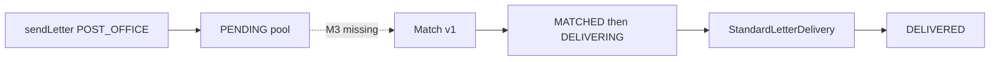

# M3 — 匹配 + 行为 + 审核 + POST_OFFICE 闭环

## 现状（M2 已具备）

- POST_OFFICE 写信已入池：[`AppMailboxServiceImpl`](senior-post-api/biz/src/main/java/cn/nine/pros/post/biz/service/biz/impl/AppMailboxServiceImpl.java) 设 `toUserId=null`、`PENDING`，注释「匹配留 M3」
- 发送后 **`audit_status` 直接 APPROVED**（与 §15.6「默认 PENDING_REVIEW 放行」不符）
- 投递调度已存在：[`StandardLetterDeliveryScheduler`](senior-post-api/biz/src/main/java/cn/nine/pros/post/biz/schedule/StandardLetterDeliveryScheduler.java) 只处理 `DELIVERING` + ETA due
- 邮局首页额度仅展示，**未在 send 强制**；无 Match / Behavior 引擎类

## 目标闭环

写信(POST_OFFICE) → 敏感词前置 → `PENDING_REVIEW` 入池 → 匹配 v1 赋收件人 → `MATCHED`→`DELIVERING`+ETA → 既有投递任务送达 → 读信/回信打行为事件；审核可中途 REJECTED 中止并退额度。

**默认范围**：PLAN M3 两条 checklist 全做；Flutter 只补状态文案/刷新；管理端审核列表做薄 Admin API（可批处理）；**不做** M5 匹配 v2 AI、不做笔友推荐(§9)。

分层遵守 skill §10–§12：查询下沉 `LetterService` 命名方法；Biz 无 Wrapper；无嵌套 if。

---

## Slice A — 匹配 v1 + POST_OFFICE 端到端（优先）

**Flyway** `V5__m3_match_behavior.sql`：`sys_config` 种子（如 `match.inbound_daily_cap`、`match.batch_size`、`match.new_user_protect_count=3`）；必要时 `log_action` 索引（若缺）。

**Base `LetterService`** 新增命名 API（示例）：
- `listPostOfficePendingPool(limit)` — `mode=POST_OFFICE`、`status=PENDING`、`to_user_id IS NULL`、`del_flag=false`
- `tryAssignMatch(letterId, toUserId, matchedAt)` — 条件更新：仍 PENDING 且无收件人 → 写 `to_user_id`/`matched_at`/`status=MATCHED`
- `startDeliveringAfterMatch(letterId, eta, now)` — `MATCHED`→`DELIVERING` + `expected_arrival_time`
- `countInboundPostOfficeToday(userId, dayStart)` — 收件日上限

**Biz** 新建 [`PostOfficeMatchService`](senior-post-api/biz/src/main/java/cn/nine/pros/post/biz/service/biz/PostOfficeMatchService.java)：
1. 过滤：非自己、status 正常、非黑名单、语言粗匹配、当日 inbound cap、保护池优先（新用户前 N 封）
2. 打分 v1（规则）：共同兴趣 Tag + 写作风格相近 + 同语言/同国家加权 + 轻微随机（不做 AI）
3. 选 Top 候选 → `tryAssignMatch` → `DeliveryDelayCalculator` → `startDeliveringAfterMatch`

**Scheduler** 新建 `PostOfficeMatchScheduler`（对齐现有 Delivery Scheduler 风格）：定时 drain 池。

**验收**：POST_OFFICE 信在调度后出现 `to_user_id`、进入 `DELIVERING`，既有投递任务可送达收件人信箱。

---

## Slice B — §15.6 审核 + §15 额度/保护池

**发送路径**（[`AppMailboxServiceImpl.sendLetter`](senior-post-api/biz/src/main/java/cn/nine/pros/post/biz/service/biz/impl/AppMailboxServiceImpl.java)）：
- 敏感词仍硬拦截不落库
- 落库 `audit_status = PENDING_REVIEW`（不再直接 APPROVED）
- **强制** `letter.daily_quota`（`countSentByFromUserBetween`；VIP 跳过若产品已约定）
- 保护池：匹配侧已用；发送侧记录「新用户前 N 封」可走 config

**审核流转**：
- 默认放行策略：入池/入轨不阻塞；投递任务已跳过非 APPROVED —— 增加 **自动放行**：定时或匹配前将超时未审的 `PENDING_REVIEW` → `APPROVED`（config 秒数），或匹配成功时一并 APPROVED（与「默认放行进入投递」一致）
- Admin 薄接口：`AdminLetterAuditBizService` 列表/通过/拒绝；拒绝走既有 abort + **退还当日额度计数口径**（文档化：拒绝不计入 sentToday 或显式 refund 标记，选「拒绝后 sent 计数排除 REJECTED」）

**机审**：若已有 DeepSeek/敏感词以外 provider，仅在 send 后异步触发（失败不阻断入池）；无则本切片只做敏感词 + 默认放行 + 人工审核 API。

---

## Slice C — §14 行为事件

复用 `log_action` / [`ActionService`](senior-post-api/biz/src/main/java/cn/nine/pros/post/biz/service/base/ActionService.java)：
- 命名方法 `recordEvent(userId, actionType, targetType, targetId, extraJson)`
- 事件类型常量：`send_letter` / `open_letter` / `reply_letter` / `login`（先这 4 个）
- 挂钩：`sendLetter`、读信 mark-read、回信、登录成功
- 匹配过滤可选用「72h 内有活跃」：`existsRecentAction(userId, since)`（有则启用，无则跳过以免空库无法匹配）

---

## Flutter（最小）

- 信箱/详情：展示 `MATCHED` / 审核中文案（已有 mode/audit 字段则补 l10n）
- 发送成功后刷新邮局首页额度
- **不**新建匹配调试页

遵循 `frontend-design` skill；沿用现有适老化组件。

---

## 验收与 PLAN

- POST_OFFICE：发信 → 匹配 → 投递 → 收件人可见
- 超额度 send 拒绝；敏感词拒绝；人工/自动审核 REJECTED 中止投递
- 行为事件可查 `log_action`
- `mvn -pl biz,client,server -am compile`；关键 Flutter analyze
- 更新 [`PLAN.md`](PLAN.md) M3 checklist 为 `[x]`

## 明确不做

- 匹配 v2 AI（M5）、推荐系统(§9)、笔友关系阈值(M4)
- 不整理 Flyway 全链（仅增量 V5）
- 不借机大改 Admin CRUD 框架
