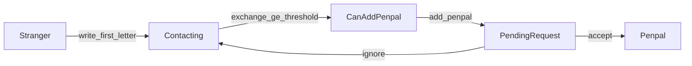

# M4 继续开发计划

## 现状与差距

M3 已交付匹配 v1、审核、行为事件、邮局首页摘要；M4  checklist 在 [`PLAN.md`](PLAN.md) 仍为 `[ ]`。

| PRD | 现状 | 主要缺口 |
|-----|------|----------|
| §10 关系 | [`FriendshipService.ensureActiveFriendship`](senior-post-api/biz/src/main/java/cn/nine/pros/post/biz/service/base/FriendshipService.java) 一键建联 | 缺申请/确认；[`acceptPostalContact`](senior-post-api/biz/src/main/java/cn/nine/pros/post/biz/service/biz/impl/AppMailboxServiceImpl.java) 与 PRD 冲突 |
| §11.3 关系消息 | [`AppPostOfficeService.home`](senior-post-api/biz/src/main/java/cn/nine/pros/post/biz/service/biz/AppPostOfficeService.java) 中 `relationMessageCount=0` 占位 | 缺明细 API + 计数逻辑 |
| §12.4 信箱 | [`mailbox_page.dart`](senior-post-flutter/lib/features/mailbox/mailbox_page.dart) Tab=收件/Connections/时光信 | 需改为 **收到的信 / 发出的信 / 时光信**；Connections 迁到笔友页 |
| §8/§9 笔友页 | [`directory_page.dart`](senior-post-flutter/lib/features/directory/directory_page.dart) 单列表 | 缺三 Tab + 每日推荐 API |
| §13 个人中心 | [`profile_page.dart`](senior-post-flutter/lib/features/profile/profile_page.dart) 扁平菜单 | 缺分组 IA + 概览统计 |

**不变量（PRD §10）**：陌生/通信中/可添加笔友 **不持久化**，由信件往来实时推导；仅 **笔友** + **申请中** 落库。



---

## 阶段 1：§10 关系后端（优先，阻塞其余）

### 1.1 数据库 — `V6__m4_penpal_relation.sql`

新增 [`senior-post-api/server/src/main/resources/db/migration/V6__m4_penpal_relation.sql`](senior-post-api/server/src/main/resources/db/migration/V6__m4_penpal_relation.sql)：

- 表 `bu_penpal_request`：`requester_id`, `target_id`, `status`（1=PENDING 2=ACCEPTED 3=IGNORED）, `source_letter_id`, 审计字段
- 唯一约束：同一对用户仅一条 `del_flag=false AND status=1` 的 PENDING
- 索引：`target_id + status`（邮局待确认列表）
- `sys_config` 种子：`penpal.min_exchange_count`（默认 2）、`recommend.daily_count`（默认 5）

`bu_friendship` **保持仅表示已确认笔友**（status=1）；不再用 `ensureActiveFriendship` 直接激活。

### 1.2 Base 层

| 组件 | 职责 |
|------|------|
| `PenpalRequestDomain` + `PenpalRequestMapper` + `PenpalRequestService` | CRUD：findPendingPair、listIncomingPending、accept/ignore |
| [`LetterService`](senior-post-api/biz/src/main/java/cn/nine/pros/post/biz/service/base/LetterService.java) 扩展 | `countExchangeBetween(a,b)`（双方 DELIVERED+ 有效往来，含 parent_letter 链）；`hasBidirectionalExchange(a,b)` |
| [`FriendshipService`](senior-post-api/biz/src/main/java/cn/nine/pros/post/biz/service/base/FriendshipService.java) 调整 | 新增 `createPenpalFromRequest`；**废弃**对外 `ensureActiveFriendship` 直建联路径 |

### 1.3 Biz 层 — `AppRelationBizService`

新建业务编排（遵循 Controller→Biz→IService）：

- `resolveRelationSnapshot(viewerId, peerId)` → `RelationSnapshotVO`（`displayState`, `letterCount`, `penpalRequestStatus`, `canAddPenpal`, `pendingRequestId`）
- `createPenpalRequest(actorId, peerId, letterId?)` — 校验阈值、黑名单、非笔友、无进行中申请
- `acceptPenpalRequest(actorId, requestId)` / `ignorePenpalRequest(...)` — 同意时写 `bu_friendship` + 腾讯 IM 同步（复用 [`TencentImFriendshipNotifier`](senior-post-api/biz/src/main/java/cn/nine/pros/post/biz/integration/tencent/TencentImFriendshipNotifier.java)）
- 行为事件：扩展 [`BehaviorActionTypes`](senior-post-api/client/src/main/java/cn/nine/pros/post/client/common/constant/BehaviorActionTypes.java) 增加 `add_penpal_request` / `accept_penpal` / `reject_penpal`

### 1.4 API 契约（client + controller）

新建 [`AppRelationApi`](senior-post-api/client/src/main/java/cn/nine/pros/post/client/api/app/AppRelationApi.java) + `AppRelationController`：

- `GET /relation/with/{userId}` — 用户主页/读信页用
- `POST /penpal/requests` — 发起申请
- `POST /penpal/requests/{id}/accept` / `.../ignore`

**迁移旧接口**：

- [`AppMailboxApi.acceptPostalContact`](senior-post-api/client/src/main/java/cn/nine/pros/post/client/api/app/AppMailboxApi.java) → 改为调用 `createPenpalRequest`（或标记 deprecated 并前端切新 API）；删除 instant friendship 逻辑

### 1.5 DTO 扩展

- [`MailboxLetterItemVO`](senior-post-api/client/src/main/java/cn/nine/pros/post/client/model/out/MailboxLetterItemVO.java)：加 `relationDisplayState`, `canAddPenpal`, `recipientRead`（列表展示用）
- [`DirectoryUserItemVO`](senior-post-api/client/src/main/java/cn/nine/pros/post/client/model/out/DirectoryUserItemVO.java)：`postalFriend` → `relationDisplayState` + `recommendReason`（推荐 Tab 用）

---

## 阶段 2：邮局关系消息 + 信箱流水 API

### 2.1 邮局关系消息（§11.3）

扩展 [`AppPostOfficeApi`](senior-post-api/client/src/main/java/cn/nine/pros/post/client/api/app/AppPostOfficeApi.java) + `AppPostOfficeService`：

- `GET /post-office/relation-messages` → `List<PostOfficeRelationMessageVO>`
  - 类型 A：待确认笔友请求（incoming PENDING）
  - 类型 B：关系提醒（已达阈值、尚未申请、viewer 可发起）
- `GET /post-office/in-transit` → 在途/未读明细（聚合现有 LetterService 计数）
- `home()` 中 `relationMessageCount` = 上述两类条数之和

### 2.2 信箱流水（§12.4）

扩展 [`AppMailboxApi`](senior-post-api/client/src/main/java/cn/nine/pros/post/client/api/app/AppMailboxApi.java)：

- `GET /mailbox/received` — 本人为收件人的 DIRECT/POST_OFFICE 信件（按 updatedAt 倒序，含关系态）
- `GET /mailbox/sent` — 本人为发件人
- 保留 `listArchive` 供过渡；Biz 内共用 `toItem()` + `AppRelationBizService.resolveRelationSnapshot`

`listFriends` / [`MailboxFriendItemVO`](senior-post-api/client/src/main/java/cn/nine/pros/post/client/model/out/MailboxFriendItemVO.java)：**从信箱 API 移除前端依赖**，笔友列表改走 Directory。

---

## 阶段 3：§9 推荐 + 笔友页后端

### 3.1 每日推荐服务

新建 `AppRecommendBizService`（复用 [`PostOfficeMatchService`](senior-post-api/biz/src/main/java/cn/nine/pros/post/biz/service/biz/PostOfficeMatchService.java) 的过滤/打分逻辑，抽取 `MatchScoringSupport` 避免重复）：

- 表 `bu_daily_recommendation`（`user_id`, `target_user_id`, `recommend_date`, `score`, `reason_key`）— 同日幂等，不可无限刷新
- `GET /directory/recommendations/today` → 3~5 条 `DirectoryUserItemVO` + `recommendReason`
- 冷启动：保护池/热门候选 fallback（对齐 §12.7）
- 行为：`view_recommendation` / `write_from_recommendation`（写信时带 `recommendationId` 可选）

### 3.2 我的笔友列表

扩展 [`AppDirectoryService`](senior-post-api/biz/src/main/java/cn/nine/pros/post/biz/service/biz/AppDirectoryService.java)：

- `GET /directory/penpals` — 基于 `FriendshipService.listActiveFriendshipsForUser` + 往来计数 + penpal 天数
- `pageUsers` 继续服务「找笔友」Tab（现有筛选逻辑不变）

---

## 阶段 4：Flutter 全栈集成

### 4.1 笔友页三 Tab（§8/§12.3）

改造 [`directory_page.dart`](senior-post-flutter/lib/features/directory/directory_page.dart)：

- `TabController(3)`：**推荐笔友** / **找笔友**（现有列表+筛选） / **我的笔友**
- 新 remote/providers：`dailyRecommendationsProvider`, `myPenpalsProvider`
- 卡片操作：仅「查看主页」「写第一封信」/「写信」（推荐 Tab 无直接成笔友）

### 4.2 信箱三 Tab（§12.4）

改造 [`mailbox_page.dart`](senior-post-flutter/lib/features/mailbox/mailbox_page.dart)：

- Tab：`收到的信` / `发出的信` / `时光信`（移除 Connections Tab）
- 新 providers 对接 `/mailbox/received`、`/mailbox/sent`
- 列表项展示 `relationDisplayState`；满足条件显示「添加笔友」

### 4.3 关系交互触点

| 文件 | 改动 |
|------|------|
| [`letter_detail_page.dart`](senior-post-flutter/lib/features/mailbox/letter_detail_page.dart) | 移除「接受邮缘」；改为「添加笔友」+ 关系态标签 |
| [`user_card_page.dart`](senior-post-flutter/lib/features/directory/user_card_page.dart) | 按 `relationDisplayState` 切换按钮（写第一封/继续写/添加笔友/写信） |
| [`post_office_home_page.dart`](senior-post-flutter/lib/features/post_office/post_office_home_page.dart) | 消息摘要卡跳转新页 `post_office_relation_messages_page.dart` |
| [`mailbox_remote.dart`](senior-post-flutter/lib/features/mailbox/mailbox_remote.dart) / 新 `relation_remote.dart` | 对齐新 API |

l10n：[`app_zh.arb`](senior-post-flutter/lib/l10n/app_zh.arb) / [`app_en.arb`](senior-post-flutter/lib/l10n/app_en.arb) 补充关系态、推荐、笔友申请文案。

### 4.4 个人中心 §13（本期范围）

改造 [`profile_page.dart`](senior-post-flutter/lib/features/profile/profile_page.dart) 为分组结构：

- **资料卡 + 概览**：新 `GET /profile/overview`（笔友数 / 通信数 / 时光信数）
- **我的内容**：草稿箱入口 → 时光信草稿列表（复用现有 [`AppTimeLetterApi`](senior-post-api/client/src/main/java/cn/nine/pros/post/client/api/app/AppTimeLetterApi.java)）；**普通信件草稿 / 信件收藏 / PDF 导出** 留 M5（无表结构，避免 scope 膨胀）
- **商店与会员**：链到现有 [`shop_page.dart`](senior-post-flutter/lib/features/commerce/shop_page.dart)
- **隐私与安全**：保留黑名单 [`blacklist_page.dart`](senior-post-flutter/lib/features/profile/blacklist_page.dart)；屏蔽推荐/陌生信设置 **UI 占位 + config 读取**，完整持久化可 M5

---

## 验证与交付

**后端**

```powershell
cd senior-post-api
mvn -pl biz,client,server -am compile "-Dmaven.test.skip=true"
```

**Flutter**

```powershell
cd senior-post-flutter
dart format lib test
flutter analyze
```

**冒烟路径**

1. A/B 互发 ≥2 封 → B 主页/信箱出现「可添加笔友」
2. A 发起申请 → B 邮局消息 +1 → 同意 → 双方「我的笔友」可见 + IM 同步
3. 笔友页推荐 Tab 每日固定 3~5 人，刷新不重复生成
4. 信箱三 Tab 数据与关系标签正确；Connections 不再出现在信箱

**Docker 联调**（改 API 后）：根目录 `.\scripts\dev-up.ps1`（先 `mvn clean package` + 刷新 dist JAR）。

**收尾**：[`PLAN.md`](PLAN.md) M4 两项改 `[x]`；删除/清理 `acceptPostalContact` 相关废弃文案与测试。

---

## 风险与决策

- **存量 friendship 数据**：M2 一键建联产生的笔友保留；新用户走申请流程。无需数据迁移。
- **普通信件草稿**：PRD §13 要求 DRAFT，但 `bu_letter` 无 DRAFT 状态 — M4 仅接时光信草稿；普通信草稿单列 M5 子项。
- **信件收藏**：仅时光信有 starred；往来信件收藏需新表，M4 不做。
- **分层合规**：新增查询一律进 `PenpalRequestService` / `LetterService`；Biz 层无 `LambdaQueryWrapper`（对齐 skill §10–§12）。
