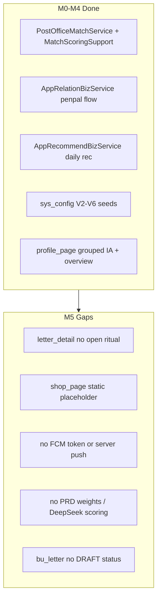
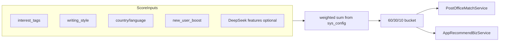

# M5 开发计划

## 范围与排除

**纳入 M5（[`PLAN.md`](PLAN.md) M5 checklist + M4 延期项）**

| 模块 | PRD | 交付要点 |
|------|-----|----------|
| 仪式 | §5.4 | 邮戳、投递动画、开信仪式；`skin_id`/`font_id` 展示 |
| 商业 MVP | §16 | 目录 + 权益 + 管理后台发放；App 模拟购买；**不含**真实 IAP |
| 配置 | §20.2 | 补齐缺失 `sys_config` 种子 + Manage 分组编辑 |
| 推送 | §11.6 | **FCM + APNs** 直连；设备 token + 事件触发 + 设置持久化 |
| 匹配 v2 | §7.3 | 可配置权重 + 60/30/10 分发；DeepSeek 语义特征（可降级） |
| §13 延期 | §13.1/§13.2 | 普通信草稿、信件收藏、PDF 导出、隐私/通知设置持久化 |

**明确排除（按你的要求）**

- Flyway 迁移链**合并/收敛/重写** — 只做增量 `V7__*.sql`、`V8__*.sql`…
- 付费邮票 / 可购买发信额度（PRD §11.5/§15.4 本期不做）
- 真实 App Store / Google Play IAP 与支付网关

---

## 现状基线（M4 已完成）



关键现有文件：
- 匹配 v1：[`MatchScoringSupport.java`](senior-post-api/biz/src/main/java/cn/nine/pros/post/biz/service/biz/support/MatchScoringSupport.java)、[`PostOfficeMatchService.java`](senior-post-api/biz/src/main/java/cn/nine/pros/post/biz/service/biz/PostOfficeMatchService.java)
- 仪式参考：[`time_letter_open_page.dart`](senior-post-flutter/lib/features/time_letter/time_letter_open_page.dart)、[`time_letter_seal_slider.dart`](senior-post-flutter/lib/features/time_letter/time_letter_seal_slider.dart)
- 商业占位：[`shop_page.dart`](senior-post-flutter/lib/features/commerce/shop_page.dart)
- 配置 CRUD：[`AdminConfigController.java`](senior-post-api/biz/src/main/java/cn/nine/pros/post/biz/controller/admin/AdminConfigController.java)、[`senior-post-manage/src/pages/config/List.tsx`](senior-post-manage/src/pages/config/List.tsx)
- DeepSeek 未接入业务：[`DeepSeekTextModerationProvider.java`](senior-post-api/biz/src/main/java/cn/nine/pros/post/biz/moderation/deepseek/DeepSeekTextModerationProvider.java) 存在但未在发信链路调用

---

## 阶段 1：Schema + 配置基座（阻塞其余）

### 1.1 Flyway 增量 — `V7__m5_commerce_prefs.sql`

**不合并历史脚本**，仅追加：

- `bu_commerce_product` — 类型 `skin|template|font|attachment|vip_bundle`；`metadata_json`（OSS 路径、预览图）
- `bu_user_entitlement` — `user_id`, `product_id`, `source`（admin_grant|mock_purchase）, `expires_at`
- `bu_letter_draft` — 普通信草稿（避免改动 `LetterBizStatus` 枚举链）：`user_id`, `content_json`, `mode`, `to_user_id?`, `updated_at`
- `bu_letter_favorite` — `user_id`, `letter_id`, 唯一约束
- `bu_user_preference` — JSON 字段：`privacy`（屏蔽推荐/拒收陌生信）、`notifications`（§11.6 各类型开关）
- `bu_user_device` 扩展：`push_token`, `push_platform`（ios|android）, `push_enabled`
- `sys_config` 种子（§20.2 缺失项）：
  - `match.score.*`（7 项权重，默认对齐 §7.3）
  - `match.distribution.high|mid|explore`（0.60/0.30/0.10）
  - `match.active_hours`（72）
  - `letter.max_length`, `letter.max_images`
  - `time_letter.free_capacity`（3）
  - `match.ai.emotion_enabled`, `match.ai.style_enabled`（默认 false，DeepSeek 就绪后开）

### 1.2 配置消费

- 扩展 [`ConfigService`](senior-post-api/biz/src/main/java/cn/nine/pros/post/biz/service/base/ConfigService.java) 读取新 key
- [`PostOfficeMatchService`](senior-post-api/biz/src/main/java/cn/nine/pros/post/biz/service/biz/PostOfficeMatchService.java) 与 [`AppRecommendBizServiceImpl`](senior-post-api/biz/src/main/java/cn/nine/pros/post/biz/service/biz/impl/AppRecommendBizServiceImpl.java) **统一**走 [`MatchScoringSupport`](senior-post-api/biz/src/main/java/cn/nine/pros/post/biz/service/biz/support/MatchScoringSupport.java)（消除 PostOfficeMatchService 内联重复打分）
- 发信/附件校验读取 `letter.max_length`、`letter.max_images`
- 时光信容量校验读取 `time_letter.free_capacity`（[`TimeLetterServiceImpl`](senior-post-api/biz/src/main/java/cn/nine/pros/post/biz/service/base/impl/TimeLetterServiceImpl.java)）

### 1.3 Manage 配置页

在 [`senior-post-manage`](senior-post-manage) 新增分组页（复用现有 `/webapi/config`）：
- `MatchConfig.tsx` — 权重 + 分发比例 + active_hours
- `LetterConfig.tsx` — 额度/长度/图片上限/时光信容量
- `CommerceProductList.tsx` — 商品 CRUD + 手动发放权益

---

## 阶段 2：商业 MVP（§16，无真实 IAP）

### 2.1 后端契约

新建 `AppCommerceApi` + `AdminCommerceApi`：

| 端点 | 用途 |
|------|------|
| `GET /api/commerce/catalog` | 商店列表（按 type 分组） |
| `GET /api/commerce/entitlements` | 我的装扮 |
| `POST /api/commerce/mock-purchase` | App 模拟购买（开发/演示；写 entitlement + 行为事件） |
| `POST /webapi/commerce/products` | 管理端商品 CRUD |
| `POST /webapi/commerce/grant` | 管理端手动发放 |

Biz 层：`AppCommerceBizService` — 校验 §16.1（不影响匹配公平）；写信时校验 `skin_id`/`font_id` 权益。

### 2.2 信件 content 扩展

- [`LetterDomain`](senior-post-api/biz/src/main/java/cn/nine/pros/post/biz/model/domain/LetterDomain.java) / `content_json` 持久化 `skin_id`, `font_id`, `template_id`（默认 `"default"`）
- Compose API 入参扩展；发信时 entitlement 校验

### 2.3 Flutter

- 改造 [`shop_page.dart`](senior-post-flutter/lib/features/commerce/shop_page.dart) → 真实 catalog + mock purchase
- 新增 `my_entitlements_page.dart`（我的装扮）
- 扩展 [`compose_flow_page.dart`](senior-post-flutter/lib/features/compose/compose_flow_page.dart) — 皮肤/模板/字体选择（免费 default + 已购项）
- [`profile_page.dart`](senior-post-flutter/lib/features/profile/profile_page.dart) 商店分组链接到新页
- [`vip_center_page.dart`](senior-post-flutter/lib/features/profile/vip_center_page.dart) 展示 VIP bundle 权益（仍从 bootstrap config + entitlement 合并）

---

## 阶段 3：§13 延期 — 草稿 / 收藏 / 导出 / 隐私

### 3.1 普通信草稿

- `AppLetterDraftApi`：`POST/GET/DELETE /api/letter-drafts`，`POST .../send` 转正式发信
- Flutter：profile「草稿箱」列表 + compose 自动/手动保存

### 3.2 信件收藏

- `POST/DELETE /api/letters/{id}/favorite`；`GET /api/letters/favorites`
- VIP 扩容：读取 entitlement 或 `vip.*` config 决定上限
- Flutter：读信页/信箱列表收藏按钮；profile「信件收藏」

### 3.3 PDF 导出（MVP）

- `POST /api/letters/export` — 同步或异步生成 PDF（Java 库如 OpenPDF/iText），上传 OSS，返回 signed URL
- 权益门控：需 `export` 类 product entitlement 或 VIP
- Flutter：profile「信件导出」选择笔友/时间范围 → 下载

### 3.4 隐私与通知持久化

- `GET/PATCH /api/profile/preferences` — privacy + notifications JSON
- 匹配/推荐读取 `reject_stranger_letters`、`hide_recommendations`（[`PostOfficeMatchService`](senior-post-api/biz/src/main/java/cn/nine/pros/post/biz/service/biz/PostOfficeMatchService.java)、[`AppRecommendBizServiceImpl`](senior-post-api/biz/src/main/java/cn/nine/pros/post/biz/service/biz/impl/AppRecommendBizServiceImpl.java) 过滤）
- Flutter：替换 [`profile_page.dart`](senior-post-flutter/lib/features/profile/profile_page.dart) 占位项；[`settings_page.dart`](senior-post-flutter/lib/features/profile/settings_page.dart) 通知开关联 API

---

## 阶段 4：仪式系统（§5.4）

**体验层 only** — 不改状态机。

### 4.1 后端 VO 扩展

信箱/读信 VO 增加 ritual bundle：
- `fromCountryName`, `toCountryName`, `postmarkLabel`
- `skinId`, `fontId`（来自 content_json）

### 4.2 Flutter 组件

新建 `features/ritual/`：
- `postmark_widget.dart` — 寄出地→送达地 + 时间 + 状态
- `letter_open_ritual_page.dart` — 拆封动画 + 分段正文展开（复用 time_letter_open 动画模式）
- `delivery_sent_animation.dart` — compose 提交成功过渡

接入点：
- [`letter_detail_page.dart`](senior-post-flutter/lib/features/mailbox/letter_detail_page.dart) — 首次进入触发开信仪式后 mark read
- [`compose_flow_page.dart`](senior-post-flutter/lib/features/compose/compose_flow_page.dart) — 提交后播放投递动画
- 读信/列表应用 `skin_id`/`font_id` 信纸样式

---

## 阶段 5：推送 FCM + APNs（§11.6）

### 5.1 Flutter

- 添加 `firebase_messaging` + iOS APNs 配置
- App 启动注册 token → `POST /api/device/push-token`
- 通知设置与 [`settings_page.dart`](senior-post-flutter/lib/features/profile/settings_page.dart) 同步
- 点击通知 deep link：`/post-office/messages`、`/mailbox`、`/letter/{id}` 等

### 5.2 后端

- `AppDeviceBizService.registerPushToken(userId, platform, token)`
- `PushNotificationService` — 封装 FCM HTTP v1（Android）+ APNs（iOS）；按 user preference 过滤
- 事件钩子（异步，不阻塞主事务）：

| 事件 | 触发点 |
|------|--------|
| 新信送达 | Letter 状态 → DELIVERED |
| 笔友请求/同意 | [`AppRelationBizServiceImpl`](senior-post-api/biz/src/main/java/cn/nine/pros/post/biz/service/biz/impl/AppRelationBizServiceImpl.java) |
| 时光信开启 | [`TimeLetterDeliveryScheduler`](senior-post-api/biz/src/main/java/cn/nine/pros/post/biz/schedule/TimeLetterDeliveryScheduler.java) |
| 审核拒绝 | [`AdminLetterAuditBizService`](senior-post-api/biz/src/main/java/cn/nine/pros/post/biz/service/biz/admin/AdminLetterAuditBizService.java) |

- Docker/配置：`application.yml` 增加 FCM service account / APNs key 占位（Manage ModerationConfig 模式可参考）

### 5.3 应用内红点

- 复用现有 provider 刷新；main shell tab badge 与 push 事件对齐（邮局关系消息、信箱未读）

---

## 阶段 6：匹配 v2 + DeepSeek 接入（§7.3）

### 6.1 加权打分重构

扩展 [`MatchScoringSupport`](senior-post-api/biz/src/main/java/cn/nine/pros/post/biz/service/biz/support/MatchScoringSupport.java)：



- 从 `sys_config` 读 7 项权重；冷启动：`match.ai.*=false` 时情绪/风格权重并入兴趣项（PRD §7.3 降级策略）
- 实现 §7.4 分发比例：候选池按 score 分档抽样

### 6.2 DeepSeek 语义特征（可选开关）

- 新建 `MatchFeatureExtractionService` — 调用 DeepSeek 提取 emotion/style 向量或标签；结果缓存 Redis（TTL 24h）
- 与审核共用 client 配置（[`ModerationProperties.Deepseek`](senior-post-api/biz/src/main/java/cn/nine/pros/post/biz/config/ModerationProperties.java)）
- **同时**将 `TextModerationProvider.auditText()` 接入 [`AppMailboxServiceImpl`](senior-post-api/biz/src/main/java/cn/nine/pros/post/biz/service/biz/impl/AppMailboxServiceImpl.java) 发信链路（§15.6 完整闭环）

---

## 验证与交付

**编译**
```powershell
cd senior-post-api
mvn -pl biz,client,server -am compile "-Dmaven.test.skip=true"
cd ../senior-post-flutter
flutter analyze lib
cd ../senior-post-manage
npm run build
```

**Docker 联调**：根目录 `.\scripts\dev-up.ps1`（API 变更后先 `mvn clean package`）

**冒烟路径**
1. Manage 改 match 权重 → 推荐/邮局匹配分数变化
2. 管理端发放皮肤 → App 装扮可见 → 写信可选 → 读信仪式展示信纸
3. mock-purchase → entitlement 写入
4. 草稿保存/发送；收藏/取消；导出 PDF 下载
5. FCM token 注册 → 模拟事件推送 → 通知设置关闭后不再推送
6. 双用户 POST_OFFICE 匹配仍不受 VIP/皮肤影响（§16.1）

**收尾**：[`PLAN.md`](PLAN.md) M5 两项改 `[x]`（**不**添加 Flyway 合并任务）

---

## 风险与决策（已确认）

| 决策 | 选择 |
|------|------|
| Flyway | **仅增量**，不合并 |
| 商业支付 | **MVP**：目录 + 权益 + 管理端发放 + App mock purchase |
| 推送 | **FCM + APNs 直连**（非 TIMPush） |
| 匹配 AI | 配置权重先行；DeepSeek 特征 + 审核 **feature flag** 控制 |
| 普通信草稿 | 独立 `bu_letter_draft` 表（避免 enum 破坏性变更） |
