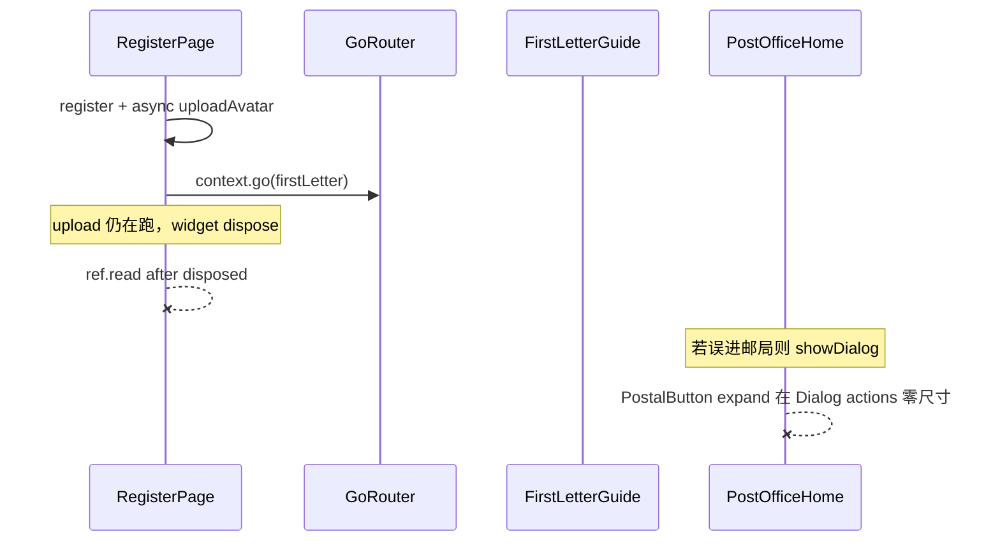

# M6 热修：注册灰屏 / 国家展示 / 写信步骤

## 问题结论

### 1. 只有国家、没有「地区」——基本正常，展示不完整

PRD §3.3 的「国家/地区」指 **ISO 3166 国家或地区码**（如 `CN`/`US`/`HK`），不是省市区下拉。后端另有可选 `city`（GPS/IP 反查写入），注册页目前只展示国家名，**城市未展示**，所以你会感觉「没有地区」。

**处理**：注册确认步与资料编辑展示只读「城市」（有则显示）；仍不提供省市区级联（首期不做）。国家继续用下拉，禁止手输。

### 2. 注册后灰屏、无操作——确认为 Bug（与额度弹窗叠加）

根因链路：

证据：
- [`register_page.dart`](senior-post-flutter/lib/features/auth/register_page.dart) `_uploadAvatarIfPossible` / `_submit` 在 `context.go` 前后仍 `ref.read`，未严格 `mounted` 守卫 → 日志 `Cannot use "ref" after the widget was disposed`
- [`post_office_home_page.dart`](senior-post-flutter/lib/features/post_office/post_office_home_page.dart) 在 `build` 的 `whenData` 里弹 **不可关闭** 额度 Dialog；[`PostalButton`](senior-post-flutter/lib/widgets/postal/postal_button.dart) 默认 `expand: true`，放在 `AlertDialog.actions` 易触发 `Cannot hit test a render box with no size` → 灰遮罩卡死
- 首封信未完成时应进 [`FirstLetterGuidePage`](senior-post-flutter/lib/features/onboarding/first_letter_guide_page.dart)；额度领取应在**进入邮局首页之后**，且不得挡住引导

**修复**：
1. 注册提交流程：先完成 register（+ 可选头像上传），全程 `if (!mounted) return`；再 `context.go`；dispose 后禁止 `ref`
2. 额度弹窗：`expand: false` 或改用 `FilledButton`；用 `WidgetsBinding` + 标志位只弹一次，且 **仅当 `firstLetterDone == true`** 时在邮局弹
3. Router：保证未完成首封信时绝不落在主壳（已有逻辑，核对 session 的 `firstLetterDone` 是否在 register 响应里正确写入）

### 3. 写信步骤顺序反了 + 缺预览

当前 [`compose_flow_page.dart`](senior-post-flutter/lib/features/compose/compose_flow_page.dart) `_rebuildSteps`：`body → mailOptions → send`。

**改为**（POST_OFFICE / DIRECT）：

`mailOptions（模板+信纸）→ body（段落正文）→ preview（信纸底色+正文预览）→ send`

- 选模板后填充段落，留在 mailOptions 或自动进 body（不回跳）
- 新增 `_ComposeStep.preview`：复用读信皮肤色 `letterSkinBackground(skinId)` + 分段正文
- 时光信：`mailOptions → body → deliveryDate → preview → seal`（预览在封存前）

---

## 实施文件

| 文件 | 改动 |
|------|------|
| [`register_page.dart`](senior-post-flutter/lib/features/auth/register_page.dart) | 异步安全；展示 city；提交后再导航 |
| [`app_session.dart`](senior-post-flutter/lib/core/session/app_session.dart) / auth 映射 | 确认 `firstLetterDone` 从注册/登录 VO 写入 |
| [`post_office_home_page.dart`](senior-post-flutter/lib/features/post_office/post_office_home_page.dart) | 额度 Dialog 布局 + 仅首封完成后弹出 |
| [`compose_flow_page.dart`](senior-post-flutter/lib/features/compose/compose_flow_page.dart) | 步骤重排 + preview 步 |
| l10n | 预览步标题、城市标签 |

后端：一般无需改；若注册响应未回 `city`/`firstLetterDone`，核对 [`AppAuthService.toPublic`](senior-post-api/biz/src/main/java/cn/nine/pros/post/biz/service/biz/AppAuthService.java)。

---

## 验证

- 新注册：无灰屏 → 首封信引导可点 → 写完进邮局 → 再弹额度领取且可点
- 注册页可见国家 +（有则）城市
- 写信：先选模板/信纸 → 再写 → 预览 → 发送

---

## 与 M7 关系

此前确认的 **M7 管理后台**（业务主体 B + 邮件追踪 C）另开里程碑计划；本热修优先合入 `feature_4.0`，不阻塞 M7 文档起草。
