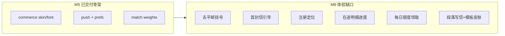

# M6 · 4.0 遗漏功能补齐

## 结论

[`PLAN.md`](PLAN.md) 将 M1–M5 标为 `[x]`，但对照 [`doc/4.0需求改版.md`](doc/4.0需求改版.md)，**仪式感与冷启动体验仍未闭环**。你点名的 8 项均成立；另有若干高置信遗漏（见下）。本里程碑定为 **M6**，执行时同步改写 [`PLAN.md`](PLAN.md)（M5 仪式项改为部分完成 + 新增 M6 checklist），**不改** PRD 正文。

---

## 你点名的 8 项（核实）

| # | 问题 | 现状 | 目标 |
|---|------|------|------|
| 1 | 平邮 / 挂号 | Flutter 仍有 Radio：[`compose_flow_page.dart`](senior-post-flutter/lib/features/compose/compose_flow_page.dart)、[`send_letter_sheet.dart`](senior-post-flutter/lib/features/directory/send_letter_sheet.dart)、[`letter_detail_page.dart`](senior-post-flutter/lib/features/mailbox/letter_detail_page.dart)；后端仍有 [`LetterPhysicalType`](senior-post-api/client/src/main/java/cn/nine/pros/post/client/common/enums/LetterPhysicalType.java) / [`LetterSendMode`](senior-post-api/client/src/main/java/cn/nine/pros/post/client/common/enums/LetterSendMode.java) | **删除 UI 选项**；发信固定 `STANDARD`；速度只由 §6.1 距离+关系决定（与 §6.2 一致） |
| 2 | 新手引导首封信 §2.8 | 仅有营销 intro [`onboarding_page.dart`](senior-post-flutter/lib/features/auth/onboarding_page.dart)；注册后无「写第一封 POST_OFFICE」 | 资料完成后强制进入引导写信（模板提示 → 寄出 → 进邮局首页） |
| 3 | 注册国家定位 §3.3 | 仅 locale 启发式 + 服务端 IP；无 GPS；注册页无失败降级手动选 | 注册：IP（已有）→ 可选 GPS 反查 → 失败则国家列表；资料可改 |
| 4 | 查找笔友能找到自己 | 目录/推荐后端已 `.ne(viewerId)`；若仍可见需排查 viewer 上下文 + **客户端兜底过滤** | 全路径不可见自己（找笔友/推荐/匹配） |
| 5 | 在途轨迹/进度 §11.4 | 有 `/post-office/in-transit` API，首页摘要却跳信箱 Tab；无相对 ETA/进度条 | 独立在途明细页：发出未达 / 收到未达 / 未读 +「约 X 小时后到达」进度 |
| 6 | 每日免费 5 次领取弹窗 | 额度自动按「今日已发」扣减，无领取仪式 | **产品覆盖 PRD 自动赠送**：注册完成/每日首次进首页强制弹窗领取，不可关闭，点领取后才可用额度 |
| 7 | 写信格式/段落 | 纯 `PostalTextField` 多行文本 | 结构化段落编辑（分段/空行控件）+ 内容模板填充，非完整富文本引擎 |
| 8 | 内置皮肤/模板 ≥2 免费 | 种子仅 `skin.default`/`font.default`；`vintage` 付费；无 `template.*`；读信页不渲染皮肤 | 至少 **2 免费皮肤 + 2 免费写信模板**；写信/读信共用信纸样式 |

---

## 额外高置信遗漏（一并纳入 M6 或标延期）

**纳入 M6（与上表强相关）**

- **§11.5 首页写信分流**：首页应二选一「寄给有缘人 / 寄给未来的自己」；现状直进 POST_OFFICE，且 compose 仍露出 DIRECT 目的地步
- **§12.6 读信页皮肤**：`skinId` 已存/已回，[`letter_detail_page.dart`](senior-post-flutter/lib/features/mailbox/letter_detail_page.dart) 未应用视觉
- **§5.4 仪式加深（与在途绑定）**：现有邮戳/开信 overlay 偏薄；在途页补路径进度动画；开信补正文分段展开
- **§7.5 / §2.8 首封信匹配优先**：保护池有，缺「高回信意愿」排序加权（规则版即可）

**明确延期（不进 M6 主交付，写入 PLAN 决策）**

- §5.2 用户时间轴整页、§5.3 完整事件流表（在途进度本期用 `sent_time`/`expected_arrival` 客户端推算）
- §4.6 图片附件上传（仅有 `letter.max_images` 配置）
- Apple 登录（PRD 可选；Google 已有）

---

## 实施阶段

### 阶段 A — 纠偏与硬伤（优先）

1. **去掉平邮/挂号**
   - Flutter：删除三处 Radio + l10n；发信/草稿/回信不再传 `letterType=1`
   - API：发送路径默认 `STANDARD`；Manage/文档不再暴露「挂号加速」语义（字段可保留兼容，UI/文案废弃）
2. **自见排查**
   - 复核 [`UserServiceImpl.pageDirectory`](senior-post-api/biz/src/main/java/cn/nine/pros/post/biz/service/base/impl/UserServiceImpl.java) 的 `viewerUserId` 是否为空
   - Flutter 目录/推荐列表按 `session.user.id` 过滤兜底
3. **注册定位**
   - API：`AppRegisterInDto` / profile patch 增加可选 `latitude`/`longitude`；反查国家（优先复用现有 Geo 能力或轻量反向地理编码）；失败回落 IP → 国家列表
   - Flutter：注册步展示自动国家；失败出国家下拉；可选请求定位权限（45+：失败不阻塞）

### 阶段 B — 冷启动仪式

4. **首封信引导 §2.8**
   - 后端：`first_letter_done`（用户偏好或 user 字段）+ 可选引导模板列表 API
   - Flutter：注册完成 → 引导页（提示文案 + 选模板）→ POST_OFFICE 发信 → 标记完成 → 邮局首页
   - 匹配：首封信额外加权高回信用户（规则：近 7 日回信率/活跃）
5. **每日额度领取弹窗**
   - 后端：`POST /api/quota/daily-claim`（幂等按用户时区日）；未领取则发信 `assertDailyQuota` 失败；首页 VO 增加 `quotaClaimedToday`
   - Flutter：注册后首次 / 每日首次进邮局 → 全屏不可关闭弹窗 → 点「领取今日 5 封」→ 刷新额度
   - Flyway 增量：`bu_daily_quota_claim` 或 preference 日标记

### 阶段 C — 在途与写信体验

6. **§11.4 在途明细页**
   - Flutter：新路由 `/post-office/in-transit`；首页摘要卡改跳此页（勿进信箱）
   - 展示三段：发出未达 / 收到未达 / 未读；相对文案「预计约 N 小时后到达」+ 进度条（`(now-sent)/(eta-sent)`）
   - 复用现有 [`AppPostOfficeApi` `/in-transit`](senior-post-api/client/src/main/java/cn/nine/pros/post/client/api/app/AppPostOfficeApi.java)，按需扩展 VO 字段（`progressRatio`、`etaRelativeHours`）
7. **写信编辑器 + 模板/皮肤**
   - Flutter：`LetterComposeEditor`——多段落 `List<String>` 编辑（加段/删段/段间空行），提交时拼为正文（保留 `\n\n`）
   - 内容模板：种子 `template.emotion` / `template.narrative`（price=0）+ 至少再一免费皮肤 `skin.linen`（或把 `skin.vintage` 改免费）
   - 写信选模板填充段落；选皮肤预览信纸；读信页按 `skinId` 渲染背景/字体
   - 首页写信分流：大按钮二选一 POST_OFFICE / SELF_TIME；DIRECT 仅从主页/笔友/回信进入

### 阶段 D — 计划文档同步（执行时必做）

8. 更新 [`PLAN.md`](PLAN.md)：
   - M5 仪式行改为「骨架已交付，体验缺口见 M6」
   - 新增 **M6 — 体验闭环补齐** checklist（上表 1–8 + 分流/读信皮肤/首封匹配）
   - §6 决策记录追加：每日额度改为「领取仪式」；平邮/挂号从产品面废弃；时间轴/事件流/图片附件延期

---

## 关键契约影响（摘要）

| 契约 | 变更 |
|------|------|
| 发信 `letterType` | 客户端停发挂号；服务端忽略/强制 STANDARD |
| 注册/资料 | 可选 lat/lng；返回解析后的 country |
| 额度 | 新增 claim API + home `quotaClaimedToday` |
| 在途 | VO 增加相对 ETA/进度；Flutter 新页 |
| 模板/皮肤 | V9+ seed 免费 template×2、skin×2；compose/read 消费 |
| 首封信 | `firstLetterDone` 标志 |

---

## 验证

- 注册 → 定位国家 → 领取额度 → 首封信 → 在途页可见进度
- 找笔友/推荐列表不含自己；写信无平邮/挂号
- 两套免费皮肤/模板可选；读信页样式可见
- `mvn compile` + `flutter analyze`；API 经 `scripts/dev-up.ps1` 重建
