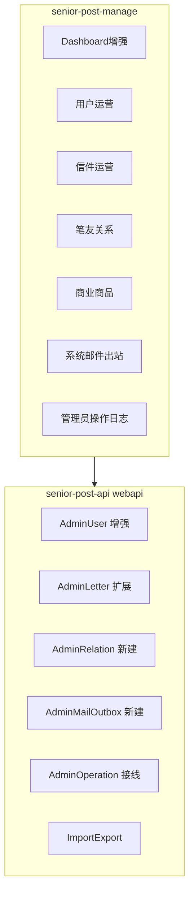

# M7 · 管理后台运营能力补齐

## 范围锁定（已确认）

| 维度 | 决策 |
|------|------|
| 业务主体 | **用户 + 信件 + 笔友关系 + 商业商品**；后续实体按同一列表规范追加 |
| 邮件追踪 | **系统邮件**（`sys_mail_outbox`）+ **用户信件**（`bu_letter` 运营/审核） |
| 不做 | App 端改版；Flyway 迁移链合并（仍属上线前窗口）；真实 IAP |

---

## 现状基线（为何要做）

- Manage 已有：看板四计数、用户列表（筛选弱）、时光信审核、举报、配置、行为/登录日志、商业商品 CRUD
- **缺口**：普通信件审核 API（[`AdminLetterAuditApi`](senior-post-api/client/src/main/java/cn/nine/pros/post/client/api/admin/AdminLetterAuditApi.java)）**无 Manage 页面**；无笔友运营页；无 `sys_mail_outbox` 查询；用户国家等仍手输；无导入导出；`log_admin_operation` 表存在但**无写入/无 `/webapi`**；列表普遍缺真实分页/排序/批量

---

## 阶段 0 — 管理端列表规范（阻塞其余 UI）

在 [`senior-post-manage`](senior-post-manage) 抽公共能力（不重造业务）：

- `components/admin/AdminProTable.tsx`：统一 `page/size`、服务端排序、多选批量、筛选表单区
- `components/admin/EnumSelect.tsx`：性别/状态/国家/信件 mode·status·auditStatus/商品类型等 **禁止 Input 手输**
- `utils/exportDownload.ts`：触发后端导出文件下载
- 布局：沿用 Ant Design Layout；表格区 `scroll.x` + 筛选折叠，保证窄屏可用（响应式基线）

后续所有运营页必须走该规范。

---

## 阶段 1 — 业务主体运营

### 1.1 用户（强化现有 [`user/List.tsx`](senior-post-manage/src/pages/user/List.tsx)）

**后端**（扩展 [`UserQueryInDto`](senior-post-api/client/src/main/java/cn/nine/pros/post/client/model/input/admin/UserQueryInDto.java) / [`AdminUserBizService`](senior-post-api/biz/src/main/java/cn/nine/pros/post/biz/service/biz/admin/AdminUserBizService.java)）：

- 筛选：邮箱/昵称模糊、status、gender、countryCode、birthYear 区间、isVip、avatarAuditStatus、注册/登录时间范围
- 排序：`createdAt` / `lastLoginAt` / `id`
- 批量：批量改 status（封禁/解封）
- 编辑：`countryCode` 改为国家下拉（复用 [`AdminCountryApi`](senior-post-api/client/src/main/java/cn/nine/pros/post/client/api/admin/AdminCountryApi.java) 列表）；gender/status Select；接通 VIP debug UI
- 导入/导出：CSV（必做）+ Excel（`.xlsx`，后端 EasyExcel 或 Apache POI；若依赖过重则 Manage 侧 `xlsx` 解析后调批量 save API）

**前端**：真实分页；多维筛选；枚举全 Select；导出按钮；导入 Modal。

### 1.2 信件运营（新建 Manage 页 + 扩展 API）

- **接线已有审核**：新页 `/content/letter` → 调用 `/webapi/letter-audit/paging|approve|reject`
- **扩展为运营列表**（在 audit 之上增加字段/筛选，可新建 `AdminLetterApi` 或扩展 audit query）：
  - 展示：id、from/to、mode、status、auditStatus、expected/actual arrival、preview、skinId
  - 筛选：收发用户 ID/昵称、mode、status、auditStatus、创建/送达时间范围、正文关键词
  - 详情 Drawer：完整正文 + content_meta + 状态时间线（created/matched/delivering/delivered/read）
  - 批量：批量通过/拒绝审核（有权限的操作）
  - 导出：当前筛选结果 CSV/Excel

### 1.3 笔友关系（新建）

- 后端新建 `AdminRelationApi`：`/webapi/relation/paging`（基于 `bu_friendship` + 可选 pending `penpal_request`）
- 筛选：userId、peerId、状态（笔友/申请中）、建立时间范围
- 操作：强制解除笔友（写操作日志）；查看往来封数
- Manage 页：`/relation/penpal`

### 1.4 商业商品（强化现有 [`CommerceProductList.tsx`](senior-post-manage/src/pages/config/CommerceProductList.tsx)）

- `productType` 改为 EnumSelect（skin/font/template/export/vip_bundle）
- 真实分页/排序；按 type/status/price 筛选；导出目录 CSV
- 批量上下架（status）

---

## 阶段 2 — 双轨邮件追踪

### 2.1 系统邮件出站（`sys_mail_outbox`）

- 新建 `AdminMailOutboxApi`：`/webapi/mail-outbox/paging`、`GET /{id}`（预览 payload）
- 状态映射展示：`pending`→待发送、`sending`→发送中、`sent`→已发送、`failed`→发送失败（与现有调度字段对齐；无「已读」则 UI 不展示该态）
- 筛选：toEmail、mailType、status、创建时间范围、关键词（payload/主题字段）
- Manage 页：`/mail/outbox`；详情 Drawer 展示 payload_json、attempts、last_error、next_retry_at
- 可选运维动作：失败重试（重置 status/next_retry_at）— 纳入本里程碑

### 2.2 用户信件追踪

- 与 1.2 同一「信件运营」模块承载状态追踪（PENDING/MATCHED/DELIVERING/DELIVERED/READ/REJECTED 等）
- 列表 Tag 色标 + 详情时间线；与系统邮件菜单分组区分：「内容运营 / 信件」vs「系统 / 出站邮件」

---

## 阶段 3 — 通用能力

### 3.1 分页 / 排序 / 批量

所有 M7 新改列表统一 `PageQuery` + `PageData`；禁止再写死 `size: 50` + `pagination={false}`（存量页在本里程碑一并改完：用户、日志、举报、配置列表）。

### 3.2 管理员操作日志

- 接线已有 [`log_admin_operation`](senior-post-api) / `AdminOperationDomain`
- 新建 `AdminOperationLogApi`：`/webapi/log/admin-operation/paging`
- 在 Biz 关键写路径埋点：用户改状态/删、信件审核、笔友解除、商品上下架、邮件重试、导入批次
- Manage：`/log/admin-operation`（与现有 action/login 并列）

### 3.3 仪表盘增强

扩展 [`AdminDashboardBizService.summary`](senior-post-api/biz/src/main/java/cn/nine/pros/post/biz/service/biz/admin/AdminDashboardBizService.java) + [`Dashboard.tsx`](senior-post-manage/src/pages/Dashboard.tsx)：

- 今日新增用户 / 今日发信 / 在途信件 / 待审信件 / 待处理举报 / 系统邮件失败数 / 笔友对数
- 近 7 日简易折线（Ant Design Charts 或 recharts；仅管理端）

### 3.4 响应式

AdminLayout 侧栏可折叠；表格横向滚动；筛选表单 `xl/md/sm` 栅格；不单独做移动端 App 级适配。

---

## 阶段 4 — 文档与计划同步（交付必做）

1. 更新 [`PLAN.md`](PLAN.md)：新增 **M7 — 管理后台运营** checklist（上表阶段）；决策记录写入范围 B+C
2. 更新 [`doc/4.0需求改版.md`](doc/4.0需求改版.md)：新增 **§21 管理后台运营**（或 §20.3）：主体列表、双轨邮件、导入导出、操作日志、看板指标；与实现字段对齐
3. 产出 `.cursor/plans/m7_管理后台运营_*.plan.md` 作为执行真源（本计划确认后落盘）

**里程碑节奏（交付物节点）**

| 周次 | 交付物 |
|------|--------|
| W1 | 列表规范 + 用户强化 + 信件审核页接线 |
| W2 | 信件运营扩展 + 系统邮件出站 + 笔友页 |
| W3 | 商业强化 + 导入导出 + 操作日志埋点 |
| W4 | 看板增强 + 存量页分页改造 + PLAN/PRD 回写 + 冒烟验收 |

---

## 关键契约（摘要）

| 新增/扩展 | 说明 |
|-----------|------|
| UserQuery 扩展字段 | gender/country/age/vip/时间范围/sort |
| Letter 运营 query | 超出现有 audit 的筛选与详情 VO |
| `AdminRelationApi` | 笔友分页与解除 |
| `AdminMailOutboxApi` | 出站邮件分页/详情/重试 |
| `AdminOperationLogApi` | 管理员操作分页 |
| Dashboard summary | 新增指标 + 7 日序列 |
| Import/Export | 用户/信件/商品 CSV+XLSX |

分层强制：Controller → BizService → IService；注释与关键路径日志按仓库规范。

---

## 验证

- `mvn -pl biz,client -am compile`；Manage `npm run build`
- 冒烟：用户多维筛选→编辑下拉→导出；信件审核通过/拒绝；出站邮件失败重试；笔友列表；看板新指标；操作日志有写入
- API 经 `scripts/dev-up.ps1` 重建后验收
