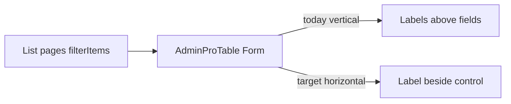

# Manage 查询条件区紧凑化

## 问题根因

当前筛选几乎都走 `[AdminProTable.tsx](senior-post-manage/src/components/admin/AdminProTable.tsx)`：`layout="vertical"` 导致 **label 独占一行**，再叠加 `Col lg={6}` 与默认 `Form.Item` 下边距，用户列表约 11 个条件可占满约 3 行高度，表格可视区被挤压。

## 范围（已定）

- **改公共壳**：一次覆盖所有使用 `filterForm`/`filterItems` 的页（用户、信件、出站邮件、笔友、商业、操作日志）。
- **同步改各页 Col/控件宽度**，去掉不必要的拉满。
- **不改**：弹窗/Drawer 内编辑表单（仍用 `layout="vertical"`）；无筛选的列表；已较紧凑的 `[CountryList](senior-post-manage/src/pages/config/CountryList.tsx)` `.filter-bar`（本轮不动）。

## 方案

### 1. 公共壳：`[AdminProTable.tsx](senior-post-manage/src/components/admin/AdminProTable.tsx)`

- Form 改为 `layout="horizontal"` + `size="small"`。
- `labelCol={{ flex: '0 0 auto' }}`，`wrapperCol={{ flex: 1 }}`，`colon={false}`，使 **label 与控件同一行**。
- Row：`gutter={[12, 8]}`；查询/重置 Col 改为垂直居中对齐（`alignItems: 'center'`），不再按 vertical 的 `flex-end`。
- 根节点加 class：`admin-filter-form`，便于统一压边距。

### 2. 样式：`[index.css](senior-post-manage/src/index.css)`

新增紧凑规则（仅作用于筛选区，不影响弹窗）：

- `.admin-filter-form .ant-form-item { margin-bottom: 8px; }`
- `.admin-filter-form .ant-form-item-label { padding: 0 8px 0 0; }`
- 小屏（`max-width: 576px`）允许 label 仍同行但控件可换行占满，避免挤爆。

### 3. 统一栅格约定（各页 `filterItems`）

| 控件类型                 | Col 建议                                  | 控件宽度                                |
| -------------------- | --------------------------------------- | ----------------------------------- |
| 短 Select / Enum / 数字 | `xs={24} sm={12} md={8} lg={6} xl={4}`  | 默认填满 Col，不再额外 `width: 100%` 以外的拉长   |
| 文本模糊（邮箱/昵称/关键词）      | 同上或 `xl={5}`                            | `allowClear`，无固定超长 `style`          |
| RangePicker          | `xs={24} sm={24} md={12} lg={8} xl={6}` | `style={{ width: '100%' }}`（日期需要宽度） |

导出可选小工具（同文件或 `components/admin/filterCol.tsx`）：`FilterCol` 包装默认 span，减少各页复制；若嫌多文件，则在各页直接改 Col props。

### 4. 用户列表「逻辑分组 + 折叠」

`[user/List.tsx](senior-post-manage/src/pages/user/List.tsx)` 条件最多，仅靠同行仍可能 2～3 行：

- **默认可见**：邮箱、昵称、状态、性别、国家 + 查询/重置。
- **更多筛选**（`Collapse`/`Button` 展开，默认收起）：出生年区间、VIP、头像审核、注册/登录时间。
- 展开后仍走同一 `filterForm`；重置清空全部字段；查询功能完整保留。
- 分组标题用简短文案（如「更多筛选」），维持信息层级。

其余页字段 ≤6，仅改水平布局 + Col，**不做折叠**。

### 5. 涉及文件

| 文件                                                                                        | 改动                           |
| ----------------------------------------------------------------------------------------- | ---------------------------- |
| `[AdminProTable.tsx](senior-post-manage/src/components/admin/AdminProTable.tsx)`          | horizontal + compact + class |
| `[index.css](senior-post-manage/src/index.css)`                                           | `.admin-filter-form`         |
| `[user/List.tsx](senior-post-manage/src/pages/user/List.tsx)`                             | Col + 更多筛选折叠                 |
| `[LetterList.tsx](senior-post-manage/src/pages/content/LetterList.tsx)`                   | Col 收紧                       |
| `[OutboxList.tsx](senior-post-manage/src/pages/mail/OutboxList.tsx)`                      | Col 收紧                       |
| `[PenpalList.tsx](senior-post-manage/src/pages/relation/PenpalList.tsx)`                  | Col 收紧                       |
| `[CommerceProductList.tsx](senior-post-manage/src/pages/config/CommerceProductList.tsx)`  | Col 收紧                       |
| `[AdminOperationLogList.tsx](senior-post-manage/src/pages/log/AdminOperationLogList.tsx)` | Col 收紧                       |

无后端 / API 变更。

## 验收

- 桌面宽屏：用户列表默认筛选约 **1 行**；展开后条件仍完整可用。
- 信件/出站等：筛选区高度明显低于现状（label 不再独占行）。
- `sm`/`xs`：条件换行可读，查询/重置可点。
- `npm run build`（manage）通过；查询/重置行为与现网一致。

