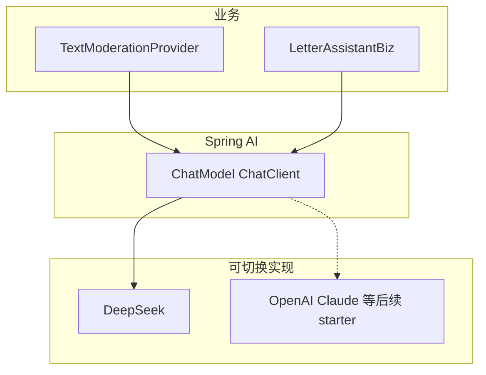

# 写信桌 + 全站 LLM 走 Spring AI

## 总原则


| 类型                                   | 接入方式                                           |
| ------------------------------------ | ---------------------------------------------- |
| **LLM 对话生成**（文本审核提示、信件助手润色，以及今后同类能力） | **一律 Spring AI**（`ChatModel` / `ChatClient`）   |
| **百度图像审核**                           | 继续 Baidu AIP SDK（非 Chat 补全，不硬套 Spring AI Chat） |


禁止再新增 `RestClient` 直打 `/v1/chat/completions`。现有 `[DeepSeekTextModerationProvider](senior-post-api/biz/src/main/java/cn/nine/pros/post/biz/moderation/deepseek/DeepSeekTextModerationProvider.java)` 一并迁到 Spring AI。




---

## A. Spring AI 基础设施

### 依赖

在 `[senior-post-api/pom.xml](senior-post-api/pom.xml)` 引入 BOM；`[biz/pom.xml](senior-post-api/biz/pom.xml)` 增加：

- `org.springframework.ai:spring-ai-starter-model-deepseek`（官方 DeepSeek Chat 自动配置）
- 版本由 `spring-ai-bom` 锁定（实现时选与当前 Boot 3 兼容的稳定版，如 1.0.x / 1.1.x Central 已发布版本）

### 配置（唯一 LLM 凭证源）

以 `**spring.ai.deepseek.***` 为准（与 [Spring AI DeepSeek 文档](https://docs.spring.io/spring-ai/reference/api/chat/deepseek-v4-flash.html) 对齐）：

```yaml
spring:
  ai:
    model:
      chat: deepseek
    deepseek:
      api-key: ${SPRING_AI_DEEPSEEK_API_KEY:${MODERATION_DEEPSEEK_API_KEY:}}
      base-url: ${SPRING_AI_DEEPSEEK_BASE_URL:https://api.deepseek.com}
      chat:
        options:
          model: ${SPRING_AI_DEEPSEEK_MODEL:deepseek-v4-flash}
          temperature: 0.7
```

- 本地可继续读旧 env `MODERATION_DEEPSEEK_*` 作 fallback，减少一次改密钥成本。
- `senior-post.moderation.deepseek`：逐步收缩为「是否启用文本机审」开关 + 管理端「凭证就绪」探测；**不再**自建 RestClient。就绪判断改为：`spring.ai.deepseek.api-key` 非空（或 `ChatModel` Bean 存在）。
- api-key 为空：不装配可用 Chat 调用；审核继续走现有 `NoOpTextModerationProvider`；信件助手返回「暂不可用」。

### 业务封装

- 注入便携 API：`ChatModel` 或 `ChatClient.create(chatModel)`，**不要**业务代码依赖 `DeepSeekChatModel` 具体类（方便日后 `spring.ai.model.chat=openai` 等切换）。
- 可放 `cn.nine.pros.post.biz.ai`：`LetterAssistantService`、审核侧只改 Provider 实现。

---

## B. 迁移：DeepSeek 文本审核 → Spring AI

保留接口 `[TextModerationProvider](senior-post-api/biz/src/main/java/cn/nine/pros/post/biz/moderation/TextModerationProvider.java)` 与 JSON 判定契约。

改写 `DeepSeekTextModerationProvider`：

- 用 `ChatClient` / `ChatModel.call(Prompt)` 发 system + user（原 system prompt 与 JSON 解析逻辑保留）
- 删除手写 `RestClient`、`DeepSeekModerationResultDto.ChatCompletionRequest` 拼装（若 DTO 仅服务 HTTP，可收拢为响应解析）
- `@ConditionalOn*`：有 api-key + ChatModel 时启用；否则 NoOp

百度图像审核、补偿任务链路不动。

---

## C. 产品：写信桌文案 / 底栏 / 信件助手

### 文案


| 位置       | 改为                           |
| -------- | ---------------------------- |
| 顶栏右侧     | **预览**                       |
| 收件人      | **有缘人** / **未来的自己** / **笔友** |
| Sheet 标题 | **寄给谁**                      |


### 底栏

去掉剩余额度。三等分：`[ 信纸 ] [ 信件助手 ] [ 寄出 ]`

### 信件助手原则

- 统一入口，主动召唤；默认不介入  
- **不静默覆盖**；对照「你写的 / 助手整理的」  
- 动作：**替换原文**（可撤销）/ **保留原文** / **继续修改**  
- 帮助模式：更有感情 / 更自然 / 扩展故事 / 检查礼貌 / 翻译 / 自定义

### API

`POST /api/mailbox/letters/letter-assistant`

- In：`sourceText`、`helpMode`、`customInstruction?`、`targetLang?`  
- Out：`suggestion`  
- 实现：Biz → `LetterAssistantService` → **Spring AI** Prompt（按 mode 选 system 文案）→ `suggestion`  
- 无模型：业务错误，前端 Snack

回信框同迭代挂同一 Sheet + API。

---

## D. 后续扩展（本迭代只留钩子，不实现）

换模型时优先改 `spring.ai.model.chat` + 对应 starter，业务仍只调 `ChatModel`。审核与助手共用同一 Chat 抽象，仅 Prompt 不同。

---

## E. 明确不做

- 新功能继续手写 DeepSeek HTTP  
- 把百度图像审核硬改成 Spring AI Chat  
- 流式输出、自动寄出、助手默认改稿  
- 本迭代大改管理端审核 UI（仅凭证就绪逻辑对齐新配置）

