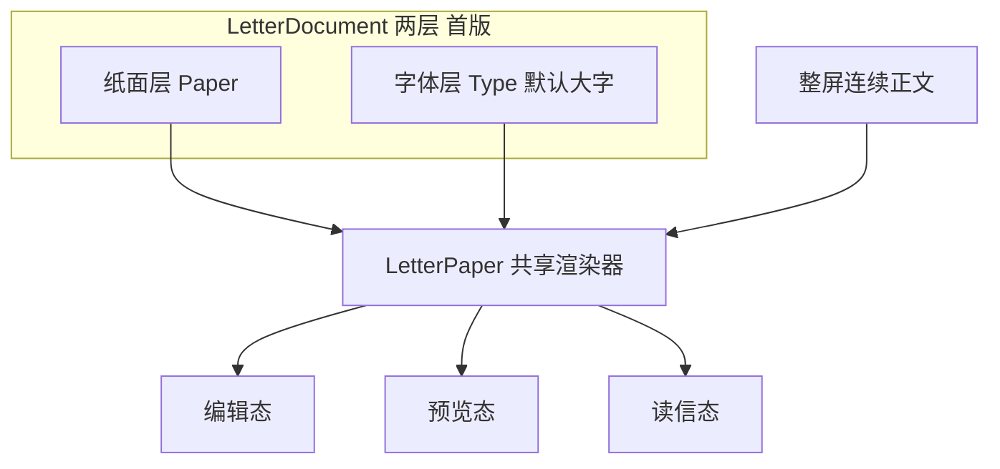

# 写信 + 读信：核心体验设计探讨（暂不实现）

## 市面对标调研（站在巨人肩膀上）

市面上「写信」其实分成三条赛道，别混着抄：

| 赛道 | 代表 | 他们赢在哪 | 和我们的关系 |
|------|------|------------|--------------|
| 慢社交笔友 | [Slowly](https://slowly.app/cn/)、[Lettre](https://www.lettre.app/)、[CornerLetter](https://apps.apple.com/us/app/cornerletter-slow-pen-pals/id6745135884) | 等待/邮票/信纸物化感 | 最接近「邮局社交」 |
| 时光封存 | [给未来写封信](https://www.to-future.net/)、SlowMail 类 | 折信入封、开信仪式、照片语音 | 最接近「时光信」 |
| 日记文档 | [Day One](https://dayoneapp.com/)、Journey | 写读一致、图文流、排版克制 | 最接近「怎么控格式」 |

### 1. Slowly — 慢邮局的教科书（但编辑器不是长板）

- **可抄：** 距离/时间延迟当产品本身；寄信必须贴邮票；集邮册 = 社交成就 + 商业化；匿名笔名头像降低社交压力。
- **不必抄：** 正文基本是长文输入，**格式深度不是他们的护城河**。用户记住的是「等信 + 集邮」，不是排版控件。
- **对我们：** 额度、在途、邮戳、邮票已经在气质上对齐；缺的是信纸文档层。

### 2. Lettre.app — 「做一封信」最强（工艺感）

- **可抄：** 写信 = 选信纸/信封/贴纸/笔触/邮票的 **工艺流程**；虚拟邮局与收藏驱动回访；一屏就是纸，不是向导。
- **用户真实吐槽（值得听）：** notes 式正文偏弱，有人用 Procreate 画好再贴上；**纸张长度有上限**被骂——说明「写得够长」比「工具多」更重要。
- **对我们：** 「格式」在用户心里往往 = **纸面装饰层**，不是 Word。但我们若还要「回忆信插图」，要补 Day One 那条图文流，不能只做贴纸。

### 3. CornerLetter — 写读沉浸的新锐

- **可抄：** 手写/纸背景、竖向翻页读信、自定义邮票、开信动效打磨。
- **对我们：** 读信分页/沉浸可后期学；手写笔迹对适老与跨端成本高，不宜当第一完整版主路径。

### 4. 给未来写封信 — 国内仪式感标杆

- **可抄：** 打开信纸动画、折信入封、火漆/封存、干净中文字体、照片+语音进信；评论里反复提的是 **「发出去起鸡皮疙瘩」**，不是工具栏。
- **不必抄：** 它主打时空胶囊，不是笔友匹配；编辑器通常偏克制。
- **对我们：** 时光信短仪式应对标这里；普通社交信对标 Slowly/Lettre。

### 5. Day One — 「写读一致」的标杆（文档层）

- **可抄：** 一篇日记 = 一个文档；照片嵌在文流里；读出来和写时一样；排版能力克制但 **质感压过 Journey 那种控件堆砌**。
- **不必抄：** 日记元数据（天气/地图/Health）、多本日记体系。
- **对我们：** 这是回答「怎么控格式」的关键参照——**共享渲染器 + 图文块**，而不是多段落输入框或完整 Word。

### 从调研直接导出的产品原则

1. **好产品几乎都没有「四步写信向导」** — 壳是一张纸；收件人/邮票/仪式是纸外动作。
2. **用户感知的「格式」= 纸面物化（信纸、字体、邮票、贴纸、插图）> 加粗斜体对齐。**
3. **写读必须同构** — Day One 赢在这里；我们现在输在这里。
4. **仪式与收藏可商业化** — Slowly/Lettre 用邮票信纸；我们已有 skin/font 商品，应接到真正渲染上。
5. **别学错：** 专业公文 Letter App、控件过重的 Journey 式编辑器、手写为主的 Lettre 路径（适老/Android/Web 成本高）。

### 建议我们「站在巨人肩膀上」的组合拳

```text
壳与节奏     ← Slowly（额度/在途/邮票感）+ 你的单页写信桌
纸面工艺     ← Lettre（skin/字体/装饰，克制贴纸）
时光仪式     ← 给未来写封信（封存/开信，不做成五步）
文档与格式   ← Day One 的写读同构（首版先纯正文；插图后期再学文中嵌图）
明确不做首版 ← Word 富文本、多框段落、手写、插图
```

---

## 45+ 适老复审：对标要打折，方案要改口

行业标杆大多面向 **年轻笔友 / 文具爱好者 / 日记极客**。Slowly、Lettre 的「集邮、贴纸、笔触、手写」在 20～35 岁是乐趣，在 **45+（本产品主用户）** 上很容易变成负担。下面按适老重新校准。

### 这个人群写信时真正在意什么

| 优先级 | 诉求 | 产品含义 |
|--------|------|----------|
| P0 | 字看得清、点得准 | 默认大字号、大热区、高对比 |
| P0 | 写完心里有底 | **预览≈读信**；寄出前确认「对方看到的就是这样」 |
| P0 | 流程不绕 | 一张纸写完就寄；少模式、少步骤 |
| P1 | 能放照片讲故事 | **后期**再加插图；首版先整屏写稳 |
| P1 | 信纸好看但不折腾 | 3～5 种纸色 + 2～3 种清晰字体即可 |
| P2 | 仪式感动人 | 开信/封存要慢、要大、要一次做完 |
| 低 | 集邮游戏、贴纸自由摆放、手写笔迹 | 可后期，不能挡主路径 |

### 对标「打折」清单（必看）

| 来源 | 年轻人版本 | 45+ 调整 |
|------|------------|----------|
| Slowly 邮票 | 寄信必贴、上千枚收藏 | **不要做成寄信门槛**；邮戳/额度已够「邮局感」。集邮若做，放商城/成就，勿塞进写信主路径 |
| Lettre 工艺台 | 贴纸、多笔触、手写、一页纸上限 | **不做手写主路径**；不做自由拖拽贴纸；正文长度要够写；装饰收敛为「选信纸/选字体」 |
| CornerLetter 手写翻页 | 沉浸强 | 手写后置；读信以 **大字连续滚动** 为主，分页可选后期 |
| 给未来写封信 | 折信动画很强 | **保留仪式**，但动画可跳过、控件要大；封存一步完成 |
| Day One 文档 | 克制富文本 + 图文流 | **文档模型照抄**；默认字号比日记 App 更大；工具更少 |

### 对前序方案的具体改口

**1. 字号从「可选项」升级为「默认就是大」**

- 写信/读信默认用 **大** 档；设置里再给「更大」
- `fontId` 只提供 **高可读** 字体（清晰黑体 / 温和但够粗的楷感）；花式手写体不做默认、甚至首版不上
- 行距 ≥ 1.6；段间距明显；信纸上左右边距加宽，方便老花眼扫读

**2. L4 行内「强调」——首版砍掉**

- 选中文字再点加粗，对 45+ 发现成本高、误触多
- 完整版格式曾规划 L1+L2+L3；**首版修订为仅 L1+L2**（插图后置）
- 情绪表达靠用词；照片能力后期再加

**3. 工具条：少而大**

- 底栏主入口：`信纸` → 半屏设纸色/字体/字号（大色块 ≥ 44pt，带名称）
- **首版无「照片」**（对标 Slowly）

**4. 题材 Chip：减数量、增字号**

- 最多 3～4 个；字号加大；点选注入可改提示语

**5. 插图：首版不做（已修订）**

- 对标 Slowly 整屏输入；先把写读同构与大字做稳
- 后期再加限张插图

**6. 预览：适老下更重要**

- 顶栏「预览」保留，文案可改为 **「看看对方看到的」**
- 寄出前二次确认可用同一渲染缩略/全屏，减少误发焦虑
- 预览页字号与读信完全一致（写读同构的硬验收）

**7. 收件人切换：文案直白，少隐喻**

- 「寄给有缘人 ▾」对产品熟悉者好，新人可能懵  
- Sheet 内用完整句子大行：`寄给有缘人（邮局匹配）` / `寄给笔友某某` / `寄给未来的自己`  
- 不要用仅图标区分类型

**8. 仪式动效：美，但可跳过、勿挡操作**

- 开信/封存动画保留「起鸡皮疙瘩」，提供 **跳过** 或短时长
- 封存滑条要够宽够高；失败态文案大而清楚

**9. 对比度与纸色安全**

- 深色纸 + 深色字禁止；每套 skin 必须绑定「正文色」
- 低视力模式优先保证对比，其次才是「像真纸」

**10. 明确更不该抄的（45+ 加重）**

- 寄信强制选邮票  
- 手写 / Apple Pencil 路径  
- 贴纸自由画布  
- 多步骤向导 + 进度 `2/5`  
- 小图标工具海、长按才出现的隐藏手势  

### 适老校准后的「完整丰富版」边界

```text
必做（首版）
  · 单页写信桌 + 整屏连续输入（对标 Slowly）
  · LetterPaper 写/预览/读三态同构
  · 信纸设置半屏：纸色 + 可读字体 + 字号（默认「大」）
  · 首次强制预览一次
  · 时光信：一步封存仪式（可跳过动画）

首版不做
  · 文中插图
  · 行内加粗/斜体/对齐
  · 手写笔迹、自由贴纸
  · 强制邮票、复杂集邮主路径
  · 多段落输入框

后期可做
  · 插图（限 3 张）
  · 邮票收藏（非寄信门槛）
  · 语音朗读来信 / 语音转写辅助写信
  · 更丰富信纸纹理（仍绑定正文色）
```

---

## 为什么现在改「页面布局」不够

核心不是「四步不好看」，而是 **格式没有真正被产品化**：

| 今天 | 问题 |
|------|------|
| 写信：多段落输入框 + `\n\n` | 像填表，用户以为在「设格式」，实际只是拆字段 |
| 预览：按空行拆段 | 与读信不一致 |
| 读信：整段 `Text(body)` | 写的节奏感在读时消失 |
| `skinId` 只改纸色 | 氛围层极薄 |
| `fontId` 已有字段 | **写读都未应用** |
| 附件/插图 | 契约几乎没有，商城有 ATTACHMENT 类型但信体不承载 |

结论：**写与读必须共用同一套「信件文档」渲染**。否则「控格式」永远虚。你的单页稿是好的壳，但里面要装的是文档模型，不是更好看的 TextField。

---

## 产品命题

这不是 IM 输入框，也不是 Word。目标气质：

> 在一张真实信纸上写信；对方打开时，看到的就是你写时的那张纸。

差异化记忆点应是：**开信仪式 + 信纸质感 + 写读像素级一致**，不是功能菜单多少。

---

## 推荐：四层格式模型（比「富文本 / 纯文本」二分更准）



### L1 纸面层（必做，已有一半）

- skin：色 / 纹理 / 边距（现 `skinId` 升级为完整 token，不只 `backgroundColor`）
- 信封壳、邮戳继续做「读信仪式」，编辑态可弱化

### L2 字体层（必做；45+ 下权重最高）

- `fontId` → **高可读** 字体（清晰黑体优先；花式手写体首版不上或不当默认）
- 字号：**默认「大」**，另提供「更大」；写读同步
- 行距 ≥ 1.6；段距与左右边距偏宽

### L3 块层 / 插图（对标 Slowly 后：首版不做）

Slowly 写信是整屏输入、无插图；45+ 也更适合先把「写得顺、读得清」做稳。

- 首版：**单一连续正文输入**（回车分段即可），无文中插图、无块编辑器
- 插图（限 3 张等）留作后期增强，不挡主路径
- **禁止**多 TextField 段落管理器

### L4 行内层（首版砍掉）

选区加粗发现成本高。首版格式停在 **L1–L2 + 整屏正文**。

---

## 交互壳：适老版单页写信桌

对标 Slowly「整屏写」+ 我们的信纸物化：

- 中央：**整屏连续输入框**（信纸背景），不是多段表单
- 底栏主入口：`信纸`（半屏：纸色/字体/字号）；**首版无「照片」按钮**
- 题材 Chip ≤ 4，字号加大；点选注入可改提示语
- 预览文案偏确认感（如「看看对方看到的」）；写读同构硬验收
- **首次写信强制进入预览一次**（本地标记，之后可直接寄；顶栏仍可随时预览）
- 收件人 Sheet 用完整句子，少隐喻
- 时光信：寄出后一步封存；动画可跳过；滑条够大
- 纸色必须绑定正文色，禁止低对比

---

## 技术契约（讨论用）

```text
content          → 纯文本正文（审核/搜索/展示同源）
content_meta     → paper + type（skinId / fontId / fontSizeTier）
```

- 写/预览/读同一 `LetterPaper`
- 旧信纯 `content` 兼容
- **首版不扩展图片附件字段**；后期再加 blocks/images
- 编辑器用大号多行 TextField 即可，不上块编辑/Quill

---

## 明确反对

1. 多段落输入框冒充格式  
2. Word/Notion 级富文本  
3. 只美化写信壳、读信仍扁 `Text`  
4. 把 Slowly/Lettre 的集邮贴纸手写当主路径  
5. **（修订）首版强上插图** — 先对齐 Slowly 的整屏写

---

## 首版范围（已锁）

**必做：** LetterPaper 三态同构 · 默认「大」字号 · 信纸半屏设置 · 整屏正文 · 首次强制预览 · 单页壳 · 时光信一步封存  

**首版不做：** 文中插图 · L4 行内样式 · 手写 · 自由贴纸 · 强制邮票  

**后期：** 插图（限 3 张）、集邮成就、语音朗读/转写、更丰富纹理

---

## 已拍板（2026-07-13，含修订）

| 议题 | 决定 |
|------|------|
| 插图 | **首版不做**（对标 Slowly 整屏输入；后期再加） |
| 默认字号 | **「大」**（另提供「更大」） |
| 首次预览 | **强制一次**（首次写信寄出前必须看过预览；之后可不强制） |
| 编辑形态 | **整屏连续输入**，非多段落框、非块编辑 |

产品首版边界已锁。下一步：写 `LetterDocument`/写信桌可开发规格，再开实现。
