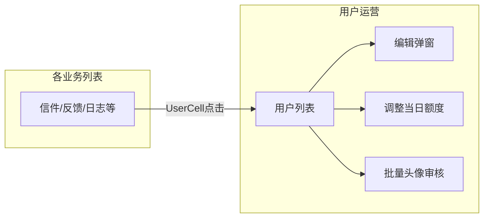

# 管理后台列表与免费额度运营增强

## 已锁定决策

- **邮票**：仅管理「每日免费发信额度」（展示已领/剩余，管理员可调当日剩余）；可购买邮票本轮不做。
- **用户详情**：不新建 `/user/:id`；列表点击「头像+昵称」→ 跳转 `/user?edit={id}`，由用户列表打开现有编辑弹窗。

## 目标流程

## 1. 用户列表字段扩展 + 头像批量审核

**前端** [`senior-post-manage/src/pages/user/List.tsx`](senior-post-manage/src/pages/user/List.tsx)

- 在现有列基础上增加（`UserDTO` 已有字段，无需新 list API）：性别、出生年、城市、邮箱已验证、首封信完成、注册时间、最后登录、**今日额度**（已领/已用/剩余，见 §2）。
- 工具栏在「批量封禁/解封」旁增加：**批量通过头像**、**批量驳回头像**（勾选行）。

**后端**（对齐信件批量审核模式）

- [`AdminUserApi`](senior-post-api/client/src/main/java/cn/nine/pros/post/client/api/admin/AdminUserApi.java) 新增：
  - `POST /webapi/user/avatar/batch-approve`
  - `POST /webapi/user/avatar/batch-reject`
  - Body 复用或新建 `AdminIdListInDto`（已有则直接用）。
- [`AdminUserBizService`](senior-post-api/biz/src/main/java/cn/nine/pros/post/biz/service/biz/admin/AdminUserBizService.java) 循环调用现有 `adminUpdateAvatarAudit`，写操作日志。
- Manage [`api.ts`](senior-post-manage/src/services/api.ts) 增加对应封装。

## 2. 免费额度运营（本轮「邮票管理」）

**语义对齐产品文案**：界面可称「免费邮票/今日额度」，实现仍是 `letter.daily_quota` + `bu_daily_quota_claim` + 当日已发计数；次日未领取则剩余为 0，不累计（现有规则保留）。

**公式调整（使管理员可调剩余）**

当前剩余用全局配置：`remaining = claimed ? max(0, configQuota - sentToday) : 0`，`claim.quota_amount` 未参与计算。改为：

- 已领取：`cap = claim.quota_amount`（领取时写入配置值；管理员可改）
- `remaining = max(0, cap - sentToday)`
- 发信校验 [`assertDailyQuota`](senior-post-api/biz/src/main/java/cn/nine/pros/post/biz/service/biz/impl/AppMailboxServiceImpl.java) 同步改用 claim 的 `quota_amount`，与首页一致。

**管理 API**

- 用户分页 VO 附加（或独立 brief）：`quotaClaimedToday`、`sentToday`、`dailyQuotaCap`、`remainingQuota`（VIP 展示规则与 App 一致：可标 VIP 不限/展示配置值）。
- `POST /webapi/user/{id}/quota/adjust`，body `{ remainingQuota: int >= 0 }`：
  - 确保当日 claim 行存在；
  - 设 `quota_amount = sentToday + remainingQuota`；
  - 记 `adminOperation` 日志。
- 用户列表操作列增加「调整额度」弹窗；编辑弹窗内也可展示只读额度 + 调整入口。

**不做**：付费邮票余额表、发信扣付费邮票、商品「邮票包」。

## 3. 全列表「头像+昵称」+ 点击打开编辑弹窗

**共享组件** [`senior-post-manage/src/components/admin/UserCell.tsx`](senior-post-manage/src/components/admin/UserCell.tsx)

- 展示：小头像 + 昵称（副文案可淡化显示 ID）。
- 点击：`navigate(/user?edit=${userId})`（不新建详情页）。

**批量用户摘要 API**（避免每个列表 VO 逐个改）

- `POST /webapi/user/briefs`，body `{ ids: number[] }` → `[{ id, nickname, avatarUrl }]`。
- `UserCell` / 列表页用 `useUserBriefs(ids)` 批量拉取并 OSS 签名预览（复用用户列表现有 `signObjectKeysForPreview` 逻辑，抽到小工具函数）。

**用户列表** [`List.tsx`](senior-post-manage/src/pages/user/List.tsx)

- `useSearchParams`：若存在 `edit`，加载该用户并打开现有编辑 Modal；关闭时清掉 query。

**替换裸 userId 的页面**（列渲染改为 `UserCell`）

- [`content/LetterList.tsx`](senior-post-manage/src/pages/content/LetterList.tsx) — from/to
- [`content/TimeLetterList.tsx`](senior-post-manage/src/pages/content/TimeLetterList.tsx) — sender/recipient
- [`relation/PenpalList.tsx`](senior-post-manage/src/pages/relation/PenpalList.tsx) — userA/userB
- [`report/List.tsx`](senior-post-manage/src/pages/report/List.tsx) — reporter
- [`user/FeedbackList.tsx`](senior-post-manage/src/pages/user/FeedbackList.tsx) — 合并 userId+nickname 为 UserCell（补头像）
- [`log/ActionLogList.tsx`](senior-post-manage/src/pages/log/ActionLogList.tsx)、[`log/LoginLogList.tsx`](senior-post-manage/src/pages/log/LoginLogList.tsx)

筛选区「用户 ID」数字框可保留（精确查），仅表格展示改为 UserCell。

## 4. 枚举中文统一

**主改** [`EnumSelect.tsx`](senior-post-manage/src/components/admin/EnumSelect.tsx)（筛选与 `labelOf` 列共用）：

| 常量 | 中文示例 |
|------|----------|
| `LETTER_MODE_OPTIONS` | 邮局匹配 / 直寄 / 时光信 |
| `LETTER_STATUS_OPTIONS` | 待处理 / 投递中 / 已送达 / … / 已读 / 已回复 / … |

**补齐** 举报/日志等仍裸码的列与筛选（在同文件或旁路 options）：

- 举报 `status`、`targetType`
- 行为/登录日志 `actionType`、`loginResult` 等（按现有后端枚举值补中文 map；未知码回退原文）

邮件出站、商品、用户状态等已中文的保持不动。

## 5. 契约与分层注意

- 后端：Controller → BizService → IService；额度调整与批量头像走 Biz + 操作日志；关键路径 SLF4J。
- 前端：注释说明 UserCell 导航约定与额度「次日不累计」；Manage 走 Compose 热更新即可。
- App 发信/首页额度公式与 admin 调整对齐后需回归：领取 → 发信 → 调剩余 → 再发信。

## 主要交付物

| 侧 | 文件 |
|----|------|
| API | `AdminUserApi` + Controller/Biz；quota adjust；briefs；batch avatar |
| Client DTO | adjust InDto；brief VO；用户分页额度字段 |
| Manage | `UserCell`、`EnumSelect` 中文、`user/List` 列/批量/额度/edit query、各列表列替换、`api.ts` |
