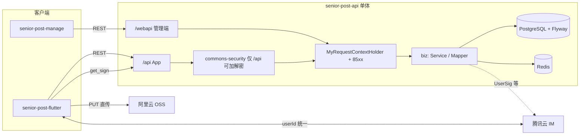

# PLAN

> **文档元信息**（**功能完成度**以 [`doc/plan/01-feature-list.md`](doc/plan/01-feature-list.md) + [`doc/plan/05-task-tracker.md`](doc/plan/05-task-tracker.md) 为准；本文为架构与决策基线）  
> **版本**：2.3 · **更新**：2026-05-09 · **维护**：项目 Owner · **治理说明**：[`doc/plan/00-documentation-governance.md`](doc/plan/00-documentation-governance.md)

## [当前栈]（仓库实测 + 决策基线）

| 层级 | 选型 | 版本 / 说明 |
|------|------|-------------|
| 语言运行时 | Java | **17**（`maven.compiler.source/target`） |
| 核心框架 | Spring Boot | **由父 POM `cn.nine.commons:commons-framework:1.0-SNAPSHOT` 统一管理**；模块使用 `mybatis-plus-spring-boot3-starter`，与 **Spring Boot 3.x / Jakarta** 对齐 |
| 构建 | Maven | 多模块 `server` / `biz` / `client`，`spring-boot-maven-plugin` 打可执行 JAR，可选拷贝至 `dist/` |
| Web 容器 | 嵌入式 Tomcat | `spring-boot-starter-web`；`server.tomcat.threads` 已在 `application.yml` 配置 |
| 可观测 | Spring Boot Actuator | `spring-boot-starter-actuator` |
| 持久层 | MyBatis-Plus | **3.5.16**（`biz/pom.xml`） |
| 库表迁移 | **Flyway** | 脚本目录 `senior-post-api/server/src/main/resources/db/migration`；与 PostgreSQL 配套 |
| 对象映射 | MapStruct | **1.5.3.Final** |
| API 文档 | springdoc-openapi + Knife4j | **springdoc-openapi-starter-webmvc-ui 2.3.0**（`client`）；UI `/doc.html`（启动日志） |
| 内部集成 | commons-* 体系 | `commons-web`、`commons-security`、`commons-basic`、`commons-data`、`commons-redis-starter`、`feign-bridge-mybatis` 等 |
| 父工程 | `commons-framework` | **本地工程**并已安装至本机 Maven 仓库；他机/CI 需同等可解析 |
| 数据库 | PostgreSQL | **JDBC** `jdbc:postgresql://...`（`application-local.yml`）；驱动由 BOM 管理 |
| 缓存 / 队列载体 | Redis | **Spring Data Redis + Lettuce** 连接池；**平邮到期送达仅用 PG + `@Scheduled`**（见 B3），**不**用 Redis ZSET 做平邮延迟队列 |
| 对象存储 | 阿里云 OSS | 全球化媒体（B8）；**`get_sign` 签发上传参数 + 客户端 HTTP PUT 直传**（接口由你实现） |
| 即时通讯 | 腾讯云 Chat（IM） | **IM userId 与业务用户 ID 统一**；会话与 UI 走腾讯方案；UserSig 等由后端签发 |
| 移动端 | Flutter | **3.x**；状态管理已拍板 **Riverpod**（见 B11） |
| 管理后台 | React + Vite + Ant Design 5 | 工程目录 `senior-post-manage`（**已初始化**）；对接 **`/webapi/**`** |
| 架构形态 | 单体优先 | 当前 `senior-post-api` 为单进程部署型单体；跨服务场景预留 **Feign Bridge** 调用形态 |

**目录现状**：`senior-post-api` 已存在；**`senior-post-flutter` 已在仓库内创建**（Riverpod + go_router + dio + secure_storage + l10n 骨架）；**`senior-post-manage` 已创建**（Vite + React + Ant Design，看板/用户/内容审核/举报/配置/VIP/日志等页面持续迭代）。Flutter **团队基线**：`tool/flutter_sdk_version.txt` 推荐 **3.41.x stable**；`pubspec` 中 Dart **`>=3.9.0 <4.0.0`** 兼容本机 3.35.x 与升级后 3.41.x。

---

## [后端技术栈梳理]（`senior-post-api`）

### 编程语言与模块边界

- **Java 17**。
- **`client`**：对外契约模块——API 接口（含 OpenAPI 注解）、分页入参/出参 DTO、常量（`AppServiceDefine.SERVER_PREFIX = "/api"`、`WEBAPI_PREFIX = "/webapi"`）。供 `biz` 中 Controller `implements` 实现，保证**前后端/Feign 契约同源**。
- **`biz`**：领域与业务——Controller、Mapper、Domain、MapStruct、Service、Feign Client/Resource。
- **`server`**：启动与配置——`SeniorPostApplication`、`application*.yml`、MyBatis `@MapperScan`。

### 核心框架与中间件

- **Spring Web MVC** + **Jackson**（`yyyy-MM-dd HH:mm:ss`，`GMT+8`，`locale: zh_CN`）。
- **MyBatis-Plus**：`mapper-locations: classpath*:/mapper/**/*.xml`。
- **Flyway**：版本化 DDL；**以迁移脚本为库表唯一可信源**（详见「库表规划」）。
- **Redis**：缓存、分布式能力；**平邮到期扫描**以 **PostgreSQL + 定时任务**为准（B3）。
- **PostgreSQL**：主事务库。

### API 设计规范（与框架一致）

- **路径前缀**：
  - **App**：**`/api/**`** — 可与 AES 加解密绑定；**加解密在收尾阶段统一在客户端封装层接入**，避免阻塞 M1~M2 联调。
  - **管理后台（对内）**：**`/webapi/**`** — 与 App **同一套后端**、同一套统一响应与 **`85xx`**；**不做**请求解密/响应加密（`jh.security` 忽略列表已含 `/webapi/**`）。
- **`jh.config`**：`interceptor-pattern`、`converter-json-pattern` 已同时包含 **`/api/**`** 与 **`/webapi/**`**。
- **风格**：HTTP + JSON；示例接口使用 **`@PostMapping`**（如 `find`、`paging`），分页入参内嵌 **`PageQuery`**，返回 **`PageData<T>`**（commons-data）。
- **统一响应**：Controller **直接返回业务对象**，由 **commons-web** 统一包装（禁止手搓 `ApiResponse`）。细节与 **`85xx`** 见 `senior-post-api/底层框架能力.md` 与 `backend-foundation-capabilities` Skill。
- **上下文**：用户/设备/版本等通过 **`MyRequestContextHolder`**，禁止业务代码自行解析 `HttpServletRequest`。
- **异常与鉴权**：业务异常用框架约定类型；**鉴权/Token/单端登录冲突等业务码统一 `85xx`**。
- **文档**：OpenAPI 3 + Knife4j；分组扫描 `cn.nine.pros.post.biz.controller`（可按需增加 `/webapi` 分组）。

### 内容与审核可见性

- **App 端所有需审核内容**（帖、评、信等）：**仅当管理后台审核通过后**才对普通用户可见；作者侧「审核中」等状态由产品细则在接口契约中固化（与 M2 审核台同步）。

### 部署环境建议

- **制品**：可执行 **Fat JAR**（Spring Boot repackage）。
- **运行时**：**JRE 17+**；典型部署为 **Linux 容器（Docker）** 或 **K8s**，前置 **反向代理**（Nginx/ALB 等）终结 TLS，与 `server.forward-headers-strategy: framework` 配合获取真实客户端信息。
- **依赖服务**：PostgreSQL、Redis、阿里云 OSS、腾讯云 IM；配置通过 **Spring Profile**（如 `local` / `prod`）与环境变量注入。

---

## [移动端 Flutter 技术栈规划]（`senior-post-flutter`，**已初始化**）

与后端 **`/api` + 统一响应 + `85xx` + 可选加解密** 对齐的推荐组合：

| 领域 | 推荐选型 | 说明 |
|------|----------|------|
| SDK / 语言 | Flutter 3.x + Dart 3.x | 与 PLAN 一致 |
| 状态管理 | **flutter_riverpod** + **riverpod_annotation**（可选代码生成） | 已决策 Riverpod；复杂异步（IM、分页流、审核态）用 `AsyncNotifier` |
| 路由 | **go_router** | 声明式路由 + 鉴权重定向（`85xx` 回登录） |
| 网络 | **dio** | 拦截器：BaseURL、Token、`85xx`；**AES 加解密最后阶段在统一封装层接入**（与 `/api` 策略对齐） |
| 序列化 | **json_serializable** 或 **freezed** + json | 与 DTO 契约一致，便于对接 `client` 模块演进 |
| 本地持久化 | **hive** 或 **isar**（二选一锁定） | 用户设置、草稿、非敏感缓存；**禁止**用全局静态变量代替持久化 |
| 敏感数据 | **flutter_secure_storage** | Token、密钥类 |
| 国际化 | **intl** + ARB | 中英（A10） |
| IM / Chat UI | **`tencent_cloud_chat_sdk`（无 UI SDK）+ 自研会话/气泡** | 与决策 B2 一致（Chat 能力）；UserSig 走 **`GET /api/im/usersig`**；TUIKit 仍为可选升级路径 |

**与后端交互方式**：HTTPS → 业务 REST **`/api/...`**；IM **userId = 业务用户 ID**，走腾讯 SDK；媒体上传：调用后端 **`get_sign`**（命名以最终实现为准）→ 客户端 **PUT** 至 OSS。

---

## [Flutter App 功能实现规划]（`senior-post-flutter`，**已初始化**）

**现状**：工程已创建，含四 Tab 主壳、国际化 ARB、`dioProvider` 占位；按下列模块与里程碑继续落地业务页与联调。

### 工程与分层（建议目录）

| 分层 | 职责 |
|------|------|
| `app/` | `MaterialApp`、主题、本地化委托、`ProviderScope` |
| `core/` | `dio` 客户端与拦截器（BaseURL、Token、`85xx` 清登录）、环境配置、日志 |
| `features/auth/` | 注册、登录、资料完善、协议与年龄门槛 UI |
| `features/post_wall/` | Tab1 列表/详情、发布、评论、举报 |
| `features/directory/` | Tab2 信件架网格、筛选、用户卡、Send Letter 入口 |
| `features/mailbox/` | Tab3：**Postal inbox** + **Connections（好友/笔友列表，**`GET /api/mailbox/friends`**，非 TIM 会话列表）**、归档、`tim_facade`（TIM 登录与 C2C）、`chat_page`、信件详情建联 |
| `features/profile/` | Tab4 个人中心、编辑资料、设置、注销/GDPR 入口（M4） |
| `features/im/` | **已并入 `features/mailbox/`**（TIM 初始化与 **C2C 聊天页**；**Connections 数据源为业务好友表，非 SDK 会话列表**）；若后续引入 TUIKit 再拆独立目录 |
| `shared/` | 通用 Widget、分页组件、图片/OSS 上传封装、国家与标签选择器 |

### 与需求文档的页面对照

| 需求区块 | Flutter 交付物 |
|----------|----------------|
| 注册与资料（§四） | 邮箱注册、密码、协议勾选、出生年/年龄（读配置门槛）、昵称/国家/标签(≥3)/简介/头像；完成后进 Tab1 |
| Tab1 Post Wall（§五） | 信息流、发帖（文+图）、评论（纯文本）、无 Like、Send Letter、举报 |
| Tab2 Directory（§六） | 邮局架 UI、国家/年龄/兴趣筛选、同龄/同兴趣排序由后端；用户卡 + Send Letter |
| Tab3 Post Box（§七~九） | 邮票 `x/3` 或 VIP Unlimited、运输中横幅、**Postal / Connections（好友列表）** 双分段、归档、信件状态（含已挂号）、平邮加速、**收件 Accept 建联 → 好友列表出现对端 → IM 聊天** |
| 邮票与 VIP（§十~十一） | 余额与上限展示、挂号消耗提示、VIP 权益由配置驱动展示（开关） |
| 设备 ID（§十二） | 启动/登录链路采集合规设备标识并随请求或专用接口上报（契约以后端为准） |
| 国际化（§十六） | `intl` + ARB：英文默认 + 中文 |
| IM（§十七） | **userId = 业务用户 ID**；**UserSig 后端签发**（`/api/im/usersig`）；客户端 **`tencent_cloud_chat_sdk`** 登录 + **C2C 聊天页**（Connections 为好友列表，不等同 TIM `getConversationList`）（TUIKit 可选） |

### 按 M1~M4 的 App 侧任务（与本文「开发计划」对齐）

**M1 — 骨架与账号**

- 初始化工程：Riverpod、`go_router`、主题、中英 ARB 占位。
- 网络层：`dio` + Token（`flutter_secure_storage`）+ **全局 `85xx` → 清凭证并跳转登录**。
- 页面：登录、注册、分步或单页资料完善；国家/标签数据源对接 `/api`（以后端 OpenAPI 为准）。
- 设备信息：封装平台侧 IDFA/IDFV/Android ID 等采集与降级，在登录/注册请求中携带。
- 可选：IM SDK 初始化占位（UserSig 接口就绪后接通）。

**M2 — 社交主路径**

- **Shell**：底部四 Tab（Post Wall / Directory / Post Box / My Post）。
- Tab1：明信片列表分页、详情、发布页（OSS 直传：`get_sign` → PUT）、审核中/仅己可见等状态展示。
- Tab2：名录网格、筛选表单、用户详情底部表或全屏卡、**Send Letter** 弹层（挂号/平邮二选一 UI）。
- Tab3：**Postal inbox / Connections（好友列表）** 分段、归档、Mock 建联与 **TIM SDK**；后端 **`/api/mailbox/*`（含 `/friends`）+ `/api/im/usersig`**；Flutter 真联调信件列表仍可与 Mock 并行切换。
- 评论、举报入口与错误提示（敏感词等由后端返回）。

**M3 — 信箱与资产闭环**

- 信件状态机 UI：On the way、预计到达、Delivered；**Speed Up** 扣邮票确认流。
- 顶部「A post is on the way」与列表角标逻辑。
- 邮票：每日赠送、发帖奖励提示；余额不足时禁用挂号信并引导平邮。
- VIP：读配置展示「无限邮票 / 免费加速」等，与后端权益字段一致。

**M4 — 合规与发布**

- 举报流程完善、注销与冷静期、隐私政策/用户协议版本展示。
- 图片与内容失败态、空态、弱网与 Loading 统一规范；`flutter analyze` / 核心 `widget_test`。
- 应用内版本强更或升级提示（若后端提供配置接口）。

### 契约与依赖（开发顺序建议）

1. 先锁定 **OpenAPI**（Knife4j）中：登录注册、用户资料、配置拉取（年龄阈值、邮票参数、平邮延迟区间）。
2. 再对接 **帖子/评论/名录**；最后 **信件状态 + 邮票扣减 + 加速** 与 **IM UserSig**。
3. **AES**：收尾阶段在 `dio` 封装层接入，避免早期阻塞联调。

### 验证（App 侧）

- `flutter analyze` 无报错；核心注册→首页、`85xx` 回登录、分页刷新、草稿/图片上传失败重试。
- 真机：双端设备 ID、推送/角标（若 M3+）、IM 收发与离线（与腾讯 SDK 能力一致）。

---

## [管理后台前端技术栈规划]（`senior-post-manage`，**已初始化**）

已选 **React**，与 **React 生态 + OpenAPI/Knife4j 文档** 配合成本最低：

| 领域 | 推荐选型 | 说明 |
|------|----------|------|
| 框架 | **React 18** | 已决策 |
| 语言 | **TypeScript** | 契约型调用、可维护性 |
| 构建 | **Vite** | 冷启快，适合中后台 |
| UI 组件库 | **Ant Design 5.x** | 表格/表单/布局成熟，适合配置中心、审核台、看板 |
| 路由 | **React Router 6** | 与权限路由结合 |
| 数据请求 | **TanStack Query (React Query)** + **axios** | 缓存、重试、与统一响应结构适配 |
| 权限与菜单 | **前端 RBAC**：路由 meta + 菜单树由后端返回 | 登录后拉取 **角色/权限码/菜单**；路由守卫统一处理 **`85xx`** 跳转登录；细粒度可用指令式封装 `access` HOC |
| 可选脚手架 | **Ant Design Pro** 或 Vite 自建 | 求快用 Pro；求轻量自搭 Vite + AntD |

**与后端交互方式**：浏览器 → REST **`/webapi/...`**（与 App **同进程、同统一响应**）；**明文 JSON**，不走 App 侧 AES；鉴权仍 **`85xx`** + Token（与框架一致）。

---

## [模块间交互与数据流]

---

## [库表规划]（先规划、再写 Flyway）

以下按 **M1 → M2 → M3** 递进；每张表在 `db/migration` 中独立版本脚本落地，字段以首版业务为准微调。

| 阶段 | 表 / 主题 | 用途摘要 |
|------|-----------|----------|
| **M1** | `sys_user`（或 `app_user`） | 邮箱登录、密码哈希、昵称、年龄/出生策略、协议勾选时间、状态（正常/冻结）、审计字段 |
| **M1** | `user_device` | 设备标识、`equipmentId` 与 user 绑定、平台、最后登录、挤下线辅助 |
| **M1** | `sys_config` / `app_config_kv` | 配置中心：年龄阈值、邮票基础参数、平邮延迟区间等（key-value 或强类型列按实现选） |
| **M1** | `email_outbox`（可选）或复用通用 `notification_log` | 异步发信队列：重试、状态，与下方邮件场景配合 |
| **M2** | `post` / `comment` | UGC 主体；**审核状态**（待审/通过/拒绝）、可见性以「通过」为对外前提 |
| **M2** | `content_audit_log`（可选） | 审核人、时间、结论、备注 |
| **M3** | `letter` / `mailbox` | 信件状态机、挂号/平邮、延迟投递时间点；**`bu_friendship`（建联）**、**`bu_letter.send_mode`**（Flyway `V4`，2026-05-02） |
| **M3** | `stamp_account` + `stamp_ledger` | 余额 + 流水账本 |
| **跨阶段** | `admin_user` / `admin_role`（若与 App 用户分表） | 管理端账号与权限；**首期也可**共用 `sys_user` + role 字段，按你偏好二选一 |

**约束**：需审核内容在 **App 列表/详情 SQL 层默认带 `audit_status = APPROVED`**（或等价枚举），避免遗漏导致未审内容泄露。

---

## [邮件能力规划]

后端需统一 **邮件发送抽象**（如 `EmailService` + 模板 ID / 变量），底层可接 **SMTP、阿里云邮件、SendGrid** 等（实现与密钥走配置）。

| 场景 | 说明 |
|------|------|
| 密码重置 | 重置链接或验证码（有效期、单次使用） |
| 安全通知 | 异常登录、敏感操作（可选 M2+） |
| 合规/账号 | 注销确认、重要条款变更通知（与 A8/M4 衔接） |

与注册：**首期仍可无邮箱激活**，但 **基础设施与 outbox 表**建议在 M1 一并预留，避免后期大改。

---

## [功能清单]

> 与代码对齐日期：**2026-05-09**（**A7**：`bootstrap` **`vipProduct`** 与 **FP-A7-001** 对齐）。细粒度以 `doc/plan/01-feature-list.md` 为准。

- [x] A1. 账号注册登录（邮箱、年龄、协议、JWT/`85xx`；**忘记密码/重置已接**；**AES 仍待（FP-A1-007）**；**设备落库一致性仍待（FP-A1-006）**）
- [x] A2. 用户资料中心（**`me` + PATCH + 兴趣标签 + 头像 OSS 写回已接**；冷启动仅 Token 时提前拉 `me` 仍可优化）
- [x] A3. Post Wall（**列表/详情/发帖/评论/OSS/举报/敏感词已接**；作者侧审核态专项优化**不设 FP**，体验后按需提）
- [x] A4. Post Directory（**分页/筛选/排序/用户卡 API/写信已接**）
- [x] A5. Post Box（**发信/收/归档/详情/Accept/好友列表/加速/平邮到期 Worker、`parentLetterId` 回信已接**；**平邮延迟完全配置化仍待**）
- [x] A5-IM. 邮政信箱 × 腾讯 IM 双轨：**后端** `V4`（`bu_friendship` + `send_mode`）、`GET/POST /api/mailbox/*`、`GET /api/im/usersig`（`tls-sig-api-v2` + `senior-post.tencent-im`）；**Flutter** Tab 分段、归档、`tim_facade`、`chat_page`、`tencent_cloud_chat_sdk:8.8.7373`、Mock 建联与单元测试 `test/mailbox_models_test.dart`（2026-05-02）
- [x] A6. Chat Stamp（**余额/流水/CAS/登录·发帖赠票与加速扣减已接**；**Manage 邮票流水页已接**）
- [x] A7. VIP 权益（**`bootstrap` → `vipProduct` + VIP 中心 + Manage 配置 + `vip-debug` 已接**；**真订阅/支付不做**；**FP-A7-002 已移除**；**FP-A7-003** 规则对齐仍见 `01`）
- [x] A8. 风控与合规（**敏感词、举报链路、Manage 设备拉黑已接**；**注销 MVP 已接**；**`user_device` 一致性见 FP-A1-006**）
- [x] A9. 管理后台（**看板/用户/审核/举报/配置/国家/敏感词/版本/公告/日志、邮票流水、用户设备列表与封禁已接**）
- [~] A10. 国际化（**App**：ARB + 设置 + `Accept-Language`；**后端 App API**：`messages/app*.properties` + `AppMessages`；**本期仅规划「邮件模板 i18n」FP-A10-001**（依赖 FP-X-001），不设全量 ARB 专项）

---

## [改动预测]

- **本次新增（2026-05-18，忘记密码完成态按钮 + 管理端用户编辑删除）**：
  - 目标：
    - 优化 Flutter 忘记密码流程完成态“返回登录”按钮视觉表现与可点击感。
    - 管理后台用户管理页移除无效行操作，新增用户编辑与删除能力。
  - 实际处理：
    - `senior-post-flutter/lib/features/auth/forgot_password_page.dart`
      - 完成态改为定制卡片（成功图标 + 强化标题文案 + 高对比渐变按钮），提升主 CTA 识别度。
    - `senior-post-api/client/src/main/java/cn/nine/pros/post/client/model/input/admin/AdminUserSaveInDto.java`
      - 新增管理端编辑用户入参 DTO（`id`、`nickname`、`birthYear`、`countryCode`、`bio`、`status`）。
    - `senior-post-api/client/src/main/java/cn/nine/pros/post/client/api/admin/AdminUserApi.java`
      - 新增 `POST /webapi/user/save`、`POST /webapi/user/{id}/delete`。
    - `senior-post-api/biz/src/main/java/cn/nine/pros/post/biz/controller/admin/AdminUserController.java`
      - 实现用户编辑保存与删除逻辑（状态校验、空更新拦截、软删除复用 `UserService.delByIds`）。
    - `senior-post-api/biz/src/main/resources/messages/app*.properties`
      - 新增 `admin.error.user.emptyUpdate` 多语言文案。
    - `senior-post-manage/src/services/api.ts`
      - 新增 `saveUser`、`deleteUser` 调用封装。
    - `senior-post-manage/src/pages/user/List.tsx`
      - 去除“调试 VIP / Enable / Ban”行按钮；
      - 新增“编辑”弹窗（昵称/出生年/国家/简介/状态）与“删除”确认按钮；
      - 保留“设备拉黑”操作。
  - 验证：
    - `mvn -pl biz,client -am compile -DskipTests` 通过。
    - `npm run build`（`senior-post-manage`）通过。
    - `flutter analyze` 通过。

- **本次新增（2026-05-18，按用户要求回滚 Tab 导航优化）**：
  - 目标：恢复“切换 Tab 即走路由跳转并触发相关刷新请求”的既有行为。
  - 实际处理：
    - `senior-post-flutter/lib/features/shell/main_shell.dart`
      - 回滚 `_goBranch` 为 `context.go(...)` 路由跳转逻辑；
      - 恢复 `go_router` import。
  - 验证：
    - `flutter analyze` 通过。

- **本次新增（2026-05-18，App 忘记/重置密码页 UI 清理）**：
  - 目标：
    - 忘记/重置密码页面新增明确「返回」按钮，避免部分路由栈场景无可见返回入口。
    - 移除该页面向用户展示的“开发环境/调试”提示文案，保持生产文案一致性。
    - 全量排查 `senior-post-flutter/lib` 中 UI 文案是否含“开发/调试”相关表述。
  - 预计改动（控制在 3 个文件内）：
    - `senior-post-flutter/lib/features/auth/forgot_password_page.dart`
    - `PLAN.md`
  - 验证：
    - `flutter analyze` 通过。
    - 手工验证忘记密码页顶部可返回；引导文案不再出现“开发环境/调试”字样。

- **本次新增（2026-05-18，Tab 切换导致 `auth/me` 高频调用排查）**：
  - 目标：修复明信片墙/通信名录排查时日志被 `/backend/api/auth/me` 大量刷屏，误判为接口路由错误。
  - 根因：
    - `MainShell` 底部导航点击会 `context.go(...)` 到不同 path（`/`、`/directory`、`/mailbox`、`/profile`）；
    - 每次 `go` 都会新建 `MainShell`，从而重复触发 `ProfilePage.initState -> refreshSessionFromServer (/api/auth/me)` 与 `Mailbox` IM 预热（`/api/im/usersig`）。
  - 实际处理：
    - `senior-post-flutter/lib/features/shell/main_shell.dart`
      - Tab 切换改为仅更新本地 `_index`（`IndexedStack` 内切页），不再每次执行路由跳转重建 Shell。
  - 验证：
    - `flutter analyze` 通过；
    - 切换 Tab 时不再出现成对重复的 `/api/auth/me` + `/api/im/usersig`。

- **本次新增（2026-05-18，AES 请求 Content-Type 修正）**：
  - 目标：修复登录时报错 `Content-Type 'text/plain;charset=UTF-8' is not supported`。
  - 根因：
    - 上一版将 AES 请求 `Content-Type` 改为 `text/plain`，与后端接口 `application/json` 约束冲突。
  - 实际处理：
    - `senior-post-flutter/lib/core/network/dio_provider.dart`
      - AES 请求保持 `application/json`；
      - 仍发送 `utf8` 原始字节密文，避免 String 被 JSON 二次包引号。
  - 验证：
    - `flutter analyze` 通过；
    - 登录接口不再返回 `text/plain not supported`。

- **本次新增（2026-05-18，Docker 内网数据库端口修复）**：
  - 目标：修复 `senior-post-api` 启动时报 `Connection to postgresql:65432 refused`。
  - 根因：
    - `.env` 将 `SPRING_DATASOURCE_URL` 配置为 `postgresql:65432`；
    - `65432` 是宿主机映射端口，不是容器网络中的 PostgreSQL 监听端口；
    - Compose 服务间应始终通过 `postgresql:5432` 通信。
  - 实际处理：
    - `/.env`：`SPRING_DATASOURCE_URL` 从 `postgresql:65432` 调整为 `postgresql:5432`。
  - 验证：
    - 重新 `docker compose up -d --build senior-post-api`，观察后端日志不再出现 `Connection refused`（若随后出现认证失败，则转入密码一致性问题排查）。

- **本次新增（2026-05-18，Flutter AES 入参调试日志增强）**：
  - 目标：排查“Flutter 已加密但后端解密失败”时，直观看到同一请求的加密前后参数。
  - 实际处理：
    - `senior-post-flutter/lib/core/network/dio_provider.dart`
      - 在请求拦截器 AES 分支新增调试日志：
        - `plain`：加密前明文入参（JSON 字符串化）
        - `cipher`：加密后 Base64 密文
      - 仅在 `kDebugMode || API_LOG=true` 时打印，避免默认污染发布日志。
  - 验证：
    - `flutter analyze` 通过。

- **本次新增（2026-05-18，Flutter AES 请求体格式修复，仅改 Dart）**：
  - 目标：修复 Flutter 端加密后，后端 `AesEncryptUtils.decrypt` 失败（`decrypt error`）。
  - 根因：
    - 加密请求体是纯密文字符串，但请求头仍是 `Content-Type: application/json`；
    - Dio 在该组合下可能对字符串再次 JSON 编码（外层加双引号），后端按原始 Base64 密文解密时失败。
  - 实际处理：
    - `senior-post-flutter/lib/core/network/dio_provider.dart`
      - 对启用 AES 的请求，发送 `utf8` 原始字节并将 `contentType` 明确设为 `text/plain`，避免 JSON 二次包裹。
    - 回退 `commons-security` 的临时改动，保持 Java 端无变更。
  - 验证：
    - 已完成 Flutter 静态检查（见下方本次终端实测日志）。

- **本次新增（2026-05-18，按用户要求恢复 `/api` 全量 AES）**：
  - 目标：纠正“把 `/api/auth/*` 放入明文白名单”的错误改动，保证“仅免 Token 拦截，不免加解密”。
  - 实际处理：
    - `senior-post-api/server/src/main/resources/application.yml`
      - 从 `resIgnoreEncryptUris/reqIgnoreDecryptUris` 移除 `/api/auth/*` 与 `/api/bootstrap/*`，保留管理端 `/webapp/**`、`/webapi/**` 明文策略。
    - `senior-post-api/server/src/main/resources/application-local.yml`
      - 同步移除 `/api/auth/*` 与 `/api/bootstrap/*` 明文白名单，确保 local 与主配置一致。
    - `senior-post-flutter/lib/core/network/jh_api_crypto.dart`
      - 客户端明文路径判定改为仅 `'/webapi/'`，`/api/**` 默认全量 AES 请求加密/响应解密。
  - 验证：
    - 配置文件已恢复为“Token 拦截例外与 AES 策略分离”。
    - Flutter 侧静态检查通过（无新增错误）。

- **本次新增（2026-05-18，登录解密失败前后端策略对齐）**：
  - 目标：修复 Flutter 登录命中后端 `request data decode failed`（请求体被当密文解密失败）。
  - 根因：
    - `application-local.yml` 的 `jh.security.reqIgnoreDecryptUris/resIgnoreEncryptUris` 仅保留了 `/webapi/**`，覆盖了 `application.yml` 中登录/注册等匿名明文白名单；
    - Flutter 仍按匿名接口明文发送登录请求，导致后端错误进入解密流程。
  - 实际处理：
    - `senior-post-api/server/src/main/resources/application-local.yml`
      - 补齐与主配置一致的匿名明文白名单（`/api/auth/login`、`/api/auth/register`、`/api/auth/forgot-password`、`/api/auth/reset-password`、`/api/bootstrap/init`、`/api/bootstrap/release-note`）。
    - `senior-post-flutter/lib/core/network/jh_api_crypto.dart`
      - 默认 AES key 调整为 `8e32de3646dc4c02ae2507511202c7ca`，与后端当前配置值对齐，避免后续需加密接口再次出现密钥不一致。
  - 验证：
    - 后端重建后，登录请求不再报 `request data decode failed`。
    - Flutter 登录链路返回业务响应（非解密异常）。

- **本次新增（2026-05-18，Docker 后端端口变更不生效修复）**：
  - 目标：修复已将 `application-local.yml` 改为 `server.port=9011` 后，容器仍以 `9012` 启动的问题。
  - 根因：`docker compose up --build` 过程中 `COPY server/target/... app.jar` 长期命中缓存，同时 `senior-post-api/.dockerignore` 包含 `target`，导致镜像未纳入最新后端 JAR。
  - 实际处理：
    - 修改 `senior-post-api/Dockerfile`：`JAR_FILE` 默认路径从 `server/target/...` 调整为 `server/dist/...`（构建产物稳定且不受 `.dockerignore` 的 `target` 规则影响）。
  - 验证：
    - `docker compose build --no-cache senior-post-api` 后 `COPY` 步骤不再复用旧层。
    - 容器启动日志 `Local:` 端口与 `application-local.yml` 配置一致（9011）。

- **本次新增（2026-05-16，登录事务中断 `25P02` 修复）**：
  - 目标：修复登录后偶发/重复登录时事务被中断，随后 `selectById` 报 `current transaction is aborted`。
  - 根因：`StampGrantServiceImpl.afterLogin` 在同一事务中直接 `insert` 每日赠票记录；命中唯一索引 `uk_stamp_daily_login` 后 SQL 异常将 PostgreSQL 事务置为 aborted，后续查询全部失败。
  - 实际处理：
    - `senior-post-api/biz/src/main/java/cn/nine/pros/post/biz/mapper/StampDailyGrantMapper.java`
      - 新增登录/发帖赠票的幂等写入 SQL，统一使用 `ON CONFLICT ... DO NOTHING`。
    - `senior-post-api/biz/src/main/java/cn/nine/pros/post/biz/service/base/impl/StampGrantServiceImpl.java`
      - 改为根据插入行数判断是否已赠送，移除依赖异常分支的幂等逻辑。
  - 验证：
    - `senior-post-api` 编译通过。
    - 重复登录同一账号不再触发 `uk_stamp_daily_login` 异常，登录接口不再因该冲突中断事务。

- **本次新增（2026-05-16，AES 密钥与 commons-security 默认值对齐）**：
  - 目标：修复开启加解密后登录/发帖请求在后端 `request data decode failed`。
  - 根因：Flutter 默认 `JH_AES_KEY` 与 `commons-security` 实际生效 key 不一致（后端未命中自定义 key 配置时使用 `EncryptionProperties` 默认值）。
  - 实际处理：
    - `senior-post-flutter/lib/core/network/jh_api_crypto.dart` 默认 key 调整为 `d86d7bab3d6ac01ad9dc6a897652f2d2`（与组件默认一致）。
    - 保留 `--dart-define=JH_AES_KEY=...` 覆盖能力，便于后端后续切换配置。
  - 验证：
    - 使用容器内网地址对 `/backend/api/auth/login` 发起 AES 加密请求，返回 `code=200`（加密 `data`）。

- **本次新增（2026-05-16，AES 请求体协议与 commons-security 对齐）**：
  - 目标：修复开启 AES 后后端解析请求体为空（如发帖 `content:must not be blank`）的问题。
  - 根因：Flutter 之前将加密请求体封装为 `{\"data\":\"...\"}`；而 `commons-security` 的 `EncryptionReqestWrapper` + `EncryptionFilter#processDecryption` 会直接把“整个请求体字符串”当作密文解密，协议不一致导致解密失败/空体。
  - 实际处理：
    - `senior-post-flutter/lib/core/network/jh_api_crypto.dart`：加密请求改为发送“纯密文字符串”。
    - `senior-post-flutter/lib/core/network/dio_provider.dart`：默认 `versionCode` 调整为 `2`，与 `androidVersion=1` 的加解密门槛策略对齐（避免被后端直接跳过加解密过滤）。
  - 验证：
    - `flutter analyze` 通过。
    - 按 `commons-security` 同算法（AES/ECB/PKCS5Padding + Base64）构造请求，`POST /backend/api/postcards` 返回成功，证明 Flutter 与后端加解密协议一致。

- **本次新增（2026-05-16，Post Wall 发布 content 为空排障）**：
  - 目标：修复发布明信片返回 `content:must not be blank`。
  - 根因：Flutter 仍对 `/api/postcards` 请求体执行 AES 包装为 `{data:...}`，而当前后端 local/docker 配置按明文处理（`reqIgnoreDecryptUris` 覆盖 `/api/**`），导致 DTO 无法解析 `content`。
  - 实际处理：
    - 在 `senior-post-flutter/lib/core/network/jh_api_crypto.dart` 增加 `API_AES_ENABLED` 编译开关，默认 `false`（本地明文）。
    - 仅当显式传入 `--dart-define=API_AES_ENABLED=true` 时才启用请求加密/响应解密。
  - 验证：
    - `flutter analyze` 通过。
    - 发布请求日志 `data` 为明文 JSON（含 `content`），接口不再报 `content:must not be blank`。

- **本次新增（2026-05-16，Post Wall 发布入口视觉改造）**：
  - 目标：将 Post Wall 空状态中的“Write postcard”普通按钮改为统一悬浮发布按钮，提升入口可见性与触达效率。
  - 实际处理：
    - 修改 `senior-post-flutter/lib/features/post_wall/post_wall_page.dart`。
    - 空状态移除中部 CTA，改为右下角统一悬浮入口（列表态与空态共用）。
    - 新增邮政风悬浮按钮样式（渐变、阴影、圆角胶囊、强化文字权重）。
  - 验证：
    - `flutter analyze` 通过。
    - 运行后 Post Wall 空态和列表态均可通过右下角悬浮按钮进入 `/post/new`。

- **本次新增（2026-05-16，注册 device 字段校验失败排障）**：
  - 目标：修复 Flutter 注册/登录在 Docker `context-path=/backend` 场景下被误加密，导致后端校验 `deviceUid/deviceType` 类字段空值错误。
  - 根因：`senior-post-flutter/lib/core/network/jh_api_crypto.dart` 的明文白名单仅匹配 `/api/...`，未处理实际请求路径 `/backend/api/...`，从而把本应明文的 `/api/auth/register`、`/api/auth/login` 包成 `{data: ...}`。
  - 实际处理：
    - 在 `isPlaintextApiPath` 增加路径归一化（去除 `/backend` 前缀）后再进行白名单判断。
    - 保持后端 AES 策略不变，修复客户端路径判断逻辑。
  - 验证：
    - `flutter analyze` 通过。
    - 观察 Dio 日志中 `/backend/api/auth/register` 请求体由 `{data: ...}` 变为明文 JSON。
    - 注册/登录不再返回设备字段为空的校验错误。

- **本次新增（2026-05-16，Flutter 启动 Directionality 崩溃修复）**：
  - 目标：修复启动后首帧报错 `No Directionality widget found` 导致页面无法渲染。
  - 根因：`SeniorPostApp` 在 `MaterialApp.router` 外层直接返回 `Stack`，`Stack` 默认依赖 `AlignmentDirectional`，在 `Directionality` 尚未建立时触发断言。
  - 实际处理：
    - 将 `senior-post-flutter/lib/app/senior_post_app.dart` 改为直接返回 `MaterialApp.router`。
    - 通过 `builder` 在应用内部叠加 `ReleaseNoteLayer`，保留原浮层能力并复用 `MaterialApp` 提供的 `Directionality`。
  - 验证：`flutter analyze` 通过；`flutter run` 启动后不再出现该断言。

- **本次新增（2026-05-16，Flutter 启动故障修复）**：
  - 目标：修复 `flutter run` 因 `dart format` 失败导致的 Android Debug 构建中断。
  - 现象：`PathNotFoundException` 指向本机 Pub 缓存缺失 `flutter_lints-5.0.0/lib/flutter.yaml`。
  - 实际处理：
    - 在 `senior-post-flutter` 执行 `flutter pub get`，补齐缺失依赖缓存。
    - 执行 `dart format lib/l10n/*.dart`，确认格式化链路恢复。
    - 执行 `flutter analyze` 与 `flutter build apk --debug`，确认工程可编译。
  - 回滚策略：若后续再次出现同类缓存损坏，优先重跑 `flutter pub get`；无效时清理 `C:\Users\Administrator\AppData\Local\Pub\Cache\hosted\pub.flutter-io.cn\flutter_lints-5.0.0` 后重拉依赖。

- **本次新增（2026-05-16，官网静态页视觉优化）**：
  - 目标：优化 `senior-post-manage/static/index.html` 的视觉层次、交互反馈与移动端可用性。
  - 预计改动：
    - `senior-post-manage/static/index.html`
  - 验证：
    - 本地构建 `senior-post-manage`（`npm run build`）通过。
    - 手工走查：锚点导航高亮、移动端折叠菜单、按钮/卡片悬停反馈、分区滚动动效可用。

- **本次新增（2026-05-15，Docker 化交付）**：
  - 目标：将 **`senior-post-manage`** 与 **`senior-post-api`** 产出可复用 Docker 镜像，并提供一键编排启动。
  - 预计改动：
    - `senior-post-manage/Dockerfile` + `senior-post-manage/.dockerignore`
    - `senior-post-api/Dockerfile` + `senior-post-api/.dockerignore`
    - 根目录 `docker-compose.yml`
  - 验证：`docker compose config` 通过，`docker build` 可产出两端镜像（后端镜像基于本机构建出的 JAR 打包，避免 `commons-framework` 本地 SNAPSHOT 依赖在容器内不可解析）。
  - 编排增强：将 **`nginx` + `postgresql` + `redis`** 纳入同一 compose 网络，后端默认改为容器服务名互联（`postgresql` / `redis`），减少宿主机依赖。
  - 开发体验增强：管理端 compose 服务切换为 **Vite dev server + 代码目录挂载 + polling**，并让 Nginx 反向代理到 `5174`，支持前端改动即时生效。
  - Nginx 配置挂载策略：恢复为 **Windows 宿主机目录 `D:/06_docker_workplace/nginx/conf.d` 挂载到 `/etc/nginx/conf.d/`**，支持多 `server` 配置并行管理。
  - 路由策略收敛：域名根路径回官网静态页；`/privacy`、`/terms` 独立协议页；管理后台迁移到 `/manage/` basePath；后端继续保持 `/api` 与 `/webapi`。
  - 后端路径策略：启用 `server.servlet.context-path=/backend`（可由环境变量覆盖）；Nginx 收敛为最小配置，仅透传 `/backend/**`，不再做 `/api`、`/webapi`、`/doc.html` 兼容转写。

- **FP-A4-004（2026-05-08）**：名录详情阻塞修复——后端新增 **`GET /api/directory/users/{userId}`**；Flutter **`directoryUserProvider`** 走 **`DirectoryRemoteRepository.getDirectoryUser`**，避免列表为真实 ID、详情仍查 Mock 导致的「Profile not found」。
- **名录 Mock 剥离（2026-05-08 续）**：后端 **`GET /api/directory/interest-tags?lang=`**（`sys_tag`，与筛选 `interestNames` 一致）；Flutter 筛选国家改 **`appBootstrapProvider`**，兴趣选项走 **`directoryFilterTagOptionsProvider`**；**Tab2 列表 / 用户卡 / Send Letter** 固定远程，**`MockDirectoryRepository` 不再参与 directory 流程**（`AppEnv` 注释已说明）。
- **已完成（2026-05-01）**：接入 **Flyway**（`server` 依赖 + `db/migration` 基线脚本）；**`/webapi`** 与 **`AppServiceDefine.WEBAPI_PREFIX`**；`application.yml` 拦截器/加解密忽略列表；**PLAN / 底层框架能力 / backend skill** 与本次决策对齐。
- **后续**：按「库表规划」追加 `V3__...sql` 与 M2 业务代码；**`get_sign`**、邮件 SPI、腾讯 UserSig 等按模块逐项实现。
- **本次新增（2026-05-01）**：新增 App 启动配置接口 **`GET /api/bootstrap/init`**（返回注册最小年龄 + 国家列表），Flutter Profile Tab 已改为真实数据页，联调 **`/api/auth/me` + `/api/bootstrap/init`** 并支持退出登录。
- **FP-A7-001（2026-05-09）**：**`AppBootstrapVO.vipProduct`**；`AppBootstrapService` 批量读 vip 键组装 **`AppVipProductConfigVO`**；Flutter **`AppBootstrapData.vipProduct`** + **`vip_center_page`**（`productEnabled=false` 时提示关闭）；与 **Manage `VipConfig`** 同一 `sys_config` 键。
- **管理后台迭代（2026-05-01）**：配置分页入参 **`ConfigQueryInDto`**（`page` + 可选 `configGroup`）；新增 **`/webapi/country/*`** 国家/地区维护；`application.yml` 放行 **`/webapi/auth/login`**（与 `jh.config.auth` 开启时一致）；前端补齐 **VIP 配置页**、**国家/地区页**、看板 Loading、侧栏选中态与当前管理员展示。
- **管理端认证（2026-05-01，修订）**：管理端与 App 共用 **`bu_user`**；JWT 均为 **`AppJwtService.createToken(bu_user.id)`**（`sub` 即用户主键）。管理端登录仅允许 **`staff_role != 0`** 的账号；`getCurrentAdmin` 返回 **`UserDTO`**（清 **`passwordHash`**）。审计 **`updated_by`**、举报 **`handler_user_id`** 等直接使用 **`MyRequestContextHolder.userId()`**（或 `"0"`）字符串化，不再使用 `AdminTokenSupport`。
- **本次新增（2026-05-01，App 同步）**：`application.yml` 将 **`/api/bootstrap/init`** 纳入 **`exclude-interceptor-pattern`**，未登录注册页可拉取配置；Flutter 抽取 **`appBootstrapProvider`**（`AppBootstrapData` / `CountryItem` 含 `nameZh`），**注册页**用服务端 **`minRegisterAge`** 生成出生年范围（上限 110 岁）、国家下拉与后端列表一致；**个人中心**复用同一 Provider，并 **`watch(authTokenProvider)`** 在登录后刷新资料。
- **注册联调修复（2026-05-01）**：根 `application.yml` 对 **`/api/auth/login`、`/api/auth/register`、`/api/bootstrap/init`** 加入 **`jh.security` 加解密忽略**（客户端尚未接 AES 时仍可解析 JSON）；Flutter 侧 **`INTERNET`** 写入主 Manifest、**Debug 明文 HTTP**、iOS **`NSAllowsLocalNetworking`**；**`kApiBaseUrl`** 集中 **`API_BASE_URL`**，注册失败页 Debug 展示 **Dio 详情 + 真机 `--dart-define` 提示**。
- **本次新增（2026-05-01，设计沟通）**：确认 UI 方向从“邮政蓝主导”调整为 **浅灰复古主导**。设计关键词：**可靠、成熟、全球化、低刺激**；目标人群 45+ 优先可读性与可操作性。登录/注册页面要求：中部卡片式布局、协议勾选必选、补齐忘记密码、按钮禁用/加载/错误反馈完整。
- **本次新增（2026-05-02，邮政 × IM）**：
  - **后端**：Flyway **`V4__mailbox_im_friendship.sql`**（`bu_friendship`、`bu_letter.send_mode`）；`LetterDTO`/`LetterDomain` 补 `sendMode`；`AppMailboxApi`（`/api/mailbox/postal`、`/sync`、`/archive`、`/letters/{id}/accept-postal`）、`AppImApi`（`/api/im/usersig`）；`AppImService`（`com.github.tencentyun:tls-sig-api-v2:2.0`）；`TencentImFriendshipNotifier` 占位；`application.yml` 增加 **`senior-post.tencent-im`** 与 **`/api/mailbox/**`、`/api/im/**`** 加解密白名单。
  - **Flutter**：`pubspec` 引入 **`tencent_cloud_chat_sdk:8.8.7373`**；`mailbox_page` **Postal / Connections（好友列表；后续对齐 `/mailbox/friends`）**、`mailbox_archive_page`、`chat_page`（邮政主题气泡 + C2C 历史）、`tim_facade`、`mailbox_providers`；Mock 扩展 **`LetterStatus.registered` / `LetterSendMode` / 建联集合**；路由 **`/mailbox/archive`、`/chat/:userId`**。
  - **验证**：`mvn compile -DskipTests`（`senior-post-api`）；`flutter analyze`；`flutter test test/mailbox_models_test.dart`。
- **本次新增（2026-05-02，资料写回 FP-A2-001）**：后端 **`PATCH /api/auth/profile`**（`AppAuthProfilePatchInDto`，昵称/国家/简介部分更新）；Flutter **`AuthRepository.refreshSessionFromServer`**（`GET /api/auth/me`）、**登录/注册响应 `user` 写入 `appSessionProvider`**、**`ProfileEditPage` / `ProfilePage` 联调**；兴趣标签与头像 URL 写回仍待后续项。
- **本次新增（2026-05-02，文档对齐 + 邮票流水 Flutter）**：`doc/plan/01-feature-list.md` 与 **`PLAN.md` [功能清单]** 回写 **A3/A4/A5/A6** 与仓库一致（明信片墙、名录、Accept、OSS 发帖图、**`stamps_remote` + 个人中心流水页** 非 Mock 走 **`POST /api/stamps/ledger/paging`**）。
- **本次新增（2026-05-06，FP-A5-005）**：**`POST /api/mailbox/letters/{letterId}/speed-up`**（发件人、平邮运输中、VIP 免扣票、非 VIP CAS 扣 1 + 流水）；Flutter **`mailbox_remote.speedUp`**、**`speed_up_sheet`** / **`letter_detail_page`** 真联调。
- **规划文档（2026-05-07）**：新增 **`doc/plan/07-gap-analysis-and-roadmap.md`** — 遗漏功能系统化清单（描述、预期行为、优先级、与现有模块关联）与四阶段开发路线图（顺序、技术方案、资源粗估）；执行时与 **`doc/plan/05-task-tracker.md`** 联动勾选 FP。
- **FP-X-005 客户端收口（2026-05-08）**：在已有服务端出站换签与 `POST /api/oss/get-sign` 基础上，Flutter 增加 **`PostalOssNetworkImage`**（预签名失效导致首帧加载失败时，从 URL 路径解析 objectKey 并单次调用换签）；**`AppEnv.ossKeyPrefix`** 与后端 `senior-post.oss.keyPrefix` 对齐；单元测试 **`test/oss_object_key_hint_test.dart`**。
- **IM 好友同步 + 赠票（2026-05-08）**：**FP-A5d-004** `TencentImRestApiClient` + 双向 `friend_add`；**FP-A6-003** `StampGrantService` + Flyway `V10` + `senior-post.stamps-grant`；E2E 步骤见 **`senior-post-api/doc/e2e-smoke.http`**；`biz` 模块 Surefire 默认不继承父级跳过测试。

---

## [验证策略]

- **需求澄清阶段**：关键决策清单闭合；产出 API + 事件 + 状态流契约草案。
- **开发阶段**：
  - Backend：单元测试 + 集成测试 + HTTP 冒烟；Knife4j `/doc.html` 契约可视。
  - Flutter：`flutter analyze`、Widget/Integration 测试、真机联调、`85xx` 链路；**邮政 Tab：Accept → Connections（好友列表）→ Chat**；**配置 `TENCENT_IM_*` 后验证 `/api/im/usersig` + C2C 聊天**。
  - IM：双端消息、离线、重连、未读数。
  - 数据：邮票账本与信件状态事务一致。

---

## [当前阻塞/待确认]

- [x] B1. 登录认证方式：JWT（禁止多端同时在线）
- [x] B2. 腾讯云 Chat 方案：会话与 UI 均采用腾讯云 Chat 能力（仅 Chat，不做语音/群组/视频）
- [x] B3. 平邮延迟实现：**PostgreSQL + 后端定时任务（`@Scheduled`）扫描到期**；**不**引入 Redis ZSET 队列（2026-05-09 已定案）
- [x] B4. 设备标识策略：优先设备安装唯一凭证，平台受限时可合规降级
- [x] B5. 内容审核策略：所有用户内容先审后发（后台审核通过后才可见）
- [x] B6. 账本模型：邮票资产采用流水账本模型
- [x] B7. 管理后台优先级：配置中心 > 用户封禁 > 举报处理 > 内容管理 > 看板
- [x] B8. 部署目标：全球化部署，媒体资源统一 OSS
- [x] B9. JWT 细节：前端统一按业务错误码 `85xx` 处理 token 失效/异常，时长与策略由后端控制
- [x] B10. 单端登录挤下线策略：由后端统一控制并通过 `85xx` 返回前端处理
- [x] B11. Flutter 状态管理最终拍板：Riverpod
- [x] B12. 管理后台技术栈确认：React
- [x] B13. 国家编码策略：ISO 3166-1 alpha-2 + Locale 自动获取 + 前后端共用常量
- [x] B14. ~~视觉主色最终确认~~（**已从 backlog 移除**，不作为交付项）
- [x] B15. ~~登录/注册视觉规范确认~~（**已从 backlog 移除**，不作为交付项）

---

## [已确认关键决策（2026-04-28）]

- 认证采用 JWT，账号不允许多端同时在线
- 邮箱激活首期不做，直接邮箱+密码注册
- 年龄输入由出生年月改为年龄选择器（45~110）
- 后端以单体架构推进（业务框架细节由你自行控制）
- IM 仅做 Tencent Chat 能力，聊天 UI 采用腾讯方案
- 平邮延迟由业务侧实现（**PostgreSQL + 定时任务扫描**；不用 Redis ZSET 延迟队列）
- 邮票采用余额+流水账本，所有扣增均可追踪
- 内容发布采用先审后发，全量后台审核
- 设备标识按平台合规优先获取安装唯一凭证，必要时降级
- 管理后台按约定优先级分阶段建设
- 全球化部署，图片/媒体资源走阿里云 OSS
- Token 过期与单端登录冲突统一走后端 `85xx` 业务错误码协议
- Flutter 状态管理最终确定为 Riverpod
- 管理后台前端技术栈确定为 React

### 已确认关键决策（2026-05-01）

- `commons-framework`：**本地工程 + 本机 Maven 仓库**已具备；组外需自备解析方式。
- **`85xx` 与统一响应**：以 `底层框架能力.md` 与 `backend-foundation-capabilities` Skill 为准。
- **App AES 加解密**：**收尾阶段**在客户端/网关统一封装层接入；当前不阻塞功能开发。
- **腾讯 IM**：**userId 与业务用户 ID 一致**。
- **OSS**：预留 **`get_sign`**（命名可最终调整），客户端 **PUT 直传**。
- **数据库**：**Flyway** 管理 schema；表结构按本文「库表规划」分版本追加。
- **审核可见性**：App 侧所有需审核内容 **仅管理端审核通过后**对普通用户可见。
- **管理端**：**`/webapi`**，**不加密**，与 App **同一后端**、同一套 **`85xx` + 统一响应**。
- **邮件**：**密码重置、安全通知、合规通知**等场景纳入规划，M1 建议预留发信与 outbox 能力。
- **国家编码**：采用 **ISO 3166-1 alpha-2** 标准编码（如 US, GB, FR）；前端 App 通过设备 **Locale 自动获取**国家代码，后端与前端**共用同一套国家编码常量**（后端 `CountryCode` 枚举或配置类）；`sys_country` 表仅用于管理后台国家名称维护。

---

## [开发计划（M1~M4）]

- M1（基础可运行骨架）
  - 目标：跑通注册登录、用户基础资料、基础配置中心、前后端与 IM 初始化链路
  - 后端：**App `/api/auth/register|login|me` + JWT 签发**（`senior-post.app.jwt.*`）；用户/设备写入；`application-local` 对 **`/api/**` 明文** 便于 Flutter 联调；**`exclude-interceptor-pattern`** 放行注册/登录
  - Flutter：**登录/注册页**、**`dio`：`Token` / `versionCode` / `deviceId` / `equipmentId`**、**`85xx` 清 Token + 刷新路由**、安装级 **deviceUuid**；资料完善页与 IM 初始化仍待下一迭代
  - 管理后台：配置中心第一版（年龄阈值、邮票基础参数、平邮延迟区间）
  - 验收：新用户从注册到进入首页全链路可用；85xx 触发后前端正确回登录态（生产开启 `jh.config.auth` 时需将 **JWT 与框架验签密钥策略对齐**）
- M2（核心社交闭环）
  - 目标：Post Wall + Post Directory + Send Letter 主流程可用
  - 后端：明信片发布（先审后发）、评论（先审后发）、目录筛选排序、写信入口
  - Flutter：Tab1/Tab2 页面、发布与审核中状态、写信弹窗（挂号/平邮）
  - 管理后台：内容审核台（帖子/评论审核通过后才展示）
  - 验收：从浏览用户到发信完整可走通；未审核内容对前台不可见
- M3（信箱与资产系统）
  - 目标：Post Box、平邮延迟投递、加速、邮票账本全部闭环
  - 后端：**PG 定时任务**推进平邮到期、信件状态机、邮票余额与流水、加速扣减原子事务；**建联表 + UserSig 已落地（2026-05-02）**
  - Flutter：信箱列表状态（Delivering/Delivered/**Registered**）、加速按钮、邮票余额展示；**Postal / Connections（好友列表）/ Archive、TIM 登录与自研聊天页已落地（2026-05-02；Connections 数据源 2026-05-09 对齐 `/mailbox/friends`）**
  - 管理后台：邮票配置中心、用户邮票流水查询、封禁/设备拉黑
  - 验收：平邮延迟与加速行为正确；账本可追溯且余额一致
- M4（风控合规与上线准备）
  - 目标：风控、举报、日志、看板、国际化、发布准备
  - 后端：举报工单、敏感词、GDPR 删除与冷静期注销、行为/设备日志
  - Flutter：举报入口、审核/失败提示、i18n 中英文切换
  - 管理后台：举报处理、用户处罚记录、数据看板
  - 验收：核心合规流程可演示；上线 checklist 全绿

---

## [接口与协议约束（已定）]

- 鉴权异常、token 过期、单端登录冲突统一使用业务错误码 `85xx`
- 前端不做 token 过期“时间推导逻辑”，只做 `85xx` 响应处理
- IM 与聊天 UI 统一走腾讯云 Chat，业务后端负责账号映射与业务扩展字段

---

## [Flutter 选型建议（best-minds）]

- 推荐：`Riverpod + StateNotifier/AsyncNotifier`
- 选择原因（对标大规模 Flutter 实战）：
  - 可测试性高，适配社交类“多异步源”场景（IM、帖子流、审核状态、延迟投递状态）
  - 依赖注入清晰，便于后续拆模块（auth/chat/feed/profile/admin-config）
  - 相比传统 Provider 更易治理复杂状态；学习和维护成本低于 BLoC 重模板方案
- 当前结论：**Riverpod** 为不可变更基线（见 B11）

---

## [状态]

- [x] S1. 已收敛基础技术栈
- [x] S2. 完成关键技术决策确认
- [x] S3. 输出第一版可开发任务排期
- [x] S4. 已创建后端底层能力技能（project skill）
- [x] S5. 已创建全栈任务路由规则（project rule）
- [x] S6. 已输出技术栈全景与模块交互说明（本文档 2026-05-01）
- [x] S7. Flyway + `/webapi` 基线与文档对齐（2026-05-01）
- [x] S8. M1 表结构与认证/配置接口落地
- [x] S9. M2 帖子/目录/写信主链路 REST 已落地（2026-05-09）
- [x] S11. 邮政信箱 × 腾讯 IM 双轨契约与 Flutter 分段 UI + TIM 登录链路（2026-05-02；**腾讯 REST 好友同步已接** FP-A5d-004，生产依赖 `TENCENT_IM_REST_IDENTIFIER` 等配置）
- [x] S10. 管理后台：`senior-post-manage` 修复配置页 UTF-8 乱码源码、侧边栏二级分组菜单；`UserServiceImpl.delByIds` 禁止删除 `staff_role != 0` 的可登录后台账号（2026-05-01）
- [x] S12. Flutter **客户端 Mock 层已移除**（2026-05-09）：删除 `lib/core/mock`、`AppEnv.useMock`；名录 Provider 拆文件解循环依赖；缺口与验证见 **`doc/plan/08-mock-removal-gaps.md`**
