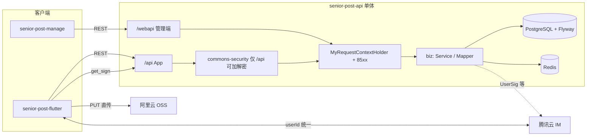

# PLAN

## [当前栈]（仓库实测 + 决策基线）

| 层级 | 选型 | 版本 / 说明 |
|------|------|-------------|
| 语言运行时 | Java | **17**（`maven.compiler.source/target`） |
| 核心框架 | Spring Boot | **由父 POM `cn.nine.commons:commons-framework:1.0-SNAPSHOT` 统一管理**；模块使用 `mybatis-plus-spring-boot3-starter`，与 **Spring Boot 3.x / Jakarta** 对齐 |
| 构建 | Maven | 多模块 `server` / `biz` / `client`，`spring-boot-maven-plugin` 打可执行 JAR，可选拷贝至 `dist/` |
| Web 容器 | 嵌入式 Tomcat | `spring-boot-starter-web`；`server.tomcat.threads` 已在 `application.yml` 配置 |
| 可观测 | Spring Boot Actuator | `spring-boot-starter-actuator` |
| 持久层 | MyBatis-Plus | **3.5.16**（`biz/pom.xml`） |
| 库表迁移 | **Flyway** | 脚本目录 `senior-post-api/server/src/main/resources/db/migration`；与 PostgreSQL 配套 |
| 对象映射 | MapStruct | **1.5.3.Final** |
| API 文档 | springdoc-openapi + Knife4j | **springdoc-openapi-starter-webmvc-ui 2.3.0**（`client`）；UI `/doc.html`（启动日志） |
| 内部集成 | commons-* 体系 | `commons-web`、`commons-security`、`commons-basic`、`commons-data`、`commons-redis-starter`、`feign-bridge-mybatis` 等 |
| 父工程 | `commons-framework` | **本地工程**并已安装至本机 Maven 仓库；他机/CI 需同等可解析 |
| 数据库 | PostgreSQL | **JDBC** `jdbc:postgresql://...`（`application-local.yml`）；驱动由 BOM 管理 |
| 缓存 / 队列载体 | Redis | **Spring Data Redis + Lettuce** 连接池（本地配置于 `application-local.yml`）；延迟队列等业务由后端在 PG + Redis 上实现（见决策 B3） |
| 对象存储 | 阿里云 OSS | 全球化媒体（B8）；**`get_sign` 签发上传参数 + 客户端 HTTP PUT 直传**（接口由你实现） |
| 即时通讯 | 腾讯云 Chat（IM） | **IM userId 与业务用户 ID 统一**；会话与 UI 走腾讯方案；UserSig 等由后端签发 |
| 移动端 | Flutter | **3.x**；状态管理已拍板 **Riverpod**（见 B11） |
| 管理后台 | React | 已拍板 **React**（见 B12）；工程目录规划为 `senior-post-manage`（当前仓库内**未初始化**） |
| 架构形态 | 单体优先 | 当前 `senior-post-api` 为单进程部署型单体；跨服务场景预留 **Feign Bridge** 调用形态 |

**目录现状**：`senior-post-api` 已存在；`senior-post-flutter`、`senior-post-manage` 为用户规划路径，**本仓库快照中尚未包含**，以下移动端与后台栈为**与后端契约对齐的推荐基线**。

---

## [后端技术栈梳理]（`senior-post-api`）

### 编程语言与模块边界

- **Java 17**。
- **`client`**：对外契约模块——API 接口（含 OpenAPI 注解）、分页入参/出参 DTO、常量（`AppServiceDefine.SERVER_PREFIX = "/api"`、`WEBAPI_PREFIX = "/webapi"`）。供 `biz` 中 Controller `implements` 实现，保证**前后端/Feign 契约同源**。
- **`biz`**：领域与业务——Controller、Mapper、Domain、MapStruct、Service、Feign Client/Resource。
- **`server`**：启动与配置——`SeniorPostApplication`、`application*.yml`、MyBatis `@MapperScan`。

### 核心框架与中间件

- **Spring Web MVC** + **Jackson**（`yyyy-MM-dd HH:mm:ss`，`GMT+8`，`locale: zh_CN`）。
- **MyBatis-Plus**：`mapper-locations: classpath*:/mapper/**/*.xml`。
- **Flyway**：版本化 DDL；**以迁移脚本为库表唯一可信源**（详见「库表规划」）。
- **Redis**：缓存、分布式能力、与 PostgreSQL 配合的延迟投递等（按业务设计）。
- **PostgreSQL**：主事务库。

### API 设计规范（与框架一致）

- **路径前缀**：
  - **App**：**`/api/**`** — 可与 AES 加解密绑定；**加解密在收尾阶段统一在客户端封装层接入**，避免阻塞 M1~M2 联调。
  - **管理后台（对内）**：**`/webapi/**`** — 与 App **同一套后端**、同一套统一响应与 **`85xx`**；**不做**请求解密/响应加密（`jh.security` 忽略列表已含 `/webapi/**`）。
- **`jh.config`**：`interceptor-pattern`、`converter-json-pattern` 已同时包含 **`/api/**`** 与 **`/webapi/**`**。
- **风格**：HTTP + JSON；示例接口使用 **`@PostMapping`**（如 `find`、`paging`），分页入参内嵌 **`PageQuery`**，返回 **`PageData<T>`**（commons-data）。
- **统一响应**：Controller **直接返回业务对象**，由 **commons-web** 统一包装（禁止手搓 `ApiResponse`）。细节与 **`85xx`** 见 `senior-post-api/底层框架能力.md` 与 `backend-foundation-capabilities` Skill。
- **上下文**：用户/设备/版本等通过 **`MyRequestContextHolder`**，禁止业务代码自行解析 `HttpServletRequest`。
- **异常与鉴权**：业务异常用框架约定类型；**鉴权/Token/单端登录冲突等业务码统一 `85xx`**。
- **文档**：OpenAPI 3 + Knife4j；分组扫描 `cn.nine.pros.post.biz.controller`（可按需增加 `/webapi` 分组）。

### 内容与审核可见性

- **App 端所有需审核内容**（帖、评、信等）：**仅当管理后台审核通过后**才对普通用户可见；作者侧「审核中」等状态由产品细则在接口契约中固化（与 M2 审核台同步）。

### 部署环境建议

- **制品**：可执行 **Fat JAR**（Spring Boot repackage）。
- **运行时**：**JRE 17+**；典型部署为 **Linux 容器（Docker）** 或 **K8s**，前置 **反向代理**（Nginx/ALB 等）终结 TLS，与 `server.forward-headers-strategy: framework` 配合获取真实客户端信息。
- **依赖服务**：PostgreSQL、Redis、阿里云 OSS、腾讯云 IM；配置通过 **Spring Profile**（如 `local` / `prod`）与环境变量注入。

---

## [移动端 Flutter 技术栈规划]（`senior-post-flutter`，待初始化）

与后端 **`/api` + 统一响应 + `85xx` + 可选加解密** 对齐的推荐组合：

| 领域 | 推荐选型 | 说明 |
|------|----------|------|
| SDK / 语言 | Flutter 3.x + Dart 3.x | 与 PLAN 一致 |
| 状态管理 | **flutter_riverpod** + **riverpod_annotation**（可选代码生成） | 已决策 Riverpod；复杂异步（IM、分页流、审核态）用 `AsyncNotifier` |
| 路由 | **go_router** | 声明式路由 + 鉴权重定向（`85xx` 回登录） |
| 网络 | **dio** | 拦截器：BaseURL、Token、`85xx`；**AES 加解密最后阶段在统一封装层接入**（与 `/api` 策略对齐） |
| 序列化 | **json_serializable** 或 **freezed** + json | 与 DTO 契约一致，便于对接 `client` 模块演进 |
| 本地持久化 | **hive** 或 **isar**（二选一锁定） | 用户设置、草稿、非敏感缓存；**禁止**用全局静态变量代替持久化 |
| 敏感数据 | **flutter_secure_storage** | Token、密钥类 |
| 国际化 | **intl** + ARB | 中英（A10） |
| IM / Chat UI | **腾讯云 TUIKit（Flutter）** | 与决策 B2 一致；业务用户体系与后端映射 |

**与后端交互方式**：HTTPS → 业务 REST **`/api/...`**；IM **userId = 业务用户 ID**，走腾讯 SDK；媒体上传：调用后端 **`get_sign`**（命名以最终实现为准）→ 客户端 **PUT** 至 OSS。

---

## [管理后台前端技术栈规划]（`senior-post-manage`，待初始化）

已选 **React**，与 **React 生态 + OpenAPI/Knife4j 文档** 配合成本最低：

| 领域 | 推荐选型 | 说明 |
|------|----------|------|
| 框架 | **React 18** | 已决策 |
| 语言 | **TypeScript** | 契约型调用、可维护性 |
| 构建 | **Vite** | 冷启快，适合中后台 |
| UI 组件库 | **Ant Design 5.x** | 表格/表单/布局成熟，适合配置中心、审核台、看板 |
| 路由 | **React Router 6** | 与权限路由结合 |
| 数据请求 | **TanStack Query (React Query)** + **axios** | 缓存、重试、与统一响应结构适配 |
| 权限与菜单 | **前端 RBAC**：路由 meta + 菜单树由后端返回 | 登录后拉取 **角色/权限码/菜单**；路由守卫统一处理 **`85xx`** 跳转登录；细粒度可用指令式封装 `access` HOC |
| 可选脚手架 | **Ant Design Pro** 或 Vite 自建 | 求快用 Pro；求轻量自搭 Vite + AntD |

**与后端交互方式**：浏览器 → REST **`/webapi/...`**（与 App **同进程、同统一响应**）；**明文 JSON**，不走 App 侧 AES；鉴权仍 **`85xx`** + Token（与框架一致）。

---

## [模块间交互与数据流]

---

## [库表规划]（先规划、再写 Flyway）

以下按 **M1 → M2 → M3** 递进；每张表在 `db/migration` 中独立版本脚本落地，字段以首版业务为准微调。

| 阶段 | 表 / 主题 | 用途摘要 |
|------|-----------|----------|
| **M1** | `sys_user`（或 `app_user`） | 邮箱登录、密码哈希、昵称、年龄/出生策略、协议勾选时间、状态（正常/冻结）、审计字段 |
| **M1** | `user_device` | 设备标识、`equipmentId` 与 user 绑定、平台、最后登录、挤下线辅助 |
| **M1** | `sys_config` / `app_config_kv` | 配置中心：年龄阈值、邮票基础参数、平邮延迟区间等（key-value 或强类型列按实现选） |
| **M1** | `email_outbox`（可选）或复用通用 `notification_log` | 异步发信队列：重试、状态，与下方邮件场景配合 |
| **M2** | `post` / `comment` | UGC 主体；**审核状态**（待审/通过/拒绝）、可见性以「通过」为对外前提 |
| **M2** | `content_audit_log`（可选） | 审核人、时间、结论、备注 |
| **M3** | `letter` / `mailbox` | 信件状态机、挂号/平邮、延迟投递时间点 |
| **M3** | `stamp_account` + `stamp_ledger` | 余额 + 流水账本 |
| **跨阶段** | `admin_user` / `admin_role`（若与 App 用户分表） | 管理端账号与权限；**首期也可**共用 `sys_user` + role 字段，按你偏好二选一 |

**约束**：需审核内容在 **App 列表/详情 SQL 层默认带 `audit_status = APPROVED`**（或等价枚举），避免遗漏导致未审内容泄露。

---

## [邮件能力规划]

后端需统一 **邮件发送抽象**（如 `EmailService` + 模板 ID / 变量），底层可接 **SMTP、阿里云邮件、SendGrid** 等（实现与密钥走配置）。

| 场景 | 说明 |
|------|------|
| 密码重置 | 重置链接或验证码（有效期、单次使用） |
| 安全通知 | 异常登录、敏感操作（可选 M2+） |
| 合规/账号 | 注销确认、重要条款变更通知（与 A8/M4 衔接） |

与注册：**首期仍可无邮箱激活**，但 **基础设施与 outbox 表**建议在 M1 一并预留，避免后期大改。

---

## [功能清单]

- [ ] A1. 账号注册登录（邮箱注册、年龄门槛、协议同意、资料完善）
- [ ] A2. 用户资料中心（头像、昵称、国家、兴趣、简介、资料编辑）
- [ ] A3. Post Wall（发帖、浏览、评论、举报、内容审核）
- [ ] A4. Post Directory（筛选、排序、用户卡片、写信入口）
- [ ] A5. Post Box（挂号信即时送达、平邮延迟送达、平邮加速）
- [ ] A6. Chat Stamp（发放、消耗、上限、余额校验、日志）
- [ ] A7. VIP 权益（无限邮票、免费加速、访客、无痕、推荐权重）
- [ ] A8. 风控与合规（设备标识、敏感词、图片审核、GDPR 删除与注销）
- [ ] A9. 管理后台（用户、内容、举报、配置中心、日志、看板）
- [ ] A10. 国际化（英文/中文）

---

## [改动预测]

- **已完成（2026-05-01）**：接入 **Flyway**（`server` 依赖 + `db/migration` 基线脚本）；**`/webapi`** 与 **`AppServiceDefine.WEBAPI_PREFIX`**；`application.yml` 拦截器/加解密忽略列表；**PLAN / 底层框架能力 / backend skill** 与本次决策对齐。
- **后续**：按「库表规划」追加 `V2__...sql` 与 M1 业务代码；**`get_sign`**、邮件 SPI、腾讯 UserSig 等按模块逐项实现。

---

## [验证策略]

- **需求澄清阶段**：关键决策清单闭合；产出 API + 事件 + 状态流契约草案。
- **开发阶段**：
  - Backend：单元测试 + 集成测试 + HTTP 冒烟；Knife4j `/doc.html` 契约可视。
  - Flutter：`flutter analyze`、Widget/Integration 测试、真机联调、`85xx` 链路。
  - IM：双端消息、离线、重连、未读数。
  - 数据：邮票账本与信件状态事务一致。

---

## [当前阻塞/待确认]

- [x] B1. 登录认证方式：JWT（禁止多端同时在线）
- [x] B2. 腾讯云 Chat 方案：会话与 UI 均采用腾讯云 Chat 能力（仅 Chat，不做语音/群组/视频）
- [x] B3. 平邮延迟实现：后端队列延迟投递（PostgreSQL + Redis）
- [x] B4. 设备标识策略：优先设备安装唯一凭证，平台受限时可合规降级
- [x] B5. 内容审核策略：所有用户内容先审后发（后台审核通过后才可见）
- [x] B6. 账本模型：邮票资产采用流水账本模型
- [x] B7. 管理后台优先级：配置中心 > 用户封禁 > 举报处理 > 内容管理 > 看板
- [x] B8. 部署目标：全球化部署，媒体资源统一 OSS
- [x] B9. JWT 细节：前端统一按业务错误码 `85xx` 处理 token 失效/异常，时长与策略由后端控制
- [x] B10. 单端登录挤下线策略：由后端统一控制并通过 `85xx` 返回前端处理
- [x] B11. Flutter 状态管理最终拍板：Riverpod
- [x] B12. 管理后台技术栈确认：React
- [x] B13. 国家编码策略：ISO 3166-1 alpha-2 + Locale 自动获取 + 前后端共用常量

---

## [已确认关键决策（2026-04-28）]

- 认证采用 JWT，账号不允许多端同时在线
- 邮箱激活首期不做，直接邮箱+密码注册
- 年龄输入由出生年月改为年龄选择器（45~110）
- 后端以单体架构推进（业务框架细节由你自行控制）
- IM 仅做 Tencent Chat 能力，聊天 UI 采用腾讯方案
- 平邮延迟由业务侧实现（PostgreSQL + Redis 队列）
- 邮票采用余额+流水账本，所有扣增均可追踪
- 内容发布采用先审后发，全量后台审核
- 设备标识按平台合规优先获取安装唯一凭证，必要时降级
- 管理后台按约定优先级分阶段建设
- 全球化部署，图片/媒体资源走阿里云 OSS
- Token 过期与单端登录冲突统一走后端 `85xx` 业务错误码协议
- Flutter 状态管理最终确定为 Riverpod
- 管理后台前端技术栈确定为 React

### 已确认关键决策（2026-05-01）

- `commons-framework`：**本地工程 + 本机 Maven 仓库**已具备；组外需自备解析方式。
- **`85xx` 与统一响应**：以 `底层框架能力.md` 与 `backend-foundation-capabilities` Skill 为准。
- **App AES 加解密**：**收尾阶段**在客户端/网关统一封装层接入；当前不阻塞功能开发。
- **腾讯 IM**：**userId 与业务用户 ID 一致**。
- **OSS**：预留 **`get_sign`**（命名可最终调整），客户端 **PUT 直传**。
- **数据库**：**Flyway** 管理 schema；表结构按本文「库表规划」分版本追加。
- **审核可见性**：App 侧所有需审核内容 **仅管理端审核通过后**对普通用户可见。
- **管理端**：**`/webapi`**，**不加密**，与 App **同一后端**、同一套 **`85xx` + 统一响应**。
- **邮件**：**密码重置、安全通知、合规通知**等场景纳入规划，M1 建议预留发信与 outbox 能力。
- **国家编码**：采用 **ISO 3166-1 alpha-2** 标准编码（如 US, GB, FR）；前端 App 通过设备 **Locale 自动获取**国家代码，后端与前端**共用同一套国家编码常量**（后端 `CountryCode` 枚举或配置类）；`sys_country` 表仅用于管理后台国家名称维护。

---

## [开发计划（M1~M4）]

- M1（基础可运行骨架）
  - 目标：跑通注册登录、用户基础资料、基础配置中心、前后端与 IM 初始化链路
  - 后端：认证接口、用户表与设备表、系统配置表、统一响应码（含 85xx 协议）
  - Flutter：登录/注册页、资料完善页、全局鉴权拦截器（只识别 85xx）
  - 管理后台：配置中心第一版（年龄阈值、邮票基础参数、平邮延迟区间）
  - 验收：新用户从注册到进入首页全链路可用；85xx 触发后前端正确回登录态
- M2（核心社交闭环）
  - 目标：Post Wall + Post Directory + Send Letter 主流程可用
  - 后端：明信片发布（先审后发）、评论（先审后发）、目录筛选排序、写信入口
  - Flutter：Tab1/Tab2 页面、发布与审核中状态、写信弹窗（挂号/平邮）
  - 管理后台：内容审核台（帖子/评论审核通过后才展示）
  - 验收：从浏览用户到发信完整可走通；未审核内容对前台不可见
- M3（信箱与资产系统）
  - 目标：Post Box、平邮延迟投递、加速、邮票账本全部闭环
  - 后端：Redis+DB 延迟队列、信件状态机、邮票余额与流水、加速扣减原子事务
  - Flutter：信箱列表状态（Delivering/Delivered）、加速按钮、邮票余额展示
  - 管理后台：邮票配置中心、用户邮票流水查询、封禁/设备拉黑
  - 验收：平邮延迟与加速行为正确；账本可追溯且余额一致
- M4（风控合规与上线准备）
  - 目标：风控、举报、日志、看板、国际化、发布准备
  - 后端：举报工单、敏感词、GDPR 删除与冷静期注销、行为/设备日志
  - Flutter：举报入口、审核/失败提示、i18n 中英文切换
  - 管理后台：举报处理、用户处罚记录、数据看板
  - 验收：核心合规流程可演示；上线 checklist 全绿

---

## [接口与协议约束（已定）]

- 鉴权异常、token 过期、单端登录冲突统一使用业务错误码 `85xx`
- 前端不做 token 过期“时间推导逻辑”，只做 `85xx` 响应处理
- IM 与聊天 UI 统一走腾讯云 Chat，业务后端负责账号映射与业务扩展字段

---

## [Flutter 选型建议（best-minds）]

- 推荐：`Riverpod + StateNotifier/AsyncNotifier`
- 选择原因（对标大规模 Flutter 实战）：
  - 可测试性高，适配社交类“多异步源”场景（IM、帖子流、审核状态、延迟投递状态）
  - 依赖注入清晰，便于后续拆模块（auth/chat/feed/profile/admin-config）
  - 相比传统 Provider 更易治理复杂状态；学习和维护成本低于 BLoC 重模板方案
- 当前结论：**Riverpod** 为不可变更基线（见 B11）

---

## [状态]

- [x] S1. 已收敛基础技术栈
- [x] S2. 完成关键技术决策确认
- [x] S3. 输出第一版可开发任务排期
- [x] S4. 已创建后端底层能力技能（project skill）
- [x] S5. 已创建全栈任务路由规则（project rule）
- [x] S6. 已输出技术栈全景与模块交互说明（本文档 2026-05-01）
- [x] S7. Flyway + `/webapi` 基线与文档对齐（2026-05-01）
- [ ] S8. M1 表结构与认证/配置接口落地
