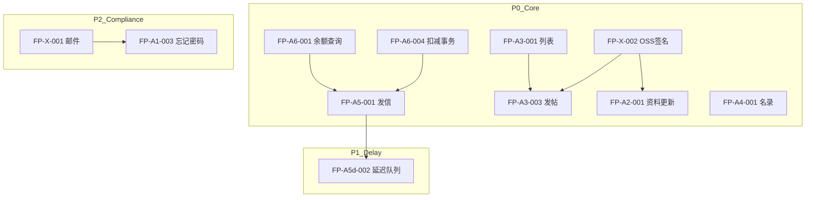

# 03 — 优先级、依赖与 Sprint 分组

> **文档元信息**  
> **版本**：1.1 · **更新**：2026-05-09 · **维护人**：AI + Owner

## P0（阻塞「社交主路径」首发）

| FP | 说明 |
|----|------|
| FP-X-002 | OSS 预签名（发帖图、头像共用） |
| FP-A3-001 ~ A3-004 | App 明信片列表/详情/发帖/评论 |
| FP-A3-007 | 发帖/评论敏感词（可与 A3-003 同迭代） |
| FP-A5-001 | 发信写库 + 业务校验 |
| FP-A6-004 | 邮票扣减与信件同事务 |
| FP-A6-001 | 余额查询（信箱顶栏依赖） |
| FP-A2-001 | 资料更新 API（与 `me` 闭环） |
| FP-A4-001 | 名录分页 API |

**P0 退出标准**：未登录可 bootstrap；登录后可刷真帖子列表；可发待审帖；可对真用户发信且 DB 有 `bu_letter`；邮票扣减正确。

---

## P1（首发体验完整）

| FP | 说明 |
|----|------|
| FP-A5-002 ~ A5-005 | 信箱 Flutter 全 REST、单封、加速 |
| FP-A5d-001 ~ A5d-002 | 平邮延迟配置 + 队列投递 |
| FP-A5d-004 | 腾讯好友同步实做（按产品是否强制） |
| FP-A6-002 ~ A6-003 | 流水分页、登录/发帖赠邮票 |
| FP-A7-001 ~ A7-003 | VIP 权益与扣费规则 |
| FP-A4-002 ~ A4-004 | 筛选、排序、用户卡数据 |
| FP-A3-005 ~ A3-006 | 举报 App 端、OSS 联调收尾 |
| FP-A8-006 | 举报与后台闭环 |

---

## P2（合规与上线闸门）

| FP | 说明 |
|----|------|
| FP-X-001 | 邮件 + outbox |
| FP-A1-003 | 忘记密码（依赖邮件） |
| FP-A1-007 | AES 全链路 |
| FP-A8-005 | GDPR 注销 |
| FP-X-003 | 版本强更 |
| FP-A1-004 | 密码策略与风控 |

---

## P3（运营、体验、国际化）

| FP | 说明 |
|----|------|
| FP-A9-002 ~ A9-004 | 邮票流水页、设备封禁 UI、UAT 清单 |
| FP-A10-001 ~ A10-002 | 运行时语言、Manage i18n（可选） |
| FP-B14-001 / FP-B15-001 | 视觉与登录规范 |
| FP-X-004 | 可观测性增强 |

---

## 依赖图（Mermaid）

---

## Sprint 分组（每 Sprint ≈ 1 周，可并行前后端）

| Sprint | 范围 | 主要 FP |
|--------|------|---------|
| **S1** | P0 后端写能力 | X-002；A3-001~004；A5-001；A6-001/004；A2-001；A4-001 |
| **S2** | P0 Flutter + 管理端联调 | 同上 FP 的 App UI；审核流端到端；`USE_MOCK=false` 默认路径 |
| **S3** | P1 | A5-002~005；A5d-*；A6-002/003；A7-*；A4-002~004；A3-005/008 |
| **S4** | P2 + P3 | X-001；A1-003/007；A8-005；A9-002/003；A10；B14/B15；X-003/004 |

**依赖说明**：S2 依赖 S1 契约冻结；S3 依赖 S1 发信与扣邮票稳定；S4 可部分与 S3 并行（如纯 UI 的 B14）。

---

## 与 PLAN.md 里程碑映射

| PLAN | 本分组 |
|------|--------|
| M2 / S9 | Sprint 1–2（P0） |
| M3 | Sprint 3（P1 + 部分 P2 若资源允许） |
| M4 | Sprint 4（P2+P3） |
