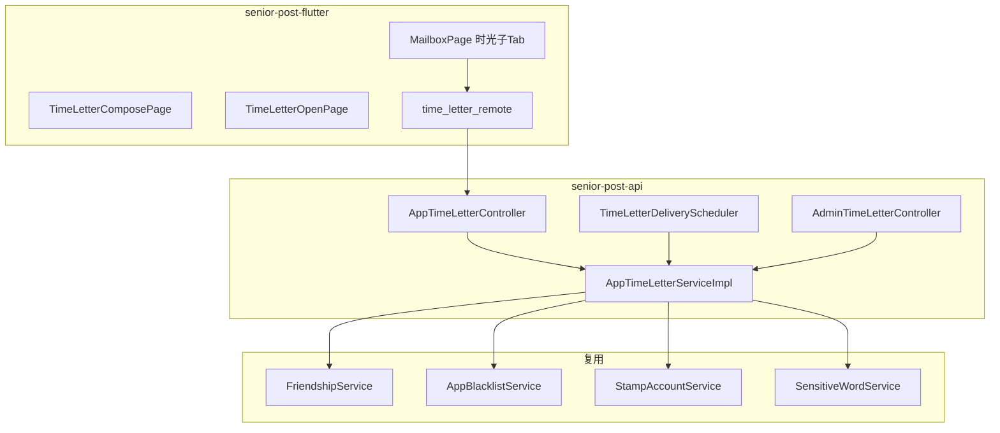
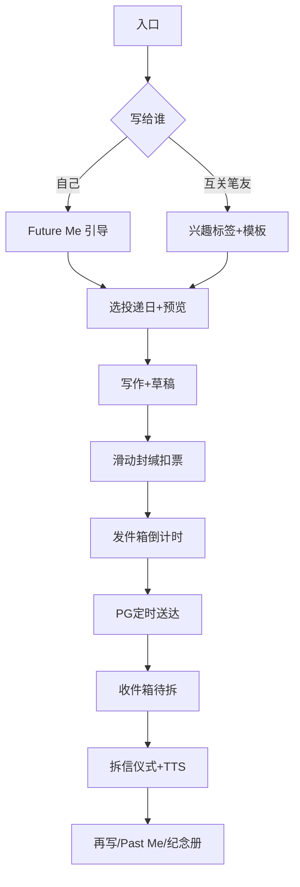

# 时光邮局 v1 — 技术实施清单

> **版本**：1.0 · **创建**：2026-05-25  
> **需求真源**：[时光邮局功能提案.md](../../../时光邮局功能提案.md) §5  
> **阶段跟踪**：[task_plan.md](./task_plan.md)

---

## 1. 架构



---

## 2. API 契约（v1）

Base: `/api/app/time-letter`

| 方法 | 路径 | 说明 |
|------|------|------|
| POST | `/draft` | 保存草稿 |
| GET | `/draft/{id}` | 读草稿 |
| DELETE | `/draft/{id}` | 删草稿 |
| POST | `/seal` | 封缄（body 含 `sealRequestId` 幂等） |
| POST | `/{id}/cancel` | 24h 内取消 |
| POST | `/outbox/paging` | 发件箱 |
| POST | `/inbox/paging` | 收件箱 |
| POST | `/memorial/paging` | 纪念册（已读） |
| GET | `/{id}` | 详情（状态决定正文可见性） |
| POST | `/{id}/open` | 拆信 → READ |
| POST | `/{id}/star` | 星标 |
| GET | `/stats` | 私密统计 |
| GET | `/calendar` | 年历（M3） |
| GET | `/preview-delivery` | 送达日预览 |
| GET | `/recent-recipients` | 最近 3 位收信人 |
| GET | `/pending-deletion` | 注销冷静期待发清单（M4） |

Admin: `/webapi/content/time-letter/paging` · `GET /{id}` · `POST /{id}/takedown`

---

## 3. 数据库 `bu_time_letter`

```sql
-- 示意，实现时写入 V26__time_letter.sql
bu_time_letter (
  id BIGSERIAL PRIMARY KEY,
  sender_id BIGINT NOT NULL,
  recipient_id BIGINT,              -- NULL = 写给自己
  recipient_type SMALLINT NOT NULL, -- 1=SELF 2=FRIEND
  body TEXT NOT NULL,
  content_tag VARCHAR(32),
  emotion_tag VARCHAR(32),
  paper_theme VARCHAR(32),
  paper_color VARCHAR(16),
  delivery_date DATE NOT NULL,
  delivery_tz VARCHAR(64) NOT NULL,
  status SMALLINT NOT NULL,
  sealed_at TIMESTAMPTZ,
  delivered_at TIMESTAMPTZ,
  read_at TIMESTAMPTZ,
  cancel_deadline_at TIMESTAMPTZ,
  cancelled_at TIMESTAMPTZ,
  stamp_cost INT DEFAULT 0,
  sender_snapshot_json JSONB,
  writer_city VARCHAR(128),
  write_duration_sec INT,
  privacy_level SMALLINT DEFAULT 1,
  pin_code_hash VARCHAR(128),
  star_flag BOOLEAN DEFAULT FALSE,
  reply_to_id BIGINT,
  seal_request_id VARCHAR(64),
  fail_reason VARCHAR(256),
  takedown_reason VARCHAR(256),
  -- AbstractAuditableDomain 审计列
  created_at, created_by, updated_at, updated_by, del_flag
);
```

**索引建议：**

- `(status, delivery_date, delivery_tz)` — 调度
- `(sender_id, status, created_at DESC)` — 发件箱
- `(recipient_id, status, delivered_at DESC)` — 收件箱
- UNIQUE `(sender_id, recipient_id, delivery_date)` WHERE status IN (PENDING, DELIVERED) — 同人同日唯一

---

## 4. 后端文件清单

| 文件 | 说明 |
|------|------|
| `server/.../db/migration/V26__time_letter.sql` | 建表 |
| `client/.../api/app/AppTimeLetterApi.java` | App 契约 |
| `client/.../api/admin/AdminTimeLetterApi.java` | Manage 契约 |
| `client/.../model/input/app/TimeLetter*.java` | 入参 DTO |
| `client/.../model/out/TimeLetter*.java` | 出参 VO |
| `client/.../common/enums/TimeLetterStatus.java` | 状态枚举 |
| `biz/.../model/domain/TimeLetterDomain.java` | 领域 |
| `biz/.../mapper/TimeLetterMapper.java` | Mapper |
| `biz/.../config/TimeLetterProperties.java` | 配置 |
| `biz/.../service/app/AppTimeLetterService.java` | 接口 |
| `biz/.../service/app/impl/AppTimeLetterServiceImpl.java` | 实现 |
| `biz/.../service/admin/AdminTimeLetterService*.java` | Manage |
| `biz/.../service/timeletter/TimeLetterDeliveryService.java` | 送达 |
| `biz/.../schedule/TimeLetterDeliveryScheduler.java` | 定时 |
| `biz/.../controller/app/AppTimeLetterController.java` | Controller |
| `biz/.../controller/admin/AdminTimeLetterController.java` | Admin |
| `biz/.../resources/messages/app*.properties` | 错误码文案 |

**配置 `application.yml`：**

```yaml
senior-post.time-letter:
  stamp-cost: 1
  max-delivery-years: 2
  daily-create-limit: 5
  recipient-30d-limit: 3
  in-flight-limit: 20
  body-max-length: 1500
  body-soft-hint-length: 800
  cancel-window-hours: 24
  delivery-batch-size: 200
  delivery-fixed-delay-ms: 60000
```

---

## 5. Flutter 文件清单

| 文件 | 说明 |
|------|------|
| `lib/features/time_letter/time_letter_remote.dart` | API |
| `lib/features/time_letter/time_letter_providers.dart` | Riverpod |
| `lib/features/time_letter/time_letter_compose_page.dart` | 写作+封缄 |
| `lib/features/time_letter/time_letter_open_page.dart` | 拆信+阅读 |
| `lib/features/time_letter/time_letter_list_tab.dart` | 时光 Tab 容器 |
| `lib/features/time_letter/time_letter_seal_slider.dart` | 滑动封缄 |
| `lib/features/time_letter/time_letter_templates.dart` | 模板文案 |
| `lib/features/mailbox/mailbox_page.dart` | 第三 Tab |
| `lib/features/directory/user_card_page.dart` | 入口 |
| `lib/app/router/app_router.dart` | 路由 |
| `lib/l10n/app_zh.arb`, `app_en.arb` | 文案 |

---

## 6. Manage 文件清单

| 文件 | 说明 |
|------|------|
| `src/pages/content/TimeLetterList.tsx` | 列表+下架 |
| `src/pages/AdminLayout.tsx` | 菜单+路由 |
| `src/services/api.ts` | API 方法 |

---

## 7. 核心业务规则

1. **扣票**：`seal` 成功扣 `stamp-cost`；`refId=letter.id`
2. **取消**：`now < cancel_deadline_at` → 退票 + `CANCELLED`
3. **送达**：scheduler 在当地 `delivery_date` 00:00 后首次批次 → `DELIVERED`
4. **已读**：`open` 完成拆信仪式 → `READ` + `read_at`
5. **失败**：到期前收件人不可收 → `FAILED` + 退票 + 通知发件人
6. **封缄后**：发件人不可再看正文，仅可 24h 内取消

---

## 8. 测试策略

| 层 | 用例 |
|----|------|
| 单元 | 非互关拒绝；限额；24h 取消退票；同人同日唯一 |
| 单元 | 时区 DST；FAILED 路径 |
| 集成 | seal → 改 date → scheduler → open |
| Flutter | compose/seal widget；主路径手工 |
| DoD | 自己+笔友闭环；拉黑失败；Manage 下架 |

---

## 9. v1 裁剪优先级

**Must（M1+M2+M4 核心）：** 草稿/封缄/扣票/取消/发收件箱/拆信/互关/黑名单/限额/Manage 下架/基础适老阅读

**Should（M3，可 v1.1）：** 年历、PIN、Past Me、快捷回邮、促活提示、明信片版式、夜间模式

**Won't（v1.5+）：** 单图、ASR、心情反馈、兴趣推荐、PDF、Push/IM

---

## 10. 用户主路径


