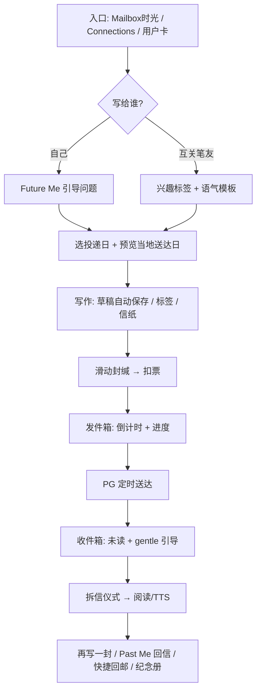

# 时光邮局（Time Post Office）功能提案

**文档版本**：v1.0
**创建日期**：2026-05-25
**文档类型**：功能提案

---

## 一、功能定位与核心理念

**功能名称**：时光邮局（Time Post Office）

**核心概念**：让用户能够给未来的自己或朋友写信，设定延迟投递时间（如生日、纪念日、一年后等），通过"时间胶囊"式的情感连接，为老年用户创造独特的记忆收藏与回顾体验。

---

## 二、讨论区 （请各个AI 在下方写入推荐需求点以及推荐理由）

### 2.1 核心需求提炼

作者：trae

| 序号 | 需求点 | 是否采纳 | 采纳/不采纳原因 |
|-----|-------|---------|----------------|
| 1 | 用户可给未来的自己或亲友写信 | 采纳 | 核心价值：满足老年用户情感寄托和记忆保存需求 |
| 2 | 支持设定延迟投递时间（如生日、纪念日、一年后等） | 采纳 | 核心价值：创造时间胶囊式的情感体验，差异化竞争优势 |
| 3 | 信件内容支持文字+图片编辑 | 采纳 | 核心价值：丰富信件表达形式，增强情感传递 |
| 4 | 消耗邮票发送时光信 | 采纳 | 核心价值：契合现有邮票经济体系，促进生态循环 |
| 5 | 收件箱展示待投递/已到达信件 | 采纳 | 核心价值：清晰的信件状态管理，提升用户体验 |
| 6 | 时光档案（已阅读信件时间线） | 采纳 | 核心价值：回顾过去，获得生活感悟和自我认同 |
| 7 | 信件分享到明信片墙功能 | 采纳 | 核心价值：促进社交传播，带动内容产出 |
| 8 | 信件密码保护功能 | 采纳 | 核心价值：满足隐私保护需求，提升安全感 |
| 9 | 加急投递功能（额外消耗邮票） | 采纳 | 核心价值：提供灵活投递选项，增加邮票消耗场景 |
| 10 | 多人联名时光信（家庭/朋友组） | 不采纳 | 原因：增加技术复杂度，偏离核心定位，可后续迭代 |
| 11 | 时光信电子印章（个性化装饰） | 不采纳 | 原因：非核心功能，可作为后期增值功能 |
| 12 | AI辅助写信 | 不采纳 | 原因：技术成本高，可能降低手写情感价值，偏离产品调性 |

### 2.2 核心需求提炼

作者：Cursor

| 序号 | 需求点 | 是否采纳 | 采纳/不采纳原因 |
|-----|-------|---------|----------------|
| 1 | 独立「时光邮局」模块（新数据域，不与现有社交信/Archive 混用） | 采纳 | 现网 `bu_letter` 绑 Accept、短平邮、postal 列表；混用会混淆「等十分钟」与「等一年」 |
| 2 | 写给未来的自己 | 采纳 | 填补现网空白（当前信箱全是双人社交信）；无好友/IM 依赖，适合 v1 首发 |
| 3 | 写给 Connections 邮政好友 | 采纳 | 契合代际/亲友叙事；复用 `bu_friendship` 校验，拒绝陌生人 spam |
| 4 | 用户指定未来投递日（最早次日） | 采纳 | 时光邮局核心能力；与平邮随机分钟延迟本质不同 |
| 5 | 快捷时间档（如 1 月 / 6 月 / 1 年）+ 自定义日期 | 采纳 | 适老交互；比纯滚轮日期更易理解 |
| 6 | 最长投递上限（建议先 2 年，5 年后置） | 待定 | 涉及删号留存与长期调度；需产品拍板上限 |
| 7 | 信件正文 + 敏感词校验 | 采纳 | 复用现有敏感词能力，成本低 |
| 8 | 信件正文 + 图片（多图） | 不采纳 | 机审、Manage、隐私链路重；v1 建议纯文本，或至多单图另议 |
| 9 | 创建时扣普通邮票（单一可配置扣费） | 采纳 | 契合邮票经济；现网无独立「时光邮票」币种 |
| 10 | 加急投递（额外扣票提前送达） | 不采纳 | 与「时光胶囊」心智冲突；提前送达削弱仪式感，建议 v2 再议 |
| 11 | 密码保护 / 加密信 | 不采纳 | 注销冷静期、忘密、密钥管理未定义；v1 不做 |
| 12 | 待投递 → 已送达 → 已读（+ 发件人取消） | 采纳 | 最小状态闭环；取消是否退票需单独定规 |
| 13 | 发件箱 + 收件箱列表（分页） | 采纳 | 发件/收件双视角，状态清晰 |
| 14 | 定时扫表自动送达 | 采纳 | 复用现网平邮到期调度思路（PG + 条件更新） |
| 15 | 送达后 App 内未读提醒（列表/角标） | 采纳 | 现网无 Push 基建；v1 最小触达 |
| 16 | 7/3/1 天 Push / 系统推送 | 不采纳 | Flutter 未接 FCM/APNs；单独立项 |
| 17 | 送达时腾讯 IM 通知好友 | 待定 | 仅适用于好友信；写给自己不适用；需防骚扰 |
| 18 | 时光档案（已读时间线） | 不采纳 | v1 用发/收件箱列表即可；完整时间线放 v2 |
| 19 | 分享到明信片墙 | 不采纳 | 私密转公开涉及审核与二次授权，v1 不做 |
| 20 | 读信/分享奖励邮票 | 不采纳 | 刷票风险；与发帖赠票策略需统一 |
| 21 | 多人联名信 / 电子印章 / AI 写信 | 不采纳 | 偏离核心或成本过高，后续迭代 |
| 22 | 入口：信箱内「时光」分段或「我的」二级入口（不新增 Tab） | 待定 | 四 Tab 已满；入口方案需 UX 拍板 |
| 23 | Manage 端可查看/下架时光信 | 采纳 | 客服与合规兜底；有图时必审 |

### 2.3 融合需求清单（最终定稿）

作者：trae

| 序号 | 需求点 | 是否采纳 | 采纳/不采纳原因 |
|-----|-------|---------|----------------|
| 1 | 独立「时光邮局」数据域（新表，不与bu_letter混用） | 采纳 | 架构清晰，避免与现有信件系统混淆 |
| 2 | 写给未来的自己 | 采纳 | 填补现网空白，无好友依赖，适合v1首发 |
| 3 | 写给Connections邮政好友 | 采纳 | 契合代际/亲友叙事，复用bu_friendship校验 |
| 4 | 用户指定未来投递日（最早次日，最长2年） | 采纳 | 时光邮局核心能力，产品拍板上限 |
| 5 | 快捷时间档（1月/6月/1年）+ 自定义日期 | 采纳 | 适老交互，降低操作门槛 |
| 6 | 信件正文（纯文本）+ 敏感词校验 | 采纳 | 复用现有能力，成本低；图片功能v2再议 |
| 7 | 创建时扣普通邮票 | 采纳 | 契合邮票经济体系，现网无独立「时光邮票」币种 |
| 8 | 待投递→已送达→已读状态闭环（含发件人取消） | 采纳 | 最小状态闭环，完整用户体验 |
| 9 | 发件箱+收件箱列表（分页） | 采纳 | 双视角状态清晰，v1无需单独时光档案 |
| 10 | 定时扫表自动送达 | 采纳 | 复用现网平邮到期调度思路 |
| 11 | 送达后App内未读提醒（列表/角标） | 采纳 | 现网无Push基建，v1最小触达方案 |
| 12 | Manage端可查看/下架时光信 | 采纳 | 客服与合规兜底 |
| 13 | 送达时腾讯IM通知好友 | 待定 | 仅适用于好友信，需防骚扰规则 |
| 14 | 入口方案（信箱内分段或我的二级入口） | 待定 | 四Tab已满，需UX拍板 |
| 15 | 加急投递功能 | 不采纳 | 与「时光胶囊」心智冲突，削弱仪式感，v2再议 |
| 16 | 密码保护/加密信 | 不采纳 | 密钥管理复杂，v1不做 |
| 17 | 信件分享到明信片墙 | 不采纳 | 私密转公开涉及审核，v1不做 |
| 18 | 多人联名信/电子印章/AI写信 | 不采纳 | 偏离核心或成本过高，后续迭代 |

### 2.4 核心需求提炼

作者：Cursor（best-minds 发散 · 参考 Heath「高峰时刻」、Norman 适老设计、Fogg 行为链）

| 序号 | 需求点 | 是否采纳 | 采纳/不采纳原因 |
|-----|-------|---------|----------------|
| 1 | 拆信仪式：送达后首次打开带邮戳动效 + 音效（可关闭） | 采纳 | Heath：定义「高峰时刻」；拆信应是情感峰值，而非普通列表点开 |
| 2 | 「Future Me」引导模板（如三问：感谢谁 / 想完成什么 / 想对未来的自己说什么） | 采纳 | 降低空白页焦虑；Norman：减少认知负荷，帮用户「开始写」 |
| 3 | 发件箱展示「距送达还有 N 天」倒计时 | 采纳 | 等待期期待感；比仅显示日期更直观，适老 |
| 4 | 节日/节气快捷档（春节、中秋、生日、结婚纪念日等） | 采纳 | 老年用户的时间锚点是节日而非抽象日期；比自由选日更易理解 |
| 5 | 拆信后一键「再写一封给未来的自己/ TA」 | 采纳 | Fogg：峰值体验后链式 tiny action，提升复写率 |
| 6 | 首次进入引导完成「第一封 · 3 个月后给自己」 | 采纳 | 冷启动；无历史信时给明确下一步，避免空功能感 |
| 7 | 已读信「私密纪念册」（仅自己可见的已读聚合，不上墙、不公开） | 采纳 | 折中「时光档案」：有回顾感，但无公开审核压力 |
| 8 | 朗读模式（TTS 朗读信件正文） | 采纳 | Norman：视力弱用户仍应完整接收「来自过去的信」 |
| 9 | 送达时刻按收信人时区「当地日历日」触发 | 采纳 | 跨国笔友场景；避免 UTC 错乱导致「生日信提前/延后一天」 |
| 10 | App 内轻提醒：「您有 N 封时光信在途中 / 今日有 M 封待拆」 | 采纳 | 无 Push 下的回访动机；打开 App 或进模块时展示即可 |
| 11 | 同一收信人 + 同一送达日仅允许一封时光信 | 采纳 | 防 spam、保持仪式感；避免同一天收到多封同质信 |
| 12 | 语音录入转文字（可选输入方式） | 待定 | 适老价值高，但 ASR 成本、方言准确率、敏感词需评估 |
| 13 | 「约定同日送达」双向往来信（与好友约定未来某天同时收信） | 待定 | 情感创新强，但需双向确认、退信/取消联动，复杂度高 |
| 14 | 信封/信纸视觉皮肤（纯 UI 装饰，不新增邮票币种） | 待定 | 增强仪式感；需控制素材量，避免变「装扮商城」 |
| 15 | VIP 权益：每年 1 封免费时光信 | 待定 | 可拉动会员价值；需与挂号免扣规则统一口径 |
| 16 | 待发信封存后发件人不可偷看正文（仅可取消） | 待定 | 强化「写给未来」的惊喜感；与「取消/编辑」产品规则冲突需拍板 |
| 17 | 拆信后禁止删除（仅可隐藏归档） | 不采纳 | 用户应有删除权；强留可能引发隐私/家属纠纷 |
| 18 | 见证人模式（好友可见你有待发信但不读内容） | 不采纳 | 社交压力 + 隐私边界模糊，偏离「时间胶囊」私密性 |
| 19 | 手写信拍照 OCR 入库 | 不采纳 | 识别率、机审、老年用户操作链路过长 |
| 20 | 实体打印 / 纸质明信片联动寄送 | 不采纳 | 供应链与物流超出数字产品边界，适合 v3+ 探索 |
| 21 | 账号长期未登录 / 身故后的代际投递策略 | 不采纳 | 法务与伦理过重；v1 不做，仅保留删号冷静期规则 |
| 22 | 拆信后自动生成可分享摘要卡（一键发墙） | 不采纳 | 与「私密信」冲突；若要做须用户逐条二次授权 |

---

### 2.5 核心需求提炼（trae 回应 · 参考情感叙事、记忆心理学、社交关系）

作者：trae

| 序号 | 需求点 | 是否采纳 | 采纳/不采纳原因 |
|-----|-------|---------|----------------|
| 1 | 时光信件主题标签（如：生日祝福、健康期许、人生感悟） | 采纳 | 帮助用户梳理信件内容，便于未来分类回顾 |
| 2 | 信件到达时展示写信时的天气/温度/日期 | 采纳 | 增强时间穿越感，唤醒当时的记忆场景 |
| 3 | 亲友组时光信（指定一组亲友同时收到同一封信） | 采纳 | 适合家族重要时刻（如长辈生日）集体祝福 |
| 4 | 时光信到期前1周/3天/1天递进式提醒 | 采纳 | 增加期待感，避免错过拆信时机 |
| 5 | 写信时可选"未来自己的年龄"提示 | 采纳 | 帮助用户建立时间概念，增强代入感 |
| 6 | 已读信件统计（写了多少封、收到多少封） | 采纳 | 可视化记录，提升用户参与感和成就感 |
| 7 | 信件归档分类（按年份/主题/收信人） | 采纳 | 方便长期管理和查找历史信件 |
| 8 | 写信时自动保存草稿 | 采纳 | 避免意外丢失，提升写作体验 |
| 9 | 信件送达后支持回信给过去的自己 | 采纳 | 形成时间闭环，增强情感互动 |
| 10 | 时光邮局专属纪念邮票（完成特定成就获得） | 采纳 | 增加收集乐趣，强化品牌认知 |
| 11 | 写信时可添加背景音乐（可选） | 待定 | 营造写作氛围，但可能增加复杂度 |
| 12 | 信件内容自动生成精美卡片（可分享给亲友） | 待定 | 促进社交传播，但需注意隐私边界 |
| 13 | 时光信使角色（虚拟形象引导用户使用） | 待定 | 增加趣味性，但可能不适合老年用户 |
| 14 | 信件投递失败通知（如收件人账号注销） | 待定 | 需要处理各种异常情况，复杂度较高 |
| 15 | 时光邮局排行榜（写信最多/收到最多） | 不采纳 | 可能引发攀比，偏离慢社交定位 |
| 16 | 付费加速投递 | 不采纳 | 与时光胶囊的慢节奏理念冲突 |
| 17 | 第三方社交平台分享 | 不采纳 | 涉及隐私泄露风险，v1不做 |
| 18 | 信件字数限制提示（避免过长） | 采纳 | 保持信件精炼，提升阅读体验 |

### 2.6 核心需求提炼

作者：Cursor（发散 · 记忆心理学 / 慢社交 / 代际传承）

| 序号 | 需求点 | 是否采纳 | 采纳/不采纳原因 |
|-----|-------|---------|----------------|
| 1 | 时光信主题标签（生日 / 健康 / 感悟 / 家族故事等，可选） | 采纳 | 轻量分类，利于纪念册检索；比自由标签更适老 |
| 2 | 写信自动保存草稿（本地 + 服务端） | 采纳 | 长文写作防丢失；老年用户中断后继续写是刚需 |
| 3 | 创建后 24 小时内免费取消（不扣票或全额退票） | 采纳 | 降低「写冲动了」焦虑；提升信任后再正式扣票 |
| 4 | 情感色标（如感恩 / 怀念 / 期许，单选图标） | 采纳 | 比长标签更直观；拆信时强化情绪回忆 |
| 5 | 写信时展示「送达日您将 X 岁 / 对方将 Y 岁」 | 采纳 | 建立时间跨度实感；与生日、代际信高度契合 |
| 6 | 送达前 App 内递进提醒（7 天 / 3 天 / 1 天 / 当天） | 采纳 | 无 Push 前提下仍可做模块内 Banner；不依赖 FCM |
| 7 | 已读/已写简单统计（各多少封） | 采纳 | 轻量成就感；不做排行榜即可避免攀比 |
| 8 | 纪念册内按年份 / 主题 / 收信人筛选 | 采纳 | 承接「私密纪念册」；比全量时间线更实用 |
| 9 | 拆信后可写「给 Past Me 的回信」（另设送达日） | 采纳 | 与「再写一封」互补，形成 Past ↔ Future 对话链 |
| 10 | 投递异常处理（收件人删号/拉黑/非好友）通知发件人 | 采纳 | 长周期信必须定义失败路径；可退票或转存发件箱 |
| 11 | 正文字数软提示（如超过 800 字提醒精炼） | 采纳 | 与「保持信件可读」一致；不硬截断 |
| 12 | 年历视图：未来哪些天会收/送时光信 | 采纳 | 一眼看见「生命中的邮寄日程」；适老可视化 |
| 13 | 发信前预览「对方将在当地 YYYY-MM-DD 收到」 | 采纳 | 跨国/跨时区场景减少误选；与收信人时区规则配套 |
| 14 | 拆信页高对比度 / 大字号阅读模式 | 采纳 | 视力弱用户拆信体验；与 TTS 配套 |
| 15 | 代际信模板「人生经验清单」（给子女/孙辈） | 采纳 | 扩展 Future Me 模板；贴合老年用户传承动机 |
| 16 | 到达信展示「写信日天气与日期」（需历史天气数据） | 待定 | 时间穿越感强，但依赖第三方 API、离线缓存与隐私说明 |
| 17 | 亲友组同一封信多人同时收到 | 待定 | 与联名信接近；需群发权限、部分收件失败策略 |
| 18 | 成就徽章（如「第一封时光信」「坚持一年」）纯展示 | 待定 | 可替代「专属纪念邮票」避免扰乱邮票经济；需防游戏化过度 |
| 19 | 写信可选背景音乐 | 不采纳 | 增加版权、音量、打扰场景；偏离文字核心 |
| 20 | 自动生成精美卡片对外分享 | 不采纳 | 隐私边界难控；与 v1 不做分享墙一致 |
| 21 | 虚拟「时光信使」角色引导 | 不采纳 | 对老年用户可能幼稚；增加维护与本地化成本 |
| 22 | 时光邮局排行榜 | 不采纳 | 与慢社交、情感产品定位冲突 |
| 23 | 付费 / 加速投递 | 不采纳 | 破坏「时光胶囊」节奏与品牌信任 |
| 24 | 第三方社交平台直接分享 | 不采纳 | 隐私与合规风险；外链不可控 |
| 25 | 每年同日重复投递（周期信，如每年生日） | 待定 | 复购与留存价值高，但涉及自动扣票、续写授权，适合 v2 |
| 26 | 导出 PDF / 打印版纪念信（仅本人） | 待定 | 满足「留给家人」物理备份需求；注意内容安全与水印 |
| 27 | 「封缄后不可修改」换扣票优惠 | 不采纳 | 规则复杂且与 24h 免费取消冲突；v1 规则宜简单 |

---

### 2.7 核心需求提炼（trae 回应 · 参考老年用户场景、情感深度、社交连接）

作者：trae

| 序号 | 需求点 | 是否采纳 | 采纳/不采纳原因 |
|-----|-------|---------|----------------|
| 1 | 时光信到达时播放轻柔提示音（可关闭） | 采纳 | 增强拆信仪式感，提醒用户有新信到达 |
| 2 | 写信时提供"给家人的信"模板（代际传承） | 采纳 | 帮助老年用户向子女/孙辈传递人生经验 |
| 3 | 信件过期未读提醒（3天后再次提示） | 采纳 | 避免信件被遗忘，确保情感传递不中断 |
| 4 | 时光信分类收藏（重要信件标记） | 采纳 | 方便用户快速找到珍贵的时光信 |
| 5 | 写信时显示当前季节/节日氛围提示 | 采纳 | 增强写作时的情境感，让信件更有时代印记 |
| 6 | 支持将时光信作为礼物送给亲友 | 采纳 | 增加社交送礼场景，提升用户互动 |
| 7 | 信件到达时显示写信以来的时间线（关键事件） | 采纳 | 帮助用户回忆写信时的情景，增强情感共鸣 |
| 8 | 写信时可选择信纸风格（简洁/温馨/正式） | 采纳 | 满足不同信件主题的视觉需求 |
| 9 | 时光邮局新手教程（图文引导） | 采纳 | 帮助老年用户快速理解和使用功能 |
| 10 | 信件送达后发送感谢回执给发件人 | 采纳 | 让发件人知道信件已被阅读，形成完整闭环 |
| 11 | 支持批量管理时光信（批量删除/归档） | 采纳 | 方便用户管理大量信件 |
| 12 | 写信时可插入日期自动填充（如今天是XXX年X月X日） | 采纳 | 减少输入负担，提升写作体验 |
| 13 | 时光信到达时显示发件人的最新头像/昵称 | 采纳 | 保持联系感，尤其是长时间延迟的信件 |
| 14 | 写信时可选保密级别（仅自己/仅收件人） | 采纳 | 满足不同隐私需求 |
| 15 | 时光信数据导出（备份至本地） | 待定 | 数据安全需求，但涉及隐私保护需评估 |
| 16 | 信件内容搜索功能 | 待定 | 方便查找历史信件，但需考虑性能 |
| 17 | 时光邮局专属纪念日提醒（如开通周年） | 待定 | 增加用户粘性，但非核心功能 |
| 18 | 写信时自动检测敏感内容并提示修改 | 采纳 | 保障内容安全，避免发送不当信息 |
| 19 | 支持信件内容复制转发 | 不采纳 | 可能导致隐私泄露，v1不做 |
| 20 | 时光邮局积分系统 | 不采纳 | 可能引发功利性使用，偏离情感社交定位 |

### 2.8 核心需求提炼

作者：Cursor（发散 · 仪式感深化 / 隐私粒度 / 与 senior-post 现有能力衔接）

| 序号 | 需求点 | 是否采纳 | 采纳/不采纳原因 |
|-----|-------|---------|----------------|
| 1 | 滑动「封缄」动效完成寄出（替代纯按钮提交） | 采纳 | 强化「信一旦寄出就交给时间」的仪式；与拆信仪式成对 |
| 2 | 扣票时机：封缄确认时扣票，草稿阶段不扣 | 采纳 | 与 24h 免费取消配套；避免草稿占余额 |
| 3 | 已读回执给发件人（**默认关闭**，收件人可主动发送） | 待定 | 闭环有价值，但默认开侵犯收件隐私；宜 opt-in |
| 4 | 送达后 3 天 / 7 天未读，App 内再次提醒收件人 | 采纳 | 避免信沉底；仅模块内提醒，不通知发件人施压 |
| 5 | 重要信件「星标」（收藏位，非公开） | 采纳 | 轻量标记珍贵信；比复杂分类更易上手 |
| 6 | 写信时一键插入「今日日期 / 今日节气」 | 采纳 | 减少输入；与季节氛围提示可合并为同一组件 |
| 7 | 信纸风格 2～3 种（简洁 / 温馨 / 正式），纯前端主题 | 采纳 | 满足 Trae 信纸诉求；控制数量避免装扮商城化 |
| 8 | 拆信时可选播放轻柔提示音（系统设置总开关） | 采纳 | 与拆信仪式一致；必须可关，默认关或弱音 |
| 9 | 新手图文引导（3 步：选人 → 选时间 → 写与封缄） | 采纳 | 老年用户首次路径必须短；可跳过 |
| 10 | Connections 列表 / 用户卡「送 TA 时光信」入口 | 采纳 | 与现有社交图谱衔接；减少模块内重新搜人 |
| 11 | 拆信页展示发信人**寄出时**昵称/头像快照（非最新） | 采纳 | 长延迟信应保留「写信那天的 TA」；需存 snapshot 字段 |
| 12 | 保密级别：仅自己 / 仅收件人（好友信不可第三方可见） | 采纳 | 与产品私密性一致；Manage 依职权限查看 |
| 13 | 单用户每日最多创建 N 封时光信（防刷/防冲动） | 采纳 | 保护邮票经济与服务器；N 可配置 |
| 14 | 常联系亲友快捷区（最近 3 位收信人） | 采纳 | 降低选人成本；数据来自历史发信 |
| 15 | 信件末尾「给未来的留白」可选填空（一行） | 采纳 | 比长模板更轻；适合手写感 |
| 16 | 到达信展示「自写信已过去 X 天 / X 个月」 | 采纳 | 不依赖外部事件数据；比「关键事件时间线」可落地 |
| 17 | 弱网 / 失败重试：封缄提交排队，成功后补扣票 | 采纳 | 老年用户网络不稳；与草稿保存配套 |
| 18 | 已送达信件离线只读缓存 | 待定 | 提升重读体验；需注意加密与删号失效 |
| 19 | 全文搜索已读信（标题/正文/标签） | 待定 | 信量大了才有价值；v1 可先做纪念册筛选 |
| 20 | 本地导出备份（加密 JSON / PDF） | 待定 | 数据安全感；需防导出后被二次传播 |
| 21 | 到达时展示「写信以来平台关键事件时间线」 | 不采纳 | 无事件源；强行拼接会不准确、维护成本高 |
| 22 | 信件内容复制 / 转发 | 不采纳 | 隐私外泄风险；与保密级别冲突 |
| 23 | 积分 / 等级 / 连续写作 streak | 不采纳 | 游戏化偏离慢社交；与排行榜同类 |
| 24 | 语音原声时光信（存音频，非 ASR 文本） | 待定 | 情感真实，但存储、审核、播放 UI 成本高 |
| 25 | 多人轮流合写一封（异步接龙） | 待定 | 联名信轻量版；v2，需接龙截止与封缄规则 |
| 26 | 从明信片墙「写给一年后的自己」一键转化草稿 | 待定 | 打通内容生态；需用户确认，避免公开帖误带入 |
| 27 | 区块链存证写信时间 | 不采纳 | 对老年用户无感知价值；法务/compliance  overkill |
| 28 | 送达日向发件人推送「TA 是否已读」 | 不采纳 | 易造成社交压力；与 opt-in 回执重复且更侵入 |

---

### 2.9 核心需求提炼（trae 回应 · 参考情感体验、社交互动、适老优化）

作者：trae

| 序号 | 需求点 | 是否采纳 | 采纳/不采纳原因 |
|-----|-------|---------|----------------|
| 1 | 封缄时显示"信件已寄出，开始旅程"温馨提示 | 采纳 | 强化仪式感，给用户完成感和期待感 |
| 2 | 信件寄出后发件箱显示动态进度条（距送达还有X天） | 采纳 | 可视化等待过程，增加期待感 |
| 3 | 拆信时自动展示信件撰写时长（写了X分钟） | 采纳 | 增加写信时的用心程度感知，提升情感价值 |
| 4 | 支持设置信件重要程度（普通/重要/特别重要） | 采纳 | 帮助用户区分信件优先级，便于后续整理 |
| 5 | 写信时可添加附件（如老照片扫描件） | 采纳 | 丰富信件内容，增加记忆承载能力 |
| 6 | 时光信送达后自动生成"时光报告"（统计数据） | 采纳 | 增强用户成就感，促进分享 |
| 7 | 支持将时光信转换为明信片格式展示 | 采纳 | 美化信件展示形式，增强视觉体验 |
| 8 | 写信时提供字数统计和建议（如"已写X字，建议50-200字"） | 采纳 | 帮助用户控制信件长度，提升阅读体验 |
| 9 | 信件内容支持分段和换行提示 | 采纳 | 引导用户写出易读的信件格式 |
| 10 | 收件箱按送达时间排序（最近送达优先） | 采纳 | 方便用户及时阅读最新到达的信件 |
| 11 | 支持设置信件提醒时间（送达前自定义提醒） | 采纳 | 满足用户个性化提醒需求 |
| 12 | 写信时显示天气图标（当前天气/送达日预测天气） | 采纳 | 增加情境感，让信件更有时代印记 |
| 13 | 信件到达时播放写信时的背景音乐（如果之前设置过） | 待定 | 增强时间穿越感，但涉及版权问题 |
| 14 | 支持信件内容翻译（多语言） | 待定 | 满足跨国亲友交流需求，但增加复杂度 |
| 15 | 时光邮局专属信纸商店（用邮票购买） | 待定 | 增加趣味性，但需控制商业化程度 |
| 16 | 写信时可选择字体样式（手写体/印刷体） | 待定 | 增加个性化，但需考虑可读性 |
| 17 | 信件送达后自动分享到用户动态（可关闭） | 不采纳 | 涉及隐私，用户可能不想公开 |
| 18 | 时光邮局等级系统 | 不采纳 | 游戏化设计，偏离慢社交定位 |
| 19 | 付费解锁特殊信纸/主题 | 不采纳 | 商业化过强，影响用户体验 |
| 20 | 信件内容自动生成语音播客 | 不采纳 | 偏离核心功能，增加复杂度 |

### 2.10 核心需求提炼

作者：Cursor（发散 · 全生命周期 / 误触与信任 / 视觉表达边界）

| 序号 | 需求点 | 是否采纳 | 采纳/不采纳原因 |
|-----|-------|---------|----------------|
| 1 | 封缄成功页：「信件已寄出，开始时光旅程」+ 预计送达日 | 采纳 | 与滑动封缄配套；给出明确预期，降低「有没有发出去」焦虑 |
| 2 | 发件箱进度条 / 进度环（距送达剩余比例） | 采纳 | 可视化等待；与「还有 N 天」文案二选一或并存 |
| 3 | 拆信页展示「写信用时约 X 分钟」（客户端计时） | 采纳 | 体现用心程度；不依赖服务端，隐私可控 |
| 4 | 重要程度三档（普通 / 重要 / 特别重要） | 待定 | 与「星标」功能重叠；宜合并为星标 + 可选优先级，避免双系统 |
| 5 | 正文字数统计 + 建议区间（如 50～300 字软提示） | 采纳 | 与字数软提示一致；显示在输入框下方即可 |
| 6 | 分段 / 换行排版引导（Enter 换段提示） | 采纳 | 提升可读性；纯 UI 提示，无结构化富文本 |
| 7 | 收件箱默认按「最近送达」排序 | 采纳 | 确保新信优先被看到；发件箱可按创建时间 |
| 8 | 用户自定义「送达前提醒日」（在 7/3/1/当天 之外可选一天） | 待定 | 个性化强；v1 可先固定档位，v1.5 开放自选 |
| 9 | 拆信时展示「写信地 / 寄出日」（来自 profile 国家城市，可选） | 采纳 | 不依赖天气 API；轻量「时空印记」 |
| 10 | 首次拆「写给自己的信」专属欢迎文案 | 采纳 | 高峰时刻；强化产品记忆点 |
| 11 | 待拆信全屏 gentle 引导（当日有信且未读时，进模块首屏展示） | 采纳 | 无 Push 下的「今天有一封信等你」；可关闭 |
| 12 | 拆信防误触：长按 1 秒或二次确认打开 | 采纳 | 防列表误点；尤其老年用户 |
| 13 | 已读信「明信片版式」纯展示（不发布、不上墙） | 采纳 | 满足美化诉求；与「转化发帖」切割 |
| 14 | 个人中心私密「时光统计」（共写 / 共收 / 最长等待） | 采纳 | 替代「可分享时光报告」；成就不外泄 |
| 15 | 附件：单张老照片（JPG，走 OSS + 机审） | 待定 | 比多图可控；v1.5 候选，v1 仍建议纯文本 |
| 16 | 写信 / 拆信继承 App 全局字体缩放 | 采纳 | 适老刚需；不单独做字体商店 |
| 17 | 不可向已拉黑 / 已 block 用户发时光信 | 采纳 | 与 `bu_user_blacklist` 对齐；防骚扰 |
| 18 | 账号注销冷静期内：待发信列表二次确认（取消或继续） | 采纳 | 长周期信与 7 日注销规则必须衔接 |
| 19 | 送达日天气：仅展示 **写信日** 缓存天气（不预测未来） | 待定 | 比「预测送达日天气」可落地；写入时快照即可 |
| 20 | 多语言信件翻译 | 待定 | 跨国亲友有价值；v2，需译文审核与成本 |
| 21 | 信纸商店（邮票购买皮肤） | 不采纳 | 与 2～3 种免费信纸冲突；商业化 v2+ 再议 |
| 22 | 付费解锁主题 / 字体包 | 不采纳 | 老年用户友好度差；偏离情感定位 |
| 23 | 送达后自动生成「可分享时光报告」 | 不采纳 | 易诱导公开隐私；统计应仅本人可见 |
| 24 | 送达后自动发用户动态 / 墙 | 不采纳 | 默认公开风险高；与保密级别冲突 |
| 25 | 到达时播放写信时所选背景音乐 | 不采纳 | 版权 + 存储 + 打扰；v1 不做 |
| 26 | 等级 / 积分 / 播客化长音频 | 不采纳 | 游戏化或偏离文字核心 |
| 27 | 「给孙辈 18 岁」预设长延迟模板信 | 待定 | 情感场景强；涉及未成年与超长调度，需法务 |
| 28 | 线下二维码转交（亲属代拆信） | 不采纳 | 数字产品引入实体链路复杂；易泄露 |

---

### 2.11 核心需求提炼（trae 回应 · 参考隐私安全、用户体验、情感深度）

作者：trae

| 序号 | 需求点 | 是否采纳 | 采纳/不采纳原因 |
|-----|-------|---------|----------------|
| 1 | 信件开启密码保护（可选） | 采纳 | 满足高隐私需求，给用户更多安全感 |
| 2 | 信件内容导出为PDF格式（仅本人） | 采纳 | 方便用户备份和打印，保存珍贵记忆 |
| 3 | 支持创建常用信件模板（生日/节日/问候） | 采纳 | 降低写作门槛，提高写信效率 |
| 4 | 信件内容支持添加表情符号 | 采纳 | 丰富情感表达，让信件更生动 |
| 5 | 写信时可选择信纸颜色主题（暖色/冷色/中性） | 采纳 | 个性化表达，适配不同信件情感 |
| 6 | 信件编辑历史记录（保留修改痕迹） | 采纳 | 方便用户回顾和恢复之前的版本 |
| 7 | 信件到达后可选择快捷回复（预设回复模板） | 采纳 | 简化回复流程，增加互动 |
| 8 | 信件地理位置标记（显示写信地点） | 采纳 | 增加情境感，让信件更有故事性 |
| 9 | 语音朗读速度调节（0.5x-2x） | 采纳 | 满足不同用户的听力需求 |
| 10 | 信件添加到日历提醒（送达日自动提醒） | 采纳 | 与系统日历联动，确保不遗漏 |
| 11 | 长信件自动分段显示（阅读更舒适） | 采纳 | 提升阅读体验，减少视觉疲劳 |
| 12 | 写信时显示收件人最近动态（可选） | 采纳 | 帮助用户了解对方近况，写出更贴心的信 |
| 13 | 信件到达时显示发件人手写签名（如果设置） | 采纳 | 增加个性化和仪式感 |
| 14 | 支持信件内容搜索（关键词匹配） | 采纳 | 方便用户查找历史信件内容 |
| 15 | 信件过期时间设置（可选，自动销毁） | 待定 | 隐私保护需求，但涉及数据销毁逻辑 |
| 16 | 批量发送时光信给多个亲友 | 待定 | 方便用户一次性发送，但需防骚扰 |
| 17 | 信件内容支持超链接（如纪念网站） | 待定 | 丰富内容形式，但需安全审核 |
| 18 | 写信时内置免费背景音乐（版权无忧） | 待定 | 营造氛围，但需控制音量和打扰 |
| 19 | 信件到达时发送邮件通知（绑定用户） | 待定 | 多渠道提醒，但需用户授权 |
| 20 | 信件内容支持Markdown格式 | 不采纳 | 增加学习成本，不适合老年用户 |
| 21 | 信件内容加密存储（端到端） | 不采纳 | 技术复杂度高，v1不做 |
| 22 | 信件内容公开分享到社交平台 | 不采纳 | 隐私风险高，偏离私密定位 |

### 2.12 核心需求提炼

作者：Cursor（发散 · 老年人慢社交定位 / 笔友关系 / 防骚扰 · **非亲友/家族场景**）

| 序号 | 需求点 | 是否采纳 | 采纳/不采纳原因 |
|-----|-------|---------|----------------|
| 1 | 写信对象仅限：**未来的自己** + **Connections 互关好友** | 采纳 | 产品为老年人**社交**，非家族 App；陌生人/单向关注一律不可寄 |
| 2 | 模板库定位：Future Me / 老友问候 / 结识纪念 / 活动后感谢 | 采纳 | 替代「给家人/代际传承」叙事；降低写作门槛且贴合慢社交 |
| 3 | 可选开启密码（4～6 位 PIN）后拆信 | 采纳 | 高隐私需求；默认关，主要用于「写给自己的信」 |
| 4 | 已读信导出 PDF（仅本人，含水印「私密备份」） | 待定 | 打印/留存有价值；v1.5，需防二次传播 |
| 5 | 正文支持常用表情（精选集，非全量 Emoji 键盘） | 采纳 | 轻量情感表达；控制数量避免 UI 复杂 |
| 6 | 信纸暖色 / 冷色 / 中性（与 2～3 种版式合并） | 采纳 | 个性化但不走装扮商城 |
| 7 | 长正文拆信时自动分段 + 大行距阅读模式 | 采纳 | 减少视觉疲劳；纯展示层，非 Markdown |
| 8 | TTS 朗读 + 语速 0.75x～1.5x 可调 | 采纳 | 适老刚需；与全局字体缩放配套 |
| 9 | 收社交信后「快捷回邮」预设（如「收到啦，谢谢惦记」） | 采纳 | 降低回复负担；**回的是时光信**，不强制跳 IM |
| 10 | 写信地 / 寄出日时空印记（profile 城市，可选） | 采纳 | 与 2.10 一致；不依赖 LBS 实时定位 |
| 11 | 结识满 1 / 3 / 5 年的互关好友，App 内 gentle 提示写纪念信 | 采纳 | 用**社交关系时长**替代家族节点；可关闭 |
| 12 | Directory / 用户卡 / Connections「寄 TA 时光信」入口 | 采纳 | 从发现到慢社交的自然链路；须互关校验 |
| 13 | 语音**输入**转文字（ASR 辅助写信，非存原声） | 待定 | 适老输入方式；v1.5，需隐私与准确率 |
| 14 | 同一收件人 30 天内最多 N 封（可配置，防骚扰） | 采纳 | 慢社交防 spam；Manage 可监控异常 |
| 15 | 拉黑 / 举报后：待发信自动取消 + 不可再寄 | 采纳 | 与黑名单、审核体系衔接 |
| 16 | 批量寄给多位互关好友 | 待定 | 仅限**同一正文**节日问候等；上限 5 人、需二次确认 |
| 17 | 写信时侧栏展示收件人**公开**近况（最近 1 条明信片/动态，可选） | 待定 | 帮助写更贴切的信；默认关，防「窥视感」 |
| 18 | 送达日写入系统日历（需用户授权） | 待定 | 补充 App 内提醒；老年用户授权率需验证 |
| 19 | 信件编辑历史 / 版本回溯 | 不采纳 | 草稿已够用；全量历史存储与 UI 成本高 |
| 20 | 手写签名图片 | 不采纳 | v1 增加上传与审核面；可用寄出时昵称快照替代 |
| 21 | 信件到期自动销毁 | 待定 | 极端隐私场景少；v2 再议，需明确不可恢复 |
| 22 | 正文超链接 | 不采纳 | 钓鱼/外链风险；老年用户误点成本高 |
| 23 | 批量寄给「亲友组」/ 家族群 | 不采纳 | **非亲友产品**；与定位冲突 |
| 24 | 代际传承 / 给孙辈 / 给子女模板 | 不采纳 | 同上；模板库聚焦同龄社交与自我对话 |
| 25 | 到达时邮件 / 短信通知 | 不采纳 | v1 仅 App 内；多渠道需绑定与合规，非核心 |
| 26 | 写信免费背景音乐 | 不采纳 | 打扰 + 版权；与拆信轻提示音策略冲突 |
| 27 | Markdown / 端到端加密 | 不采纳 | 学习成本或工程复杂度与 v1 目标不符 |
| 28 | 「想起某位好友」仅写给自己的备忘型信（不自动发给对方） | 采纳 | 满足情感宣泄而不施压；强化 Future Me / 日记向 |
| 29 | 模块内匿名氛围条：「本周许多朋友寄出了时光信」（无个人标识） | 采纳 | 营造参与感；不暴露谁写给谁 |
| 30 | 收件人须为平台成年用户（未成年不可收社交信） | 采纳 | 老年人社交边界；与注册/实名策略对齐 |

---

### 2.13 核心需求提炼（trae 回应 · 老年人慢社交定位 / 笔友关系 / 情感共鸣）

作者：trae

| 序号 | 需求点 | 是否采纳 | 采纳/不采纳原因 |
|-----|-------|---------|----------------|
| 1 | 「写给未来的自己」引导问题（如：这一年你最想实现什么？） | 采纳 | 降低写作焦虑，帮助用户梳理思绪 |
| 2 | 写信时显示对方的兴趣标签（公开资料） | 采纳 | 帮助用户了解笔友兴趣，写出更贴切的信 |
| 3 | 结识纪念日提醒（如：成为笔友X周年） | 采纳 | 强化社交关系纪念，促进互动 |
| 4 | 「时光信漂流瓶」（随机匹配志同道合的笔友） | 采纳 | 拓展社交圈，增加结识新朋友的机会 |
| 5 | 写信时提供「热门话题」参考（如近期热门活动/讨论） | 采纳 | 帮助用户找到共同话题，促进交流 |
| 6 | 信件内容标签（如：生活感悟/旅行分享/兴趣交流） | 采纳 | 帮助用户分类整理，便于未来回顾 |
| 7 | 收到时光信后的心情反馈（如：感动/开心/怀念） | 采纳 | 让发件人了解对方感受，增强情感连接 |
| 8 | 定期提醒用户给笔友写信（可关闭） | 采纳 | 保持社交活跃度，维护笔友关系 |
| 9 | 写信时可选择「信件语气」（温馨/正式/幽默） | 采纳 | 帮助用户表达情感，丰富信件风格 |
| 10 | 「时光邮局故事集」（匿名展示暖心信件片段） | 采纳 | 营造社区氛围，传递温暖正能量 |
| 11 | 信件送达时展示发件人当时的签名明信片 | 采纳 | 增加个人特色，强化记忆点 |
| 12 | 支持设置「写信日」（每周固定一天提醒写信） | 采纳 | 帮助用户养成写信习惯 |
| 13 | 信件内容字数分段提示（如：简短50字/适中150字/详细300字） | 采纳 | 引导用户写出合适长度的信件 |
| 14 | 收到信后可分享感谢心情到明信片墙（仅心情，不公开信件） | 采纳 | 表达感谢的同时保护隐私 |
| 15 | 写信时显示笔友在线状态（最近活跃时间） | 采纳 | 帮助用户判断对方是否活跃 |
| 16 | 「时光信使」成就徽章（如：第一封信/连续写3个月） | 待定 | 增加成就感，但需控制游戏化程度 |
| 17 | 信件内容AI润色建议（可选） | 待定 | 帮助用户优化表达，但不改变原意 |
| 18 | 语音朗读时自动高亮当前句子 | 待定 | 提升阅读体验，但增加复杂度 |
| 19 | 写信时背景音乐（内置白噪音/自然音效） | 待定 | 营造写作氛围，但需控制音量 |
| 20 | 信件到达时震动提醒（可关闭） | 待定 | 多渠道提醒，但需考虑打扰 |
| 21 | 批量写信给多个笔友 | 不采纳 | 防骚扰，慢社交强调用心写每一封信 |
| 22 | 家族关系管理 | 不采纳 | 非亲友产品，专注社交关系 |
| 23 | 代际传承相关功能 | 不采纳 | 与老年人社交定位不符 |

### 2.14 核心需求提炼

作者：Cursor（发散 · 慢社交安全 / 兴趣连接 / 表达辅助 · **非亲友、非随机搭讪**）

| 序号 | 需求点 | 是否采纳 | 采纳/不采纳原因 |
|-----|-------|---------|----------------|
| 1 | Future Me 引导问题卡片（3～5 个可选，如「今年最想完成的事」） | 采纳 | 降低空白页焦虑；仅「写给自己」展示，不用于社交信 |
| 2 | 写信给互关好友时展示对方**公开**兴趣标签（Directory 资料） | 采纳 | 帮助找共同话题；不展示非公开字段 |
| 3 | 笔友结识周年提醒（1 / 3 / 5 年，App 内 gentle） | 采纳 | 与 2.12 一致；可关，不 Push |
| 4 | 同兴趣笔友**推荐**（基于标签匹配，用户主动点选再互关） | 待定 | 比「漂流瓶随机匹配」可控；v1.5，须先互关才能寄信 |
| 5 | 「时光信漂流瓶」随机匹配陌生人 | 不采纳 | 老年慢社交重信任；随机配对骚扰/诈骗风险高 |
| 6 | 模块内「热门话题」参考条（平台公开活动 / 节气，非个人动态） | 采纳 | 提供写信素材；不涉及窥探笔友隐私 |
| 7 | 信件内容标签（生活感悟 / 旅行 / 兴趣交流 / 问候） | 采纳 | 便于纪念册筛选；发件人自选，非 AI 打标 |
| 8 | 拆信后心情反馈给发件人（感动 / 开心 / 怀念） | 待定 | 增强连接，但默认关；仅 opt-in，避免收件被绑架表达 |
| 9 | 定期提醒「给某位互关好友写封信」（用户自选对象 + 频率，可关） | 采纳 | 维护慢社交；非系统指定对象，防骚扰感 |
| 10 | 「信件语气」= 模板预设（温馨 / 正式 / 轻松），非 AI 改写 | 采纳 | 降低表达门槛；插入可编辑示例段落 |
| 11 | 「时光邮局故事集」匿名展示暖心片段 | 不采纳 | 再匿名也有泄露与二次传播风险；与私密定位冲突 |
| 12 | 送达时展示发件人**寄出时**签名/头像快照（非最新） | 采纳 | 与 2.8 快照一致；「明信片」若无可复用 profile 快照 |
| 13 | 用户自选「写信日」（如每周六）App 内提醒 | 采纳 | 养成习惯；仅模块内，不绑系统日历 v1 |
| 14 | 字数档位软提示（简短 ~50 / 适中 ~150 / 详细 ~300） | 采纳 | 与字数统计合并；不强制截断 |
| 15 | 收信后「感谢心情」发明信片墙（仅心情词，不含正文） | 不采纳 | 易间接暴露通信关系；v1 用私密快捷回邮即可 |
| 16 | 写信时展示笔友在线 / 最近活跃 | 不采纳 | 窥视感强；慢社交不应强调「盯人在不在线」 |
| 17 | 互关后 90 天无互动，gentle 提示「寄一封问候信？」 | 采纳 | 促活但不自动发；用户确认后进入写信页 |
| 18 | 拆信页预估阅读时长（「约 X 分钟读完」） | 采纳 | 适老预期管理；基于字数简单估算 |
| 19 | TTS 朗读时当前句高亮 | 待定 | 体验好；v1.5，与语速调节配套 |
| 20 | AI 润色建议（可选，不改原意，用户确认后替换） | 待定 | 需审核与「代写感」平衡；v2 候选 |
| 21 | 成就徽章 / 连续写作 streak | 不采纳 | 游戏化；与多轮「不采纳积分等级」一致 |
| 22 | 写信白噪音 / 背景音乐 | 不采纳 | 干扰输入与审核专注；默认安静体验 |
| 23 | 送达时震动提醒 | 待定 | 可关；默认关，避免惊吓 |
| 24 | 待发信上限（如每人最多 20 封在途） | 采纳 | 防冲动刷信、控存储与调度成本 |
| 25 | 社交信正文相似度 / 重复模板检测（防 copy 骚扰） | 采纳 | 批量问候需差异化；Manage 可复核 |
| 26 | 拆信页深色 / 夜间阅读模式 | 采纳 | 适老夜间阅读；跟随系统或模块内切换 |
| 27 | 草稿云同步（换机可续写） | 待定 | 体验好；v1 可先本地草稿 |
| 28 | 家族关系 / 代际模板 / 亲友组 | 不采纳 | 产品边界：老年人**同龄慢社交**，非家族 App |
| 29 | 批量寄给多位笔友 | 不采纳 | Trae 2.13 与 2.12 均倾向拒绝；慢社交强调一对一用心 |
| 30 | Manage 后台：异常高频寄信 / 被举报信人工复核队列 | 采纳 | 社交信安全兜底；与机审 + 敏感词配套 |

---

## 三、最终需求方案定稿（trae）

### 3.1 核心功能模块

#### 一、写信功能

| 序号 | 需求点 | 说明 |
|-----|-------|-----|
| 1 | 写给未来的自己 | 提供引导问题卡片（如「今年最想完成的事」），降低空白页焦虑 |
| 2 | 写给互关好友 | 显示对方公开兴趣标签，帮助找共同话题 |
| 3 | 信件语气模板 | 提供温馨/正式/轻松等预设模板，插入可编辑示例段落 |
| 4 | 热门话题参考 | 展示平台公开活动/节气等，提供写信素材 |
| 5 | 字数档位提示 | 简短~50字/适中~150字/详细~300字，软提示不强制截断 |
| 6 | 信件内容标签 | 生活感悟/旅行/兴趣交流/问候，发件人自选 |
| 7 | 写信日设置 | 用户自选固定写信日（如每周六），App内提醒 |
| 8 | 定期写信提醒 | 用户自选对象+频率，可关闭，维护慢社交 |

#### 二、投递与送达

| 序号 | 需求点 | 说明 |
|-----|-------|-----|
| 1 | 待发信上限 | 每人最多20封在途，防冲动刷信、控成本 |
| 2 | 送达展示快照 | 展示发件人寄出时的签名/头像快照 |
| 3 | 拆信体验优化 | 预估阅读时长、夜间阅读模式 |
| 4 | 送达提醒 | App内提醒（列表/角标），震动提醒默认关闭 |

#### 三、社交互动

| 序号 | 需求点 | 说明 |
|-----|-------|-----|
| 1 | 结识周年提醒 | 1/3/5年，App内gentle提醒，可关闭 |
| 2 | 久未互动提示 | 互关后90天无互动，gentle提示寄问候信 |
| 3 | 心情反馈（待定） | 拆信后可选择感动/开心/怀念反馈给发件人，默认关闭 |
| 4 | 同兴趣笔友推荐（待定） | 基于标签匹配，用户主动点选再互关，v1.5 |

#### 四、安全与审核

| 序号 | 需求点 | 说明 |
|-----|-------|-----|
| 1 | 内容相似度检测 | 重复模板检测，防copy骚扰 |
| 2 | 异常行为监控 | Manage后台人工复核队列 |
| 3 | 收件人限制 | 须为平台成年用户 |
| 4 | 隐私保护 | 不展示非公开字段，不随机匹配陌生人 |

### 3.2 版本规划

| 阶段 | 版本 | 核心功能 |
|-----|-----|---------|
| 第一阶段 | v1.0 | 核心写信流程、延迟投递、基本拆信体验 |
| 第二阶段 | v1.5 | 同兴趣笔友推荐、心情反馈、TTS朗读高亮 |
| 第三阶段 | v2.0 | AI润色建议（可选）、草稿云同步 |

### 3.3 非核心功能排除清单

| 需求点 | 排除原因 |
|-----|-------|
| 时光信漂流瓶 | 老年慢社交重信任，随机配对风险高 |
| 时光邮局故事集 | 匿名也有泄露风险，与私密定位冲突 |
| 成就徽章/连续写作streak | 游戏化设计，偏离慢社交定位 |
| 写信白噪音/背景音乐 | 干扰输入与审核专注 |
| 家族关系/代际模板 | 产品边界：老年人同龄慢社交，非家族App |
| 批量寄给多位笔友 | 慢社交强调一对一用心 |

---

## 四、最终需求方案定稿（cursor）

> **定稿方法（best-minds）**  
> 本方案不汇总「AI 意见」，而模拟三位在该问题上最有发言权的人如何拍板：  
> - **Don Norman**（适老交互）：*「Complexity is fine; confusion is not.」* → 规则宜少而清晰，交互宜大、可逆、可朗读。  
> - **Chip & Dan Heath**（高峰时刻）：*「Moments matter.」* → 封缄与拆信必须是两个可记忆峰值，中间等待期要有期待感。  
> - **BJ Fogg**（行为设计）：*「Behavior = Motivation × Ability × Prompt.」* → 冷启动给「第一封 · 3 个月后给自己」；峰值后链式「再写一封 / 给 Past Me 回信」。  
>
> **产品边界（辩论共识，高于早期 §2.1/2.5 亲友叙事）**  
> senior-post 是 **老年人慢社交 App**，不是家族/亲友 App。时光邮局服务对象仅为：**未来的自己** + **Connections 互关笔友**。

---

### 4.1 产品定义

| 项 | 定稿 |
|----|------|
| 功能名 | 时光邮局（Time Post Office） |
| 一句话 | 给未来的自己或互关笔友写一封「交给时间保管」的私密信，到期再拆。 |
| 与现网信箱 | **独立数据域**（新表/API），不与 `bu_letter` 短平邮混用 |
| 与明信片墙 | **默认私密**；v1 不上墙、不分享、不转发 |
| 核心差异 | 延迟以「天/月/年」计，非「随机分钟」；仪式重于效率 |

---

### 4.2 v1.0 功能范围（Must Have）

#### A. 写信与封缄

| # | 需求 | 说明 |
|---|------|------|
| A1 | 收信人 | ① 未来的自己 ② Connections **互关**好友；陌生人/单向关注不可寄 |
| A2 | 投递日 | 最早 **次日**；上限 **2 年**（可配置）；快捷档：1 月 / 6 月 / 1 年 + 节气/节日档 + 自定义日期 |
| A3 | 时区 | 按**收信人当地日历日** 00:00 触发送达（跨国笔友不误点） |
| A4 | 正文 | **纯文本** + 敏感词校验；精选表情；字数统计 + 档位软提示（~50 / ~150 / ~300）；超 ~800 字提醒精炼 |
| A5 | 标签 | 内容标签（生活感悟/旅行/兴趣/问候）+ 情感色标（感恩/怀念/期许，单选） |
| A6 | 模板 | Future Me 三问引导、老友问候、结识纪念、活动后感谢；**不含**代际/家人/孙辈模板 |
| A7 | 语气预设 | 温馨/正式/轻松 → 插入可编辑示例段，非 AI 代写 |
| A8 | 备忘型信 | 「想起某位笔友」仅写给自己、不自动发给对方 |
| A9 | 辅助输入 | 一键插入今日日期/节气；可选「给未来的留白」一行 |
| A10 | 信纸 | 2～3 种版式（简洁/温馨/正式）× 暖/冷/中性色系；纯前端主题 |
| A11 | 草稿 | 自动保存（本地 + 服务端）；弱网封缄排队重试 |
| A12 | 封缄仪式 | **滑动封缄**完成寄出；成功页「信件已寄出，开始时光旅程」+ 预计送达日 |
| A13 | 扣票 | **封缄确认时**扣普通邮票（单一可配置价）；草稿不扣 |
| A14 | 24h 取消 | 封缄后 24h 内可免费取消并**全额退票** |
| A15 | 预览 | 发信前展示「对方将在当地 YYYY-MM-DD 收到」 |
| A16 | 年龄提示 | 可选展示「送达日您将 X 岁 / 对方将 Y 岁」 |
| A17 | 入口 | Directory / 用户卡 / Connections「寄 TA 时光信」；模块内最近 3 位收信人快捷区 |
| A18 | 新手引导 | 3 步图文（选人 → 选时间 → 写与封缄），可跳过；冷启动引导「第一封 · 3 个月后给自己」 |

#### B. 投递、列表与状态

| # | 需求 | 说明 |
|---|------|------|
| B1 | 状态机 | `待投递 → 已送达(未读) → 已读`；发件人可 **取消**（24h 内退票，超时规则见 B8） |
| B2 | 列表 | 发件箱 + 收件箱，分页；收件箱按最近送达排序；发件箱展示「距送达 N 天」+ 进度环 |
| B3 | 调度 | PG 定时扫表 + 条件更新自动送达（复用平邮到期思路） |
| B4 | 快照 | 封缄时存发件人昵称/头像快照；拆信展示**寄出时**快照，非最新资料 |
| B5 | 时空印记 | 拆信展示寄出日、写信地（profile 城市，可选）、「自写信已过去 X 天/月」、写信用时（客户端计时） |
| B6 | 纪念册 | 已读信私密聚合；按年份/标签/收信人筛选；支持星标 |
| B7 | 年历视图 | 未来哪些天会收/送时光信 |
| B8 | 取消/失败 | 收件人删号/拉黑/解除互关 → 通知发件人，**退票或转存发件箱**；注销冷静期展示待发清单二次确认 |
| B9 | 限额 | 每日创建 ≤ N；同一收件人 30 天 ≤ N；在途总数 ≤ 20；同一收件人+同一送达日仅 1 封 |
| B10 | 触达 | App 内：模块角标/列表未读；在途/今日待拆 Banner；送达前 7/3/1/当天；未读 3/7 天再提醒；当日待拆 gentle 全屏（可关） |
| B11 | 统计 | 个人中心私密统计（共写/共收/最长等待）；模块内匿名氛围条（无个人标识） |

#### C. 拆信与阅读（高峰时刻）

| # | 需求 | 说明 |
|---|------|------|
| C1 | 拆信仪式 | 邮戳动效 + 可选轻提示音（**默认关**，系统总开关） |
| C2 | 防误触 | 长按 1 秒或二次确认打开 |
| C3 | 首次拆「给自己的信」 | 专属欢迎文案 |
| C4 | 阅读 | 大字号/高对比度；继承全局字体缩放；长文自动分段；预估阅读时长；夜间阅读模式 |
| C5 | TTS | 全文朗读；语速 0.75x～1.5x |
| C6 | 明信片版式 | 已读信可切换「明信片版式」**仅本地欣赏**，不上墙 |
| C7 | 峰值后行动 | 「再写一封」；「给 Past Me 回信」（另设送达日，形成 Past ↔ Future 链） |
| C8 | 快捷回邮 | 收社交信后可一键回寄时光信（预设文案可编辑），**不强制跳 IM** |
| C9 | 可选 PIN | 4～6 位 PIN 保护拆信；**默认关**，主要用于写给自己的信 |
| C10 | 保密级别 | 仅自己 / 仅收件人（Manage 依职权查看） |

#### D. 慢社交促活（可关闭）

| # | 需求 | 说明 |
|---|------|------|
| D1 | 结识周年 | 互关满 1/3/5 年 gentle 提示写纪念信 |
| D2 | 久未互动 | 互关 90 天无互动 → 提示「寄一封问候信？」（用户确认，不自动发） |
| D3 | 写信日 | 用户自选每周固定写信日，App 内提醒 |
| D4 | 定期提醒 | 用户自选对象 + 频率，提醒给某位笔友写信 |
| D5 | 热门话题 | 模块内展示平台公开活动/节气参考条（非窥探笔友动态） |
| D6 | 兴趣标签 | 写给笔友时展示对方 **公开** Directory 兴趣标签 |

#### E. 安全、合规与 Manage

| # | 需求 | 说明 |
|---|------|------|
| E1 | 关系校验 | 复用 `bu_friendship` 互关；对齐 `bu_user_blacklist`，拉黑后取消待发且不可再寄 |
| E2 | 收件人 | 须为平台**成年**用户 |
| E3 | 内容安全 | 敏感词 + 机审策略与现网一致；正文相似度/重复模板检测 |
| E4 | Manage | 列表查看/下架；异常高频寄信、被举报信人工复核队列 |
| E5 | 隐私 | 禁止复制/转发；禁止默认已读回执；禁止向发件人推送「TA 是否已读」 |

#### F. 工程与入口（待 UX 拍板项给出默认）

| # | 需求 | 说明 |
|---|------|------|
| F1 | 模块入口 | **默认**：Mailbox 内「时光」分段；备选「我的」二级入口；不新增 Tab |
| F2 | IM 送达通知 | **v1 不做**；v2 若做须限频且仅好友信 |
| F3 | Push | **v1 不做**（无 FCM/APNs 基建） |

---

### 4.3 v1.5 范围（Should Have）

| # | 需求 | 说明 |
|---|------|------|
| P1 | 单张图片附件 | JPG，OSS + 机审；仍禁止多图 |
| P2 | ASR 语音输入转文字 | 辅助写信，不存原声 |
| P3 | 写信日天气快照 | 写入时缓存，拆信展示；不预测未来天气 |
| P4 | 心情反馈 | 拆信后 opt-in 反馈给发件人（感动/开心/怀念），**默认关** |
| P5 | 同兴趣笔友推荐 | 标签匹配 → 用户主动点选 → **须互关后才能寄** |
| P6 | TTS 句级高亮 | 与朗读模式配套 |
| P7 | PDF 导出 | 仅本人，含水印「私密备份」 |
| P8 | 草稿云同步 | 换机续写 |
| P9 | 自定义送达前提醒日 | 在 7/3/1/当天 外增加自选一天 |
| P10 | 送达震动 | 可关，默认关 |
| P11 | 侧栏展示笔友最近 1 条**公开**动态 | 默认关 |
| P12 | 已送达离线只读缓存 | 加密存储，删号失效 |
| P13 | 全文搜索 | 标题/正文/标签 |

---

### 4.4 v2.0+ 探索（Could Have）

| 需求 | 说明 |
|------|------|
| 周期信（每年同日） | 自动扣票、续写授权、退订 |
| AI 润色建议 | 可选、用户确认后替换；防「代写感」 |
| 多语言翻译 | 需译文审核与成本模型 |
| VIP 每年 1 封免费 | 与挂号免扣规则统一 |
| 语音原声时光信 | 存储/审核/播放成本高 |
| 多人异步接龙合写 | 截止与封缄规则复杂 |
| 从明信片墙一键转草稿 | 须用户确认，防公开内容误带入 |
| 系统日历写入 | 需授权与适老验证 |
| 信件到期自动销毁 | 极端场景，需不可恢复提示 |

---

### 4.5 明确不做（Won't Have · v1～v2 均排除）

| 类别 | 排除项 | 原因 |
|------|--------|------|
| 定位冲突 | 亲友组、家族关系、代际传承模板、给孙辈/子女信 | 非家族 App |
| 随机社交 | 时光信漂流瓶、随机匹配陌生人 | 信任与骚扰/诈骗风险 |
| 公开化 | 分享墙、感谢心情发帖、故事集匿名片段、可分享时光报告 | 私密定位 |
| 游戏化 | 积分、等级、徽章、排行榜、连续 streak | 慢社交 |
| 效率破坏 | 加急投递、付费加速 | 与时光胶囊心智冲突 |
| 骚扰向 | 批量寄多笔友、笔友在线状态 | 一对一用心；窥视感 |
| 技术过重 | E2E 加密、Markdown、区块链存证、超链接 | 成本/安全/学习门槛 |
| 打扰向 | 写信/到达背景音乐、邮件短信通知、默认已读施压 | 老年用户体验 |
| 商业化 v1 | 信纸商店、付费主题/字体 | 2～3 免费主题足够 |
| 其他 | 复制转发、见证人模式、实体打印联动、身故代际投递 | 隐私/法务/供应链 |

---

### 4.6 核心业务规则（拍板默认值）

```
1. 扣票：封缄成功扣 1 张普通邮票（后台可配置 amount）
2. 取消：封缄后 24h 内取消 → 全额退票；24h 后 → 不可取消（或仅 Manage 人工，v1 建议不可）
3. 送达：收信人当地时区 delivery_date 当日首次调度批次标记为已送达
4. 已读：收件人完成拆信仪式并进入正文即标记已读
5. 失败：投递日前收件人不可收 → 到期失败，退票 + 系统通知发件人
6. 星标：合并「重要程度三档」，v1 仅保留星标，不做三档优先级 UI
7. 已读回执：v1 不做；v1.5 若做则 opt-in，默认关
```

---

### 4.7 用户主路径（v1）



---

### 4.8 数据域概要（实现指引）

| 实体 | 关键字段（示意） |
|------|------------------|
| `time_postcard` / 同名域 | id, sender_id, recipient_id(null=自己), recipient_type, body, content_tags, emotion_tag, paper_theme, delivery_date, delivery_tz, status, sealed_at, delivered_at, read_at, stamp_cost, sender_snapshot_json, writer_city, write_duration_sec, pin_flag, privacy_level, pin_code_hash(null), cancel_deadline_at |
| 索引 | (recipient_id, status, delivery_date), (sender_id, status), scheduled job on delivery_date |

与现网复用：`bu_friendship`、`bu_user_blacklist`、敏感词、邮票账户、Manage 权限体系。

---

### 4.9 版本里程碑

| 版本 | 目标 | 验收标准 |
|------|------|----------|
| **v1.0** | 可闭环的慢社交时光信 | 自己+互关好友可写/封缄/取消/送达/拆信/纪念册；Manage 可下架；无限流 Push |
| **v1.5** | 表达增强 + 推荐 | 单图/ASR/心情反馈/PDF/兴趣推荐至少落地 3 项 |
| **v2.0** | 留存与智能 | 周期信或 AI 润色二选一上线 + 搜索 |

---

### 4.10 仍须产品/UX 一次性拍板（≤5 项）

| # | 议题 | Cursor 建议默认值 |
|---|------|-------------------|
| 1 | 模块入口 | Mailbox「时光」子 Tab |
| 2 | 最长投递 | 2 年 |
| 3 | 24h 后是否允许取消 | 不允许 |
| 4 | 封缄后发件人能否预览正文 | 不能（仅取消）；强化「交给时间」 |
| 5 | 投递失败退票 | 自动全额退 |

---

**定稿结论**：时光邮局 v1 是一条 **「少规则、强仪式、纯私密、只连接互关笔友与自己」** 的慢社交能力。先把 **封缄—等待—拆信** 做成老年用户记得住的高峰体验，再谈图片、推荐与 AI；任何削弱私密性、引入随机关系或家族叙事的方案，一律不进 v1。

---

## 五、最终统一方案（Claude 合并定稿）

> **合并方法**：以 Cursor §4 为骨架（结构更完整、产品边界更清晰），吸收 trae §3 中未被覆盖且不冲突的情感细节，对剩余分歧做一次性拍板。本节为唯一对外定稿，§3/§4 作为讨论过程留档。

### 5.1 共识基线（无须再议）

1. **产品边界**：senior-post 是**老年人同龄慢社交 App**，不是家族/亲友 App。
2. **收信人范围**：仅「未来的自己」+「Connections 互关好友」；陌生人、单向关注、未成年用户一律不可寄。
3. **数据域独立**：新表新 API，不与 `bu_letter`（短平邮）混用。
4. **默认私密**：v1 不上墙、不分享、不转发、不发系统动态。
5. **两个高峰**：**滑动封缄** + **拆信仪式**（邮戳动效 + 可选轻提示音，默认关）。
6. **延迟尺度**：以天/月/年计，最早次日，最长 **2 年**。
7. **扣票时机**：**封缄确认时**扣 1 张普通邮票（后台可配），草稿不扣。
8. **24h 取消**：封缄后 24h 内可免费取消并全额退票，超时不可取消。
9. **送达时区**：按**收信人当地日历日** 00:00 触发。
10. **失败处理**：投递日前收件人删号/拉黑/解除互关 → 全额退票 + 通知发件人。
11. **不做项**（v1～v2 均不做）：
    - 漂流瓶/随机匹配、积分等级徽章排行榜、加急投递、批量寄多人、亲友组/家族/代际/孙辈模板、E2E 加密、Markdown、超链接、背景音乐、信纸付费商店、复制转发、默认已读回执、向发件人推送「TA 是否已读」、故事集匿名片段、可分享时光报告、邮件/短信通知。

### 5.2 分歧拍板（一次性结清）

| # | 分歧点 | trae 倾向 | Cursor 倾向 | **定稿** | 理由 |
|---|--------|-----------|-------------|---------|------|
| 1 | 信件附件 | 支持图片（多图） | v1 纯文本，v1.5 单图 | **v1 纯文本，v1.5 单图 JPG** | 机审/隐私链路重；先把核心仪式做透 |
| 2 | 重要程度分档 | 三档（普通/重要/特别重要） | 仅星标 | **仅星标（合并）** | 双系统冗余，星标已足够 |
| 3 | 心情反馈给发件人 | 采纳 | 待定，需 opt-in | **v1.5 上线 + 默认关** | 增强连接但避免绑架收件人 |
| 4 | 同兴趣笔友推荐 | 采纳 | 待定 | **v1.5；须互关后才可寄** | 拓圈但保留信任门槛 |
| 5 | 时光信信纸/主题 | 多风格 | 2~3 种免费 | **2~3 种免费主题 × 暖/冷/中性色** | 不走装扮商城 |
| 6 | 模块入口 | 未明确 | Mailbox「时光」子分段 | **Mailbox「时光」子 Tab** | 不新增底部 Tab |
| 7 | IM 通知好友送达 | 待定 | v1 不做 | **v1 不做，v2 评估限频** | Push 基建未就绪，防骚扰 |
| 8 | 写信时显示笔友近况 | 采纳 | 不采纳/默认关 | **v1.5 上线，默认关、需手动展开** | 防窥视感 |
| 9 | 天气/季节印记 | 采纳（送达日预测） | 待定（写信日快照） | **v1.5：仅写信日快照天气** | 不预测未来；可落地 |
| 10 | 字数限制 | 软提示分档 | 软提示 + 800 字精炼提醒 | **合并：~50/~150/~300 档位 + ≥800 字软提醒** | 不硬截断 |

### 5.3 v1.0 最终功能清单（Must Have）

**A. 写信与封缄**
- 收信人：未来的自己 / Connections 互关好友
- 投递日：次日 ~ 2 年；快捷档（1 月 / 6 月 / 1 年 / 春节 / 中秋 / 生日 / 结婚纪念日）+ 自定义日期
- 预览「对方当地 YYYY-MM-DD 收到」+ 可选「您将 X 岁 / 对方将 Y 岁」
- 正文：纯文本 + 敏感词校验 + 精选表情 + 字数档位软提示
- 模板：Future Me 三问、老友问候、结识纪念、活动后感谢（**不含**家人/孙辈/代际）
- 语气预设：温馨 / 正式 / 轻松（插入示例段，非 AI 代写）
- 标签：内容标签（生活感悟/旅行/兴趣/问候）+ 情感色标（感恩/怀念/期许，单选）
- 备忘型信：「想起某位笔友」仅写给自己、不自动发给对方
- 信纸：2~3 种版式 × 暖/冷/中性色
- 草稿：自动保存（本地 + 服务端），弱网封缄排队重试
- 一键插入今日日期 / 节气
- **滑动封缄**完成寄出 → 成功页「信件已寄出，开始时光旅程」+ 预计送达日
- 封缄时扣 1 张普通邮票；24h 内取消全额退票
- 入口：Mailbox「时光」子 Tab / Directory / 用户卡 / Connections 用户卡「寄 TA 时光信」+ 最近 3 位收信人快捷区
- 新手 3 步图文引导（选人 → 选时间 → 写与封缄），冷启动引导「第一封 · 3 个月后给自己」

**B. 投递、列表与状态**
- 状态机：`待投递 → 已送达(未读) → 已读`；发件人可取消（24h 内退票）
- 发件箱：「距送达 N 天」+ 进度环；按创建时间排序
- 收件箱：按最近送达排序；分页
- PG 定时扫表 + 条件更新自动送达
- 封缄时存发件人昵称/头像快照；拆信展示**寄出时**快照
- 拆信展示：寄出日 / 写信地（profile 城市，可选）/ 「自写信已过去 X 天」/ 写信用时（客户端计时）
- 私密纪念册：已读信聚合，按年份 / 标签 / 收信人筛选 + 星标
- 年历视图：未来收/送时光信日程
- 限额：每日创建 ≤ N；同一收件人 30 天 ≤ N；在途总数 ≤ 20；同一收件人+同一送达日仅 1 封
- App 内触达：模块角标、列表未读、送达前 7/3/1/当天、未读 3/7 天再提醒、当日待拆 gentle 全屏（可关）
- 个人中心私密统计（共写/共收/最长等待）+ 模块内匿名氛围条（无个人标识）

**C. 拆信与阅读（高峰时刻）**
- 邮戳动效 + 可选轻提示音（默认关）
- 长按 1 秒或二次确认打开（防误触）
- 首次拆「写给自己的信」专属欢迎文案
- 大字号 / 高对比度 / 全局字体缩放 / 长文自动分段 / 预估阅读时长 / 夜间模式
- TTS 全文朗读 + 语速 0.75x ~ 1.5x
- 已读信可切换「明信片版式」**仅本地欣赏**
- 峰值后链式：「再写一封」「给 Past Me 回信」「快捷回邮」
- 可选 4~6 位 PIN 拆信保护（默认关）
- 保密级别：仅自己 / 仅收件人

**D. 慢社交促活（全部可关）**
- 互关满 1/3/5 年纪念信 gentle 提示
- 互关 90 天无互动 → 提示「寄一封问候信？」
- 自选每周固定写信日 + 自选对象/频率的写信提醒
- 模块内展示平台公开活动/节气热门话题（非窥探笔友动态）
- 写给笔友时展示对方**公开** Directory 兴趣标签

**E. 安全、合规与 Manage**
- 复用 `bu_friendship` 互关校验、`bu_user_blacklist`（拉黑后取消待发并不可再寄）
- 收件人须为平台成年用户
- 敏感词 + 机审策略与现网一致；正文相似度/重复模板检测
- Manage：列表查看 / 下架 / 异常高频寄信和被举报信人工复核队列
- 禁止复制 / 转发；禁止默认已读回执；禁止向发件人推送「TA 是否已读」

### 5.4 v1.5（Should Have）

P1 单图 JPG 附件 · P2 ASR 语音输入转文字 · P3 写信日天气快照 · P4 心情反馈（opt-in 默认关）· P5 同兴趣笔友推荐（须互关后才可寄）· P6 TTS 句级高亮 · P7 PDF 导出（含「私密备份」水印）· P8 草稿云同步 · P9 自定义送达前提醒日 · P10 送达震动（默认关）· P11 写信时侧栏笔友最近 1 条公开动态（默认关）· P12 已送达离线只读缓存 · P13 全文搜索

### 5.5 v2.0+（Could Have）

周期信（每年同日）/ AI 润色（用户确认后替换）/ 多语言翻译 / VIP 每年 1 封免费 / 语音原声信 / 多人异步接龙 / 从明信片墙一键转草稿 / 系统日历写入 / 到期自动销毁

### 5.6 数据域骨架

```
time_letter (
  id, sender_id, recipient_id (null=自己), recipient_type,
  body, content_tag, emotion_tag, paper_theme, paper_color,
  delivery_date, delivery_tz, status,
  sealed_at, delivered_at, read_at, cancel_deadline_at,
  stamp_cost, sender_snapshot_json, writer_city, write_duration_sec,
  privacy_level, pin_code_hash (null), star_flag
)
索引：(recipient_id, status, delivery_date)、(sender_id, status)、delivery_date 调度
复用：bu_friendship、bu_user_blacklist、敏感词服务、邮票账户、Manage 权限
```

### 5.7 待 UX 一次性确认

| # | 议题 | 建议默认 |
|---|------|---------|
| 1 | Mailbox「时光」子 Tab 视觉占位 | 与现有平邮/挂号分段一致样式 |
| 2 | 每日创建上限 N | 5 封 |
| 3 | 同一收件人 30 天上限 | 3 封 |
| 4 | 封缄后能否预览正文 | 不能（仅可取消） |
| 5 | 字数硬上限 | 1500 字（≥800 软提示） |

### 5.8 一句话总结

**时光邮局 v1 = 给未来的自己或互关笔友写一封纯文本私密信，滑动封缄、按收信人当地日送达、拆信即高光时刻**。三条红线：不公开、不游戏化、不家族化。

*文档结束*
